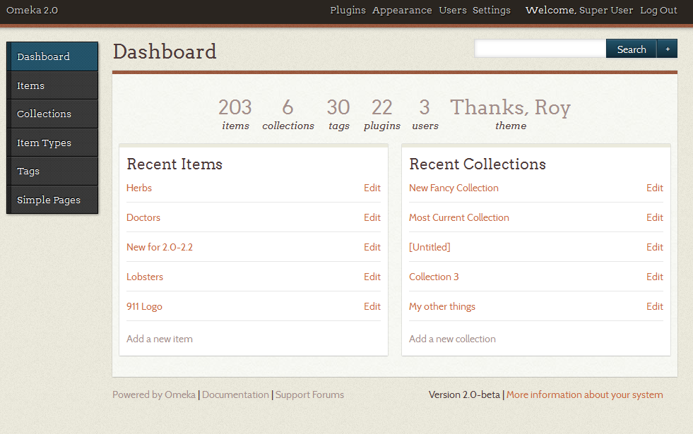

The following documentation is for Omeka Classic **versions 1.0-1.5+**. For versions 2.0 and higher, please see the [main documentation page](../documentation_index.md).

If you do not know which version of Omeka you have, log in to the admin dashboard. There should be a message stating the version either on the right sidebar (versions 1.0-1.5) or in the lower right hand corner (versions 2.0+) of the dashboard.

The dashboards of Omeka Classic versions 1.x and 2.x look very different, as well:

A 1.x dashboard:

A 2.x dashboard:

Working with Omeka Admin
------------------------------------------------

-   [Using the Omeka Admin](../1x_documentation/Using_the_Omeka_Admin.md)

**Content**
-   [Managing Items](../1x_documentation/Managing_Items_v1.md)
-   [Working with Dublin Core](../Working_with_Dublin_Core.md)
-   [Managing Files](../1x_documentation/Managing_Files_v1.md)
-   [Managing Collections](../1x_documentation/Managing_Collections_v1.md)
-   [Managing Item Types](../1x_documentation/Managing_Item_Types_v1.md)
-   [Managing Tags](..1x_documentation/Managing_Tags_v1.md)

**Users**
- [Managing Users](../1x_documentation/Managing_Users_v1.md)

**Add-Ons**
- [Managing Plugins](../1x_documentation/Managing_Plugins_v1.md)
- [Managing Themes](..1x_documentation/Managing_Themes_v1.md)

**Settings**
-   [Managing General Settings](../1x_documentation/Managing_General_Settings_v1.md)
- [Managing Element Sets](../1x_documentation/Managing_Element_Sets_v1.md)
- [Managing Security Settings](../1x_documentation/Managing_Security_Settings_v1.md)

**Screencasts**
-   [Screencasts](../1x_documentation/Screencasts_1x.md)

Plugins for Omeka 1.x
------------------------------

-   [Atom Output](../1x_documentation/Plugins_1x/AtomOutput.md)
-   [Reports](../1x_documentation/Plugins_1x/Reports.md)
-   [Coins](../1x_documentation/Plugins_1x/Coins.md)
-   [Collection Tree](../1x_documentation/Plugins_1x/CollectionTree.md)
-   [Commenting](../1x_documentation/Plugins_1x/Commenting.md)
-   *[Contribution](../1x_documentation/Plugins_1x/Contribution.md)*
-   [CreativeCommonsChooser](../1x_documentation/Plugins_1x/CreativeCommonsChooser.md)
-   [CSV Import](../1x_documentation/Plugins_1x/CsvImport.md)
-   [Docs Viewer](../1x_documentation/Plugins_1x/DocsViewer.md)
-   [Dropbox](../1x_documentation/Plugins_1x/Dropbox.md)
-   [Dublin Core Extended](../1x_documentation/Plugins_1x/DublinCoreExtended.md)
-   [EadImporter](../1x_documentation/Plugins_1x/EadImporter.md)
-   [ExhibitBuilder](../1x_documentation/Plugins_1x/ExhibitBuilder.1.md)
-   [Geolocation](../1x_documentation/Plugins_1x/Geolocation.md)
-   [GoogleTranslate](../1x_documentation/Plugins_1x/GoogleTranslate.md)
-   [HTML Purifier](../1x_documentation/Plugins_1x/HtmlPurifier.md)
-   [Image Annotation](../1x_documentation/Plugins_1x/ImageAnnotation.md)
-   [Image Resize](../1x_documentation/Plugins_1x/ImageResize.md)
-   [IntenseDebate Comments](../1x_documentation/Plugins_1x/IntenseDebateComments.md)
-   [Item Order (for collections)](../1x_documentation/Plugins_1x/ItemOrder.md)
-   [Item Relations](../1x_documentation/Plugins_1x/ItemRelations.md)
-   [Library of Congress Suggest](../1x_documentation/Plugins_1x/Library_of_Congress_Suggest.md)
-   [MediaRss](../1x_documentation/Plugins_1x/MediaRss_for_Cooliris.md)
-   [My Omeka](../1x_documentation/Plugins_1x/MyOmeka.md)
-   [OAI-PMH Harvester](../1x_documentation/Plugins_1x/OaipmhHarvester.md)
-   [OAI-PMH Repository](../1x_documentation/Plugins_1x/OaipmhRepository.md)
-   [PageCaching](../1x_documentation/Plugins_1x/PageCaching.md)
-   [PDF Search](../1x_documentation/Plugins_1x/PdfSearch.md)
-   [Scripto](../1x_documentation/Plugins_1x/Scripto.md)
-   [Simple Blog](../1x_documentation/Plugins_1x/SimpleBlog.md)
-   [SimpleContactForm](../1x_documentation/Plugins_1x/SimpleContactForm.md)
-   [SimplePages](../1x_documentation/Plugins_1x/SimplePages.md)
-   [Simple Vocab](../1x_documentation/Plugins_1x/SimpleVocab.md)
-   [SiteNotes](../1x_documentation/Plugins_1x/SiteNotes.md)
-   [SocialBookmarking](../1x_documentation/Plugins_1x/SocialBookmarking.md)
-   [TagBandit](../1x_documentation/Plugins_1x/TagBandit.md)
-   [TeiDisplay](../1x_documentation/Plugins_1x/TeiDisplay.md)
-   [Terms of Service](../1x_documentation/Plugins_1x/Terms_of_Service.md)
-   [Timeline](../1x_documentation/Plugins_1x/Timeline.md)
-   [Zoom.It](Plugins/ZoomIt.md)
-   [ZoteroImport](../1x_documentation/Plugins_1x/ZoteroImport.md)

Designing and Developing with Omeka
---------------------------------------------------------------

**Note:** The documentation in this section is for Omeka 1.x. All of the design and developer documentation for version 2.0 and higher can be found on [Omeka's Read the Docs](http://omeka.readthedocs.org) site.

### Getting Started for versions 1.0-1.5
-   [Learning PHP](../1x_documentation/Learning_PHP.md)
-   [Theme Writing Best Practices](../1x_documentation/1x_theming/Theme_Writing_Best_Practices.md)
-   [Plugin Writing Best Practices](../1x_documentation/Plugin_Writing_Best_Practices.md)
-   [MVC Pattern and URL Paths in Omeka](../1x_documentation/MVC_Pattern_and_URL_Paths_in_Omeka.md)
-   [Understanding Default Theme Files](../1x_documentation/1_theming/Understanding_Default_Theme_Files.md)
-   [Unit Testing](../1x_documentation/Unit_Testing.md)
-   [Escaping Data](../1x_documentation/Escaping_Data.md)

### Reference
-   [Function Reference](../1x_documentation/Reference/Functions.1.md)
-   [Plugin API](../1x_documentation/Reference/Plugin_API.md)
    -   [Hooks](../1x_documentation/Reference/Hooks.md)
    -   [Filters](../1x_documentation/Reference/Filters.md)
-   [Retrieving Error Messages](../1x_documentation/Reference/Retrieving_Error_Messages_v1.md)

### Recipes
Recipes are extended examples that show how to use the tools in Omeka to accomplish specific goals.

-   *[Adding a YouTube Video as an Item](../Recipes/YouTube_Video_For_Item)*
-   *[Display different header image on Simple Pages](../Recipes/Display_different_header_image)*
-   *[Add default thumbnail links for items without images](../Recipes/Default_Item_Thumbnail_Images)*
-  *[Add thumbnails for collection items on browse page](../Recipes/Collection_Item_Thumbnails)*
-   *[Create browse navigation on collection show pages](../Recipes/Browse_Within_A_Collection)*
-  * [Navigate items by type](../Recipes/Navigate_Items_by_Type "Recipes/Navigate Items by Type")*
- *  [Using Search Results to Create Custom Next and Previous Links](../Recipes/Using_Search_Results_to_Create_Custom_Next_and_Previous_Links "Recipes/Using Search Results to Create Custom Next and Previous Links")*
-   *[Removing Fields from Advanced Search](../Recipes/Removing_Fields_from_Advanced_Search "Recipes/Removing Fields from Advanced Search")*
-   *[Modifying the Appearance of Page Navigation](../Recipes/Modifying_Appearance_of_Page_Navigation "Recipes/Modifying Appearance of Page Navigation")*
-   *[Multiple Featured Collections](../Recipes/Multiple_Featured_Collections "Recipes/Multiple Featured Collections")*
-   [Linking to Related Items](../Recipes/Linking_to_Related_Items "Recipes/Linking to Related Items")
-   [Controlling Editing Access on Plugin Content](../Recipes/Controlling_Editing_Access_on_Plugin_Content "Recipes/Controlling Editing Access on Plugin Content")
-   [Looping the Omeka Way](../Recipes/Looping_the_Omeka_Way "Recipes/Looping the Omeka Way")
-   [Browsing Items Alphabetically](../Recipes/Browsing_Items_Alphabetically "Recipes/Browsing Items Alphabetically")

Done something interesting with Omeka that you don't see here? [Write a recipe](../How_to_write_a_recipe_page "How to write a recipe page") and share your solution.

### Miscellaneous 
-   *[Internationalization](../Internationalization "Internationalization")*
-  * [Translate_Omeka](Translate_Omeka.html "Translate Omeka")*
-   [Deprecated Helper Functions and Hooks](../1x_documentation/Deprecated_Helper_Functions_and_Hooks.md)
-   [Output Formats](../1x_documentation/Output_Formats.md)
-   [Retrieving Error Messages](../1x_documentation/Reference/Retrieving_Error_Messages_v1.md)