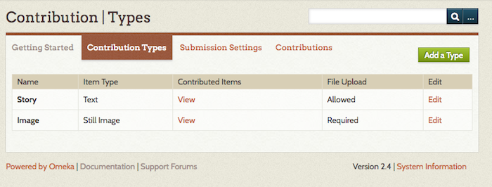
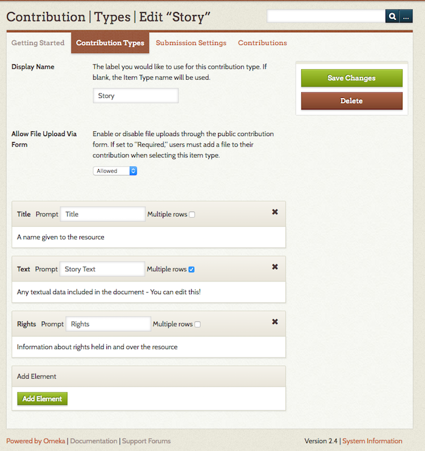

There is a [screencast](https://vimeo.com/165200216) for this plugin

The Contribution plugin provides a way to collect stories, images, and other files from the public and manage those contributions in your Omeka site as items. Contributors may share and upload content anonymously, and their information will only be available site administrators. The form can also automatically add a reCAPTCHA box at the bottom of each form to prevent spam-bots from spamming your website.

All contributions are private by default and require a site
administrator to make them public on the Omeka site.

Contribution offers site administrators the ability to let contributors create guest user accounts to better enable multiple contributions from the same user. Administrators can collect specific information about those users with the User Profiles plugin.

An Omeka site with the Contribution plugin now requires you to upload and install two separate plugins. There are two additional plugins you will need to install if you want to collect any user information:

-   [Guest User](/GuestUser_2.0.md)
-   Contribution
-   [Record Relations](/RecordRelations_2.0.md) (optional, only required for collecting user information)
-   [User Profiles](/UserProfile_2.0.md) (optional, only required for collecting user information)

Installing
------------------------------------------------------------

-   Upload and [install](../Managing_Plugins_2.md#Installing_a_Plugin) the Guest User plugin first. If you have uploaded the other plugins first, you will see in the plugin directory that you cannot install other Contribution-related plugins until Guest User is installed first.

### Guest User Configuration
After installing the plugin, click the Configure button. For more information go to the [Guest User documentation](GuestUser_2.0.md).

### Installing
1. Upload and install the Contribution plugin in the plugin directory.
2. Contribution settings: A new tab will appear in the left side
navigation bar labeled, “Contribution.” Click on Contribution to configure the form and submission settings.
    - Note: a link to the contribution form will automatically be added to the site’s navigation. If you wish you draft the form first, go to the site’s Appearance tab at the top of the Dashboard and click on Navigation. Uncheck the “Contribute an Item” link. At this point you can edit the label, or do that later.

## Setting up Contribution
Contribution is managed from the plugin's tab on the left-hand navigation of the admin dashboard. 

The Contribution section has four tabs: Getting Started, Contribution Types, Submission Settings, and Contributions. 

### Getting Started
The *Getting Started* tab offers instructions for setting up for the form and submission settings.

### Contribution Types
The Contribution Types tab has a table with a row for each type. Every row shows:
-  the type's *name* (the label you give it); 
- its *type* (corresponding Item Type from your Omeka install);
- the number of *Contributed Items* (which also acts as link to those items);
- whether *File Upload* is allowed, disallowed, or required; and
- an *Edit* button. 

Click *Edit* to add or change data collection for a specific type. Click *Add* to create a new type to collect. 

On the Add/Edit screen for Contribution Types, there are fields for the display name and form upload, and a series of element inputs for the data you will collect from contributors. 

Options are:
- *Display Name* is the label for the contribution type - how it will appear on the public side. If left blank, the form will just use the Item Type name.
- *Allow File Upload Via Form*: you can choose to allow, require, or disallow. If this is set to "required," users will not be able to submit the contribution form without attaching a file. 
- *Elements*: each element appears as a block. 
     - The block is labeled with the Dublin Core element,
     - *Prompt* is like display name, in that it changes the label of the element on the form. 
     - The *Multiple Rows* checkbox sets whether the entry field on the form has a single row (indicating a short answer) or allows for multiple rows (making it easier for contributors to write paragraphs of text).

To add an element (question) to the contribution form:
1. Go to the bottom element block, titled "Add Element".
1. Select an element from the dropdown list (this will be all the Dublin Core elements as well as all Item Type elements.
1. Type a prompt in the Prompt field.
1. If you want contributors to be able to enter longer blocks of text, click the *Multiple rows* checkbox. 
1. Remember to save changes.

You can edit any element's prompt or multiple row setting at any time.

To delete an element, click the X button in the right corner of the block and save changes. If you accidentally click the delete button, you can click again (the X changes to an undo arrow) to restore the block.

In the above image, the upper block has marked for deletion - note that the header for the block is highlighted in red. The lower block is the add element block option with the dropdown open.

If you want users to select from a drop-down instead of entering text, use [Simple Vocab](/SimpleVocab_2.0.md) to set up a controlled vocabulary for the element which will be applied on the admin side when adding/editing an item and in contribution forms. If you want users to be able to assign a location to their contributions, use the [Geolocation](/Geolocation_2.0.md) plugin and check the *add map to contribution form* in its configuration settings.

### Submission Settings
This section is for the standard settings for your contribution form and general contribution options. 

The settings are:
- *Contribution Slug*: customize the url for the contribution form.
- *Contribution Confirmation Email* : An email message will be sent to each contributor from this address confirming that they submitted a contribution to this website. Leave blank if you do not want an email sent.
- *New Contribution Notification Emails*: Add emails to which you want a notification sent when new contributions are received. You can enter multiple email addresses, separated by a comma.
- *Terms of service*: paste in text of language of consent for anyone contributing to the site, or make a short statement linking to a [Simple Page](/SimplePages_2.0.md) with a longer terms of service statement. 
 - *Use 'Simple' Options*: requires that contributors only provide an email address. Select this option if you have set up the Guest User plugin enabling “instant access.”
- *Email text to send to contributors*: the text of the email sent to contributors when they contribute an item. 
- *Contribution Collection*: If you want, you can specify a collection to which all new contributed items will be added (note that you must create the collection before you can select it from this dropdown).
- *Default Contribution Type*: If you select a type, it will automatically load when someone navigates to the public contribution form.
- If you’re collecting user data with the User Profiles plugin, you must select which profile to make available for your contribution users. See below for more information about creating a user profile.

Remember to save changes. 

#### Versions X and above
Versions X and higher of Contribution have two additional settings to enable anonymous contribution, which replace the *Use 'Simple' Options* setting.

*Allow non-registered contributions* requires that contributors only provide an email address. Select this option if you have set up the Guest User plugin enabling “instant access.” These contributors will get an email enabling them to make a password if the decide to create an account. (This setting is similar to the old 'Simple' option when it is checked and 'Allow Anonymous Contribution' is not).

*Allow Anonymous contributions* can only be used if the previous checkbox is on. You cannot allow anonymous contributions without allowing non-registered contributions. 

### Contributions
This  tab is where you can view all submissions through the public contribution form. From this screen, it is possible to review and make items public or change their status. All contributions through the form will also be available to browse and search on from the Items tab in your Omeka site.

## Collecting Information from Contributors (optional)

To ask for additional information about your contributors, you will need to install 2 additional plugins. If you were not collecting contributor information, you do not need to install Record Relations or User Profiles to use Contribution.

1. Upload and install the [Record Relations plugin](/RecordRelations_2.0.md)
2. Upload and install the [User Profiles plugin](/UserProfile_2.0.md). Once Record Relations is installed, the User Profiles plugin will become available to install. Follow directions for creating user profiles in that plugin's documentation.

Adding Contribution link to Site Navigation
----------------------------------------------------------

- A link to the contribution form is automatically added to the main site navigation.
    - Go to the site’s Appearance tab at the top of the Dashboard and click on Navigation. You may rename the public link to the Contribution form. The default label is “Contribute an Item.”
-   Drag and drop the links if you wish to re-order the navigational elements of your site.

Vetting and Managing Contributions ------------------------------------------------------------

All new contributions will be not be made public, and by default will be marked as “Needs Review.”

1. To review, go to the **Contributed Items** tab in the left navigation (once you start collecting, this tab changes name from Contribution to Contributed Items).
1. Go to the **Contributions** tab and browse contributions.
1. You may filter by status to see what Needs Review. Any item you wish to approve, you must make public and save changes.
      - Users have the option to contribute an item that they do not wish to be made public. You will not be able to override this request from the user, so you cannot make those items "public."
      - Contributors can also make their contributions anonymously. In that case, contributor information is only visible to site administrators.

Upgrading from 1.x to 2.x 
---------------------------------
*Be sure to make a copy of the plugin’s files and a backup copy of the database before upgrading.*
1. Follow upgrading process for all [Omeka sites](../Upgrading.md).
2. Upload and install the following plugins, following all of the steps above for installing plugins and configuring the form above.
    - [Guest User](../../add-ons/plugins/guest-user.1.html)
    - [Contribution](../../index.html%3Fp=1284.html)
    - [Record Relations](../../add-ons/plugins/record-relations.1.html)
    - [User Profiles](../../add-ons/plugins/user-profiles.1.html)
3. If you have asked Contributor Questions on 1.5 form, go to User Profiles plugin page. Locate the check box asking if you want to import Contributor settings: check the box and save changes.
4. Contributor pages should be linked to a Contributor’s profile, and the questions you asked before should be available in the User Profile.
5. If you have modified the text on the Contribution form itself, those changes will not be transferred. You will need to modify the text on the contribute.php form again in the plugin directory on the server.

