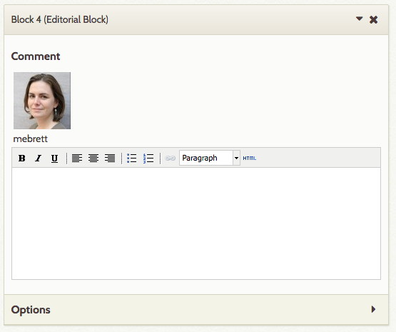
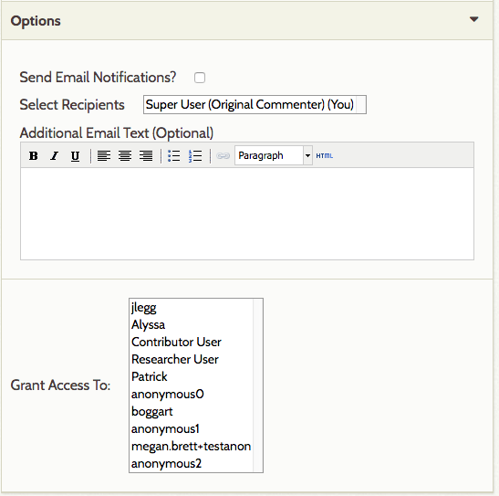
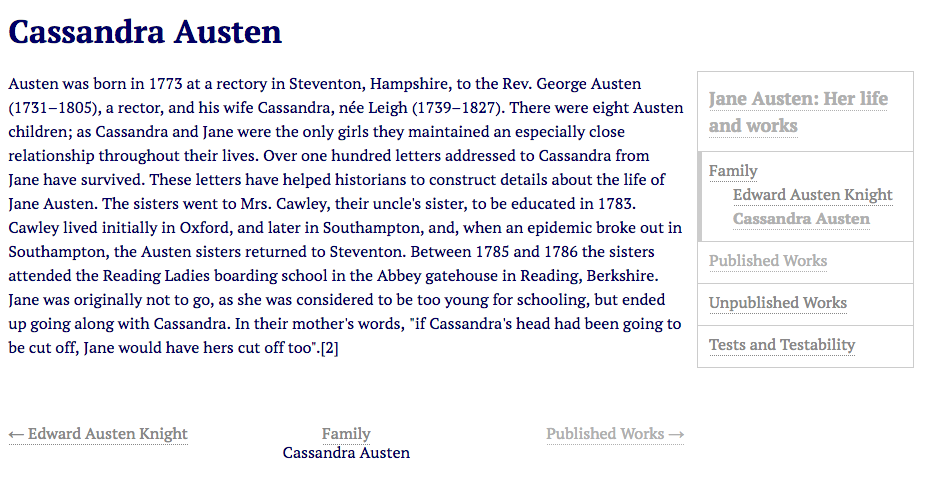

The Editorial Plugin adds a block to [Exhibit Builder](/ExhibitBuilder_3.0.md) pages which allows users to add comments on and discuss in-progress exhibits. These comments are only visible to logged-in users of the site.

You must be using Exhibit Builder version 3.3.2 or higher for Editorial to work.

Editorial User Role
-----------------------
The plugin creates a new [role](../User_Roles.md), Exhibit-contributor, which largely functions like the Contributor role but can also edit Exhibits when added in the Editorial blocks (see below for more information)

Using Editorial Blocks
-------------------------
Once you have [installed](../Managing_Plugins_2.md#installing-a-plugin) and activated the Editorial plugin, it is ready to use.

From the Exhibits tab on the left-hand navigation of your admin dashboard, click *Edit* on the Exhibit for which you want to create an editorial block. Select the page on which you want to leave a comment or start a discussion. 

### Add an Editorial block
The New Block layout options should now include an Editorial Block, with Omeka's logo for the block icon:

Select Editorial Block in the New Block options and click the long green *Add New Content Block* button.

### Add the first comment in a block
The block will have your username and a text field for comments, which can be formatted [using html](../Using_HTML_Editor-TinyMCE.md). If your Omeka site email is also registered with [Gravatar](https://en.gravatar.com/), then your Gravatar will show up above your username. Type your comment in the text field.

Once you have made your comment, you can either Save Changes to save it, or configure the following options before saving: 
- *Send Email Notifications*: If checked, the plugin will send an email every time someone comments on this editorial block to receipients you select.
- *Selected Recipients*: select recipients to be emailed about changes to the block. This will initially only have your username. As you grant access to users, their name will also appear in this select box. Use the command key while clicking to select more than one user. 
- *Additional Email Text*: this optional field allows you to add instructions or other text to the email. 
- *Grant Access To*: set which users on the Omeka site can see and comment on this Editorial block. SuperUsers will always be able to see Editorial blocks. Other users must be added. 
      - Use *Grant Access* to allow Exhibit-contributor users to view this exhibit.

Always remember to save changes.

### Reply to someone's comment
If another user has made an Editorial block on an Exhibit page and granted access to you, you will see it on the edit page. 

To reply to their comments, simply type in the *Leave New Response* field directly below their comment. Note that previous comments will show up below the *Leave New Response* field, not above it.

### Editing and deleting comments 
Currently users are unable to delete comments. However, it is possible to edit your own comments. Go to the comment you would like to edit, click the right-facing arrow to have the text box appear, make any needed fixes or updates, and save changes. Administrators and superusers are able to edit original comments but not responses to those comments.  

### Public side view
Although the content of Editorial blocks is not visible to non-logged in users, they do show up on the public side view when you are logged in:

Editorial block on the public side when the user is logged in:

The same page seen by a non-logged-in site visitor:

Click the small triangle button to the left of the label *Internal Comments* to expand or collapse the comment thread of a single Editorial block.

