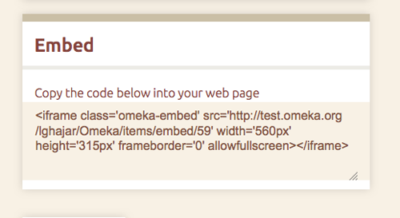

The EmbedCodes plugin enables you to share individual Omeka items as an iframe in other webpages and blogs, including Wordpress installations and Omeka Simple Pages.

Installing the Plugin
----------------------------------------------------------------
Download the plugin and unzip it to your plugins directory. Install the EmbedCodes plugin from your admin Plugins screen. The Embed Code field then appears in the public view of individual items in your website. No further configuration is required.

]

How to Embed Omeka Items in Other Sites 
------------------------------------------------------
Highlight and copy the entire code in the Embed field.
 

Paste the embed code into the appropriate section of the website where you want your selected item to appear. A thumbnail of the item and item title are linked from the page where you pasted the embed code.

Track Embeds 
-----------------------------------------------------------------

The Embed Code plugin allows you to track which items from your Omeka site have been embedded, where they are embedded, dates of first and latest views, and number of views. In admin, select Embedded Items in the left hand navigation list to track embedded items from your Omeka site.

