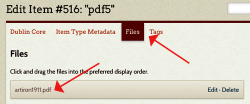

PdfText enables searching on PDF files by extracting their texts and saving them to their file records. PdfText strips out images and layout in the original file, leaving only searchable text which is viewable from site admin.

### Configure

If PDF files are already in your Omeka database when you install the plugin, check the *Process Existing PDF files* box and save changes. This will run the text extraction process on those items.

### View Text

To locate extracted text, select the item to which the PDF is attached. Select File from the Item navigation. Click on the name of the file.  The searchable, extracted text opens in a new window.