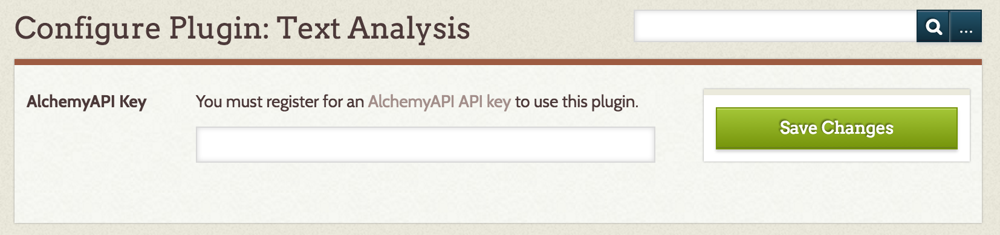
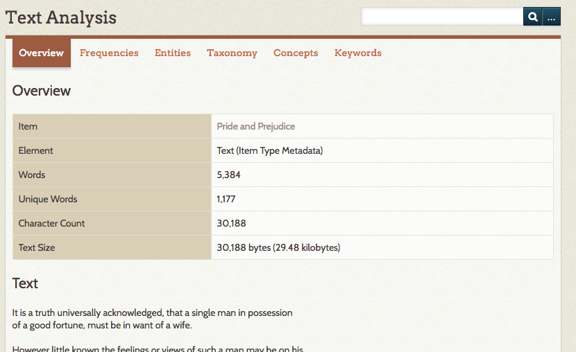
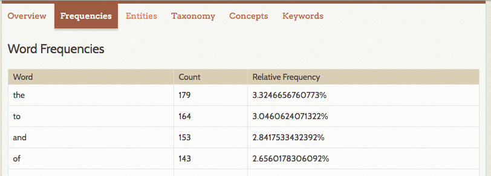
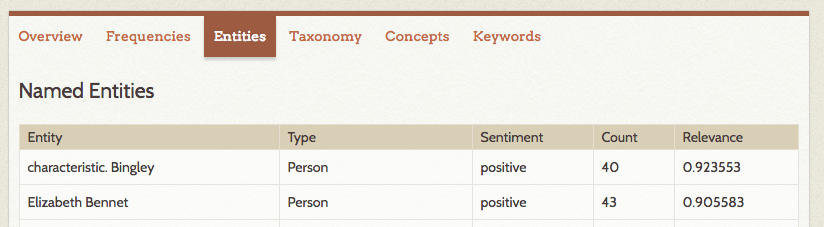
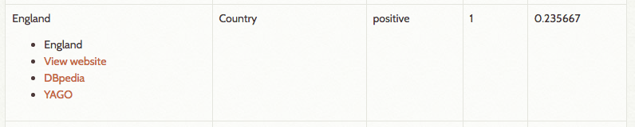

*version 1.1*

The Text Analysis plugin connects your Omeka Classic site with [AlchemyAPI](http://www.alchemyapi.com/) to enable text analysis on individual items. 

Configuration
-------------
After you have installed the plugin, go to the Plugins tab in the upper navigation, and scroll down to Text Analysis. Click the blue *Configure* button. 

On the Configure Plugin page, enter your [AlchemyAPI key](http://www.alchemyapi.com/api/register.html). In order to get an AlchemyAPI key, you must register for the Watson Developer cloud, part of IBM Bluemix. While IBM Bluemix has paid options, you should be able to use the free version to run this plugin. (Note: once logged in to Bluemix, AlchemyAPI is under the Watson tab. See their [getting started documentation](https://new-console.ng.bluemix.net/docs/services/AlchemyAPI/index.html#gettingstartedtemplate) for more information). 

Be sure to save changes after entering the API key.

Using Text Analysis
--------------------
Once you have saved the API key, you can view text analysis on any item in your collection. 

Go to the Items tab on on the left hand navigation and click on the title of any item (this plugin will work best with longer text blocks). Note that you want to click on the title and not the *edit* button so that you are looking at the items/show page, not the items/edit page. 

On the items/show page, the bottom option of the right hand blocks (below the Edit/View Public/Delete buttons, etc) is a Text Analysis block.

Select an element from the dropdown in the Text Analysis block; you should be able to select any Dublin Core or Item Type element that has text entered in that item. Once you have chosen an element, click the *Analyze This Element* button.

The Text Analysis page will load. It has the following tabs, most of which correspond to various [AlchemyLanguage features](http://www.alchemyapi.com/products/alchemylanguage):

*Overview*: which summarizes the item and element analyzed, the word count for the element along with number of Unique words, the character count, text size, and the full text of the element being analyzed.

*Frequencies* is a table with each word, the total count within the element, and the relative frequency of the word in relation to the total word count. 

*Entities* displays a table of named entities in the text, with columns for entity, type, sentiment, count, and relevance. When possible, entites are linked to external sources including maps, [DBpedia](http://wiki.dbpedia.org/about), and the official website if it can be determined.

*Taxonomy* applies the AlchemyAPI [taxonomy](http://www.alchemyapi.com/products/alchemylanguage/taxonomy) grouping labels to your content, with a confidence marker and a score. 

*Concepts* are given in a table with the concept and relevance; the words and phrases are generated by computation extraction and may not be referenced in the text. For more on how concepts work, see [the documentation from AlchemyAPI](http://www.alchemyapi.com/products/alchemylanguage/concept-tagging). 

*Keywords* include keywords, the associated sentiment based on context, and relevance in the overall text sample.

