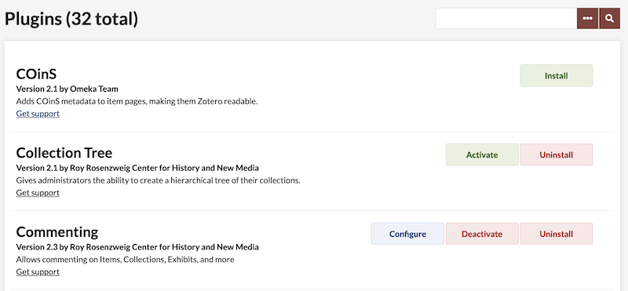
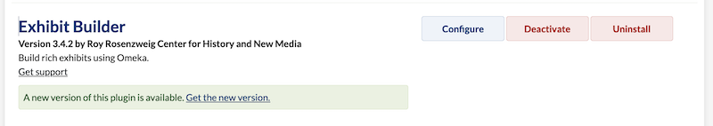
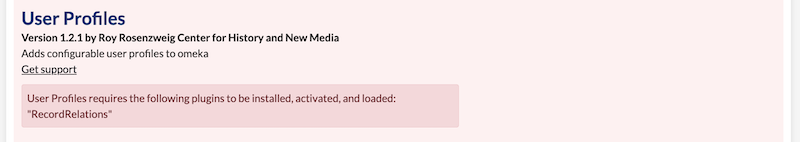

# Working with Plugins

Plugins are tools to extend the basic functionality of Omeka Classic. A list of plugins available for download is on the [Plugins Directory](http://omeka.org/classic/plugins){target=_blank}. Instructions are available on each plugin's documentation page.

!!! Note
    Not every plugin will work with every version of Omeka, especially newer plugins on old installations. Older versions of plugins may be available on their Github pages. Use the Plugins Directory to find the "Github" link on the right side of the screen for each plugin, then look on the right hand side of the Github page for the "Releases" section. 

Manage plugins from the Plugins page found at the top of your Dashboard. Plugins will be listed alphabetically.  Each plugin listed will have links to perform various actions:

-   **Install**: Runs the installer for the plugin and activates the plugin.
-   **Configure**: Takes you to a page for customizing the plugin's unique settings. 
-   **Deactivate**: Deactivating merely "unplugs" the plugin, but does not delete any data collected while the plugin was active. 
-   **Activate**: Activates the plugin after it has been manually deactivated. All plugins are automatically activated once installed.
-   **Uninstall**: Runs the uninstaller for the plugin and deletes any information in your installation related to the plugin, including data in metadata fields.

In some cases, uninstalling plugins can delete data associated with the plugin from your database. Check the plugin's documentation before uninstalling if you're unsure. Consider deactivating and testing first. 

Installing a Plugin
-------------------
Watch [our screencast showing these steps](https://vimeo.com/153819886){target=_blank}. To add and activate a new plugin for your Omeka installation, follow these steps: 

1.  [Download and unzip the compressed plugin file](https://omeka.org/classic/plugins/){target=_blank} on your computer.
1.  Open your FTP client and use your FTP login info to access your site. Or, if you are using cPanel File Manager, WebFTP, or another in-browser tool, log in there.
1.  Navigate to your Omeka folder (it should have the same name as your Omeka install), open it, then open the `/plugins` folder.
1.  Locate the plugin folder on your computer and upload it into your Omeka website's `/plugins` folder. 
    - Sometimes the plugin unzips into a folder of the same name, so make sure to go inside it and upload the folder that only contains the plugin name, not the version number. For example, you may have downloaded the `CSSEditor-1.1.zip` file and extracted it to a `CSSEditor-1.1` folder, which contains a `CSSEditor` folder. Upload the `CSSEditor` folder. 
    -- You may also be able, or required, to upload the zipped file and unzip it here, if your file client does not allow you to upload a folder. Remember to watch for an extra folder level in this case.
1.  In another browser window, log in to your Omeka admin panel (`https://youromekasite.org/admin`).
1.  Navigate to the Plugins tab in the upper navigation of the admin dashboard, and scroll down to find the plugin you uploaded. Plugins are listed alphabetically.
    - If the plugin is not visible, double-check that the folder is in the right location ('/plugins') and that the folder name for the theme does not start with 'plugin-'.
1.  Click the “Install” to the right of the plugin name to finish the process.
    - Click “Configure” if available/needed.
1. Read the documentation for plugin to understand what configuration options are available.

If you are using a hosting provider that offers cPanel and online file management options, [Reclaim Hosting](../GettingStarted/Hosting_Suggestions.md) has [step-by-step instructions](http://docs.reclaimhosting.com/omeka/uploading-plugins-to-omeka){target=_blank} for uploading plugins with cPanel's browser-based FTP option.

!!! Note
    You can also use `git clone` or the Github interface to download the latest plugin code directly from Github. Be sure to watch for extra folder levels or incorrect folder names in this case, such as a folder starting with `plugin-` or ending with `-master`. Rename the folder to remove things like `plugin-` and/or `-master` from the folder name. 

Upgrading Plugins
-----------------
When a plugin is out of date, a notification will appear at the bottom of the plugin's entry on your Plugins page. The notification reads "A new version of this plugin is available. Get the new version." Clicking the phrase "get the new version" will take you to a page where you can download the latest version of the plugin. 

In order to upgrade a plugin, you will need to use your FTP client to replace the old plugin folder with the new one: 

1. Go to the admin dashboard of your Omeka site and navigate to the Plugins tab on the top navigation menu.
1. Click the "Deactivate button" to deactivate the plugin you would like to upgrade. **Warning**: Do not click the uninstall button, or you may delete any data created with the plugin.
1. Download the new version of the plugin, and unzip it on you computer. 
1. Open your FTP client and use your FTP login info to access your site.
1. Navigate to your Omeka folder (it should have the same name as your Omeka install), open it, then open the `/plugins` folder.
1. Remove the old plugin folder from your `/plugins` folder.
1. Upload the new version of the plugin to the `/plugins` folder. Be careful, as above, to ensure the folder name is correct. 
1. Go back to the Plugins page in your browser.
1. You may be directed to upgrade your plugin - click the link to upgrade and then re-activate your plugin.

Plugin Dependencies
----------------
Some plugins are designed to provide infrastructural functions for other plugins. Such plugins are required to be installed and active for other plugins that depend on them to work. If you upload a plugin to your site but cannot activate it due to a message like this, simply install the required plugin following the usual steps above.

 

Pre-packaged Plugins
--------------------
The following plugins come prepackaged with the download of Omeka Classic: 

-   [Coins](../Plugins/Coins.md) – Adds Coins metadata to items on the admin theme and in public themes.
-   [Simple Pages](../Plugins/SimplePages.md) – Publish static pages on your public site.
-   [Exhibit Builder](../Plugins/ExhibitBuilder.md) – Build narratives around your collections.
