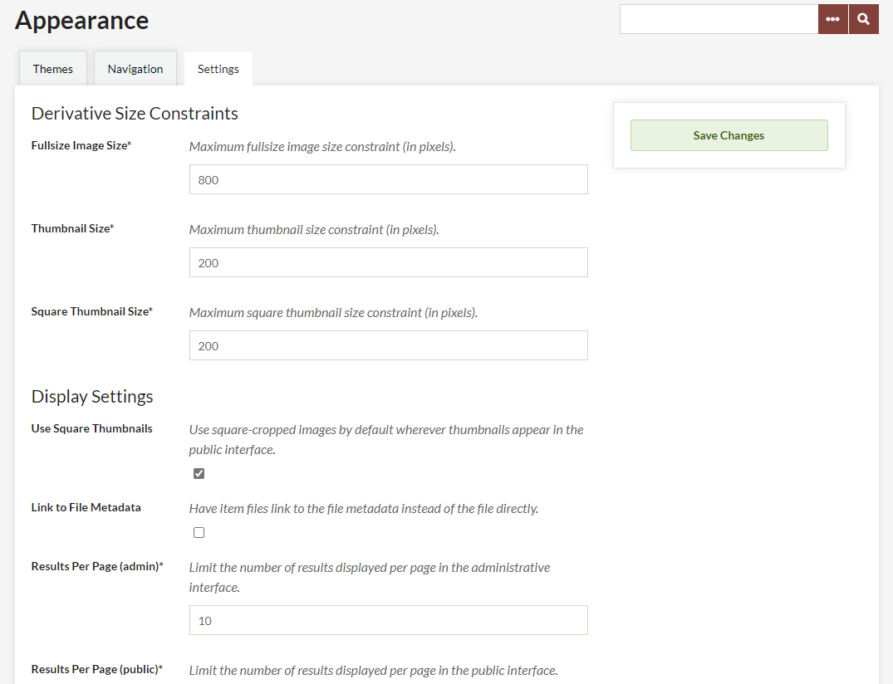
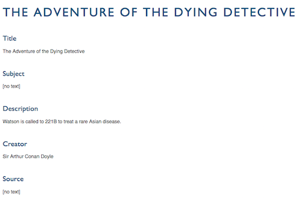
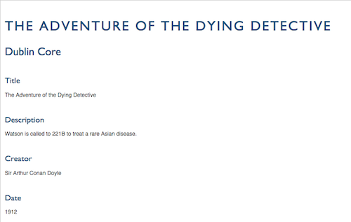

# Appearance Settings

The Settings sub-tab in the Appearance section help you to manage derivative image sizes and adjust some of the display settings for items on the public and admin sides. It is divided into two sections: **Derivative Size Constraints** and **Display Settings**.

Derivative Size Constraints
----------------------------------------------------------------
In this section, you can set the maximum image sizes for the derivative images Omeka creates when you upload a file. 

For each of Fullsize, Thumbnails, and Square Thumbnails, you can set a number in pixels for the longest side of the image. For example, if you are uploading a 1600x2000 pixel image, a setting of "100" as the thumbnail maximum would resize the image down to 80x100 pixels.

Note that these settings are general for the installation - the size at which thumbnails display on item browse, exhibit, and other pages may also depend on which theme you are using.

These following are the default settings for the three size constraints, in pixels:

-   Fullsize Image: 600
-   Thumbnail: 200
-   Square Thumbnail: 200.

To make changes, simply type a number into the corresponding text field and save the page.

Please note that changes to these settings will only affect files uploaded after you have made the changes; it does not retroactively re-size existing files. If you want to change existing files, you will need to install the [Derivative Images plugin](../../Plugins/DerivativeImages.md).

Those with access to the server files can also [manage thumbnail creation settings](../../Technical/ConfiguringThumbnailCreation.md) to change where thumbnails crop the image (see linked documentation for more information).

Display Settings
----------------------------------------------------------------
These settings relate to the display of results on the public and admin sides and some aspects of metadata display on the public side. 

**Use Square Thumbnails**: sets the installation to use square-cropped images by default wherever thumbnails appear in the public interface, regardless of themes. (This setting is for Omeka Classic versions 2.5 and higher only.)

**Link to File Metadata**: when this box is checked, clicking on a file on an item's public show page will take site users to the file's metadata page rather than the fullsize image. 

**Results per page (admin)**: sets the number of results on the admin-side browse pages for items, collections, and exhibits. The default is 10.

**Results per page (public)**: sets the number of results on the public-side browse pages for items, collections, and exhibits. The default is 10.

**Show Empty Elements**: determines whether you want to show empty metadata fields on the public pages. The default setting is unchecked. If you wish to show all metadata (empty and filled) fields, check this box. The image below shows how empty elements display on a public item show page.

**Show Element Set Headings**: unchecking this box will remove the element set headings (e.g. "Dublin Core," "Person Item Type Metadata") from display on the public pages of the site. The default setting is checked. The image below shows the Dublin Core heading on a public item show page.

