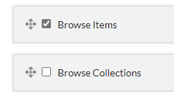
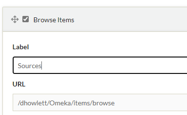
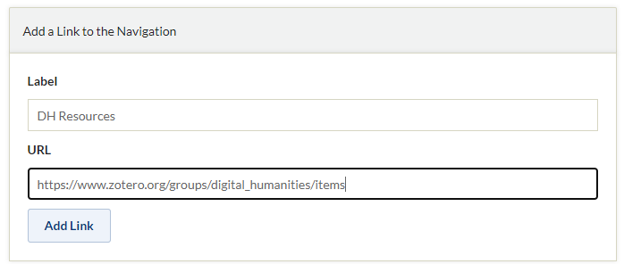
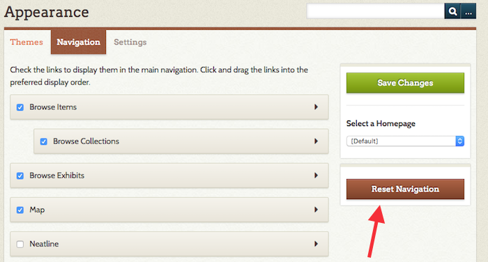

# Navigation

The Navigation section in Appearance lets you manage your Omeka's public navigation by ordering, editing, and adding navigation links, and by selecting a homepage.

Access Navigation settings by clicking Appearance in the top navigation menu in the admin dashboard and then going to the Navigation tab in that section.

 

Omeka includes links to Browse Items and Browse Collections by default. If you have installed [Simple Pages](../../Plugins/SimplePages.md), the About page will also appear by default, and any published Simple Pages will be automatically added to the navigation. Likewise, once you have installed Exhibit Builder, Browse Exhibits will automatically appear in the navigation.

You may arrange navigation items in any order by dragging and dropping.

Managing navigation links
----------------------------------------------------

The checkbox located to the left of each section or page title indicates when a navigation link is visible on the public site. This is useful for both default pages, plugin-added pages, and temporarily turning custom links on and off. For example, if you don’t want "Browse Collections" to display, uncheck the box.

To rename the links to different pages and sections in the site's navigation, click the arrow found to the right of the page or section's title to reveal the Label and URL.

Edit the word or phrase that appears in the Label text box. For instance, you may change "Browse Items" to "Sources", or some other phrase.

To add menu navigation for a specific collection, exhibit, or item, see the section on links, below.

Adding navigation links
----------------------------------------------------------------
In the section, "Add a Link to the Navigation," you may add links to other content, whether on your site or elsewhere.

Choose a Label, or title for the link, and paste in the URL to the external or internal webpage.

Click "Add Link."

Choosing a homepage
--------------------------------------------------------------
You may change the homepage of your installation by selecting a page from the dropdown menu located under the heading "Select a Homepage" found on the right side of the screen. The dropdown lists all of the public navigation links you created. "[Default]" will display the Homepage as set up in the Theme's settings (so, if you change themes, you will need to re-enter Homepage information if you are utilizing this feature).

Select the desired page from the list and click "Save Changes" to designate a new homepage.

Resetting the navigation
--------------------
To reset the navigation back to the Omeka default, click the "Reset Navigation" button below the "Save Changes" button and Homepage dropdown. **All customizations will be lost**: custom links will be deleted, and navigation item order and custom labels will revert to Omeka defaults.

