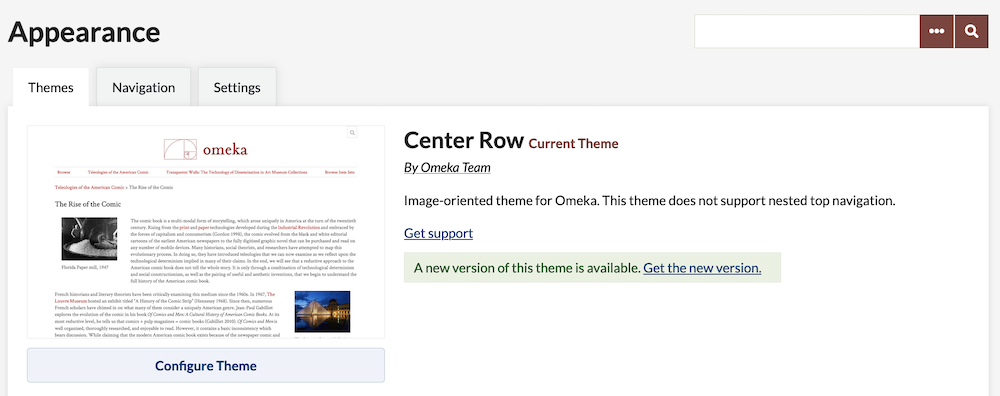
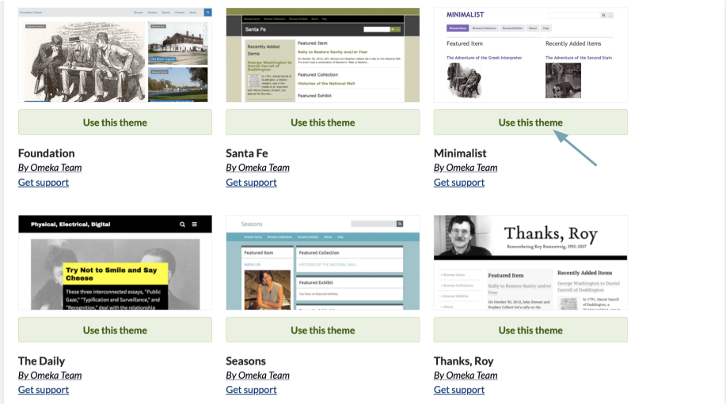
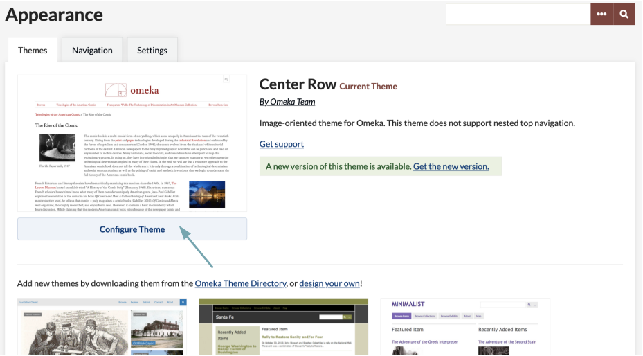

Themes determine the the look and feel of the public side of your Omeka site.

Most themes have a number of settings which can be customized in the admin dashboard by superusers of the site. If you want to further customize a theme, or create your own, you can do so by editing the [files on the server side](https://omeka.readthedocs.io/en/latest/Tutorials/index.html#public-themes)

Installing a Theme
-----------------------------------------------------------------
Watch the [screencast](https://vimeo.com/153819886) demonstrating the process of installing plugins and themes (closed captioned).

To add and activate a new plugin for your Omeka installation, follow these steps:

1.  Download and unzip the file on your desktop.
2.  Open your FTP client.
3.  Use your FTP login info to access your site.
4.  Navigate to your Omeka folder. It should have the same name as your Omeka install, and may be located in the 'public_html' folder. Open the folder
5.  Open the '/themes' folder
6.  Upload your new theme folder into your Omeka website's '/themes' folder. Sometimes the unpacked theme is inside a folder of the same name so make sure you are uploading the correct directory.
    - NB: your theme must be inside the '/themes' folder.
    - If the folder's name includes 'theme-' you will need to delete that prefix in order for the theme to work.
7.  Log in to your Omeka admin panel
8.  Navigate to Appearance in the top nav bar. You should immediately be in the Themes section.
    - If the theme is not visible, return to step 6 and double-check that the folder is in the right location ('/themes') and that the folder name for the theme does not start with 'theme-'
9.  Click "Use This Theme" to finish the process.
    - Click “Configure Theme” if desired.

Selecting a Theme
-------------------------------------------------------------
You can browse the themes you have installed for your Omeka Classic site by going to the Appearance tab in the upper admin navigation. The Themes tab in the Appearance section will be the first which loads. 

This page displays your active theme at top, with all available themes in a grid below.

The active theme is displayed at top, with a preview of the the theme's appearance, a summary of its features, and a button to configure the theme (see below). 

If the active theme is out of date, you will see a message under the active theme summary stating "A new version of this theme is available. Get the new version." The phrase "get the new version" is a link to the page where you can download the latest version of your theme. To update, simply follow the installation instructions above, replacing the outdated theme folder with the new one.

To select a new theme, find the theme you want among those installed on your Omeka Classic site, and click the green "Use this theme" button displayed between the theme's thumbnail and its title. In the image below, the arrow is pointing at the button to activate Rhythm as the site's theme.

Configuring a Theme
----------------------------------------------------------------
Configurations let you make choices about the look of your site, including adding a logo and homepage text, managing featured elements, and adding footer text. 

The configuration settings you make are unique to each theme and will be saved with that theme. Not all themes have the same configuration settings. 

To configure your theme, click the "Configure Theme" button below the theme graphic to customize your site. While not all themes have the same configuration settings, most will have the following two sections: 

*Header and Footer* configuration options are:

- *Logo file.* You may upload a logo file that will replace the site title in the header of the theme. Recommended maximum width for the logo is 500px.
- *Header background.* Upload an image file that will display across the top of your public website.
- *Footer text.* An HTML-enabled text box where you can enter text for a site footer to appear on every page. 
- *Display copyright in footer.*  Check this box if you wish to display your site’s copyright information in the footer. Site copyright information is found in the [General Settings](../Settings/General_Settings.md) section.
- *Use Advanced Site-wide search.* Check this box to allow public-side site visitors to search the whole site, including items, collections, and files, and to use boolean methods when searching.

*Homepage* configuration options:

- *Display Featured Item.* Check this box if you wish to show a featured item on the homepage.
- *Display Featured Collection.* Check this box if you wish to show a featured collection on the homepage.
- *Display Featured Exhibit.* Check this box if you wish to show a featured exhibit on the homepage.
- *Homepage Recent Items.* Choose the number of recent items to be displayed on the homepage. These will appear in the order in which they were mostly recently added to the archive.
-   *Homepage Text*. Add some text to be displayed on your homepage above the Featured Items. This is a good place to add a very short tagline or description of your site. Save longer explanations for an About page.

Additional Configuration Options:

* **Item File Gallery:** For the themes Thanks Roy, Seasons, Minimalist, and Emiglio. This box displays the files for each item as a gallery of square thumbnails rather than fullsize images. 
* **Style Sheet:** For the themes Seasons and Rhythm. Select a style sheet (color scheme) from a dropdown menu.
* **Exhibit Builder navigation:** For the themes Seasons and Minimalist. Choose whether page navigation in exhibits is a full-width bar that stretches across the page or a sidebar that uses a small fraction of the page width.
* **Colors:** For the themes Thanks Roy, Center Row, The Daily, Big Stuff, . These fields allow you to customize the color of specific parts of the theme (link text, buttons, etc). You must use a six-character [hexadecimal color value](https://www.w3schools.com/colors/default.asp), including the `#`. 
* **Homepage Text position:** A dropdown menu to set whether the homepage text appears above or below featured items, exhibits, and collections.

Remember to save changes.
