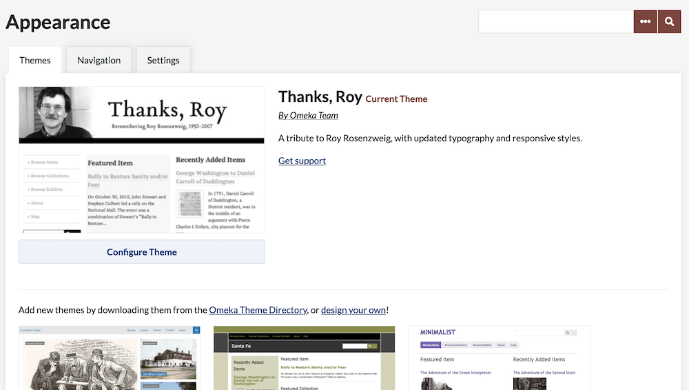
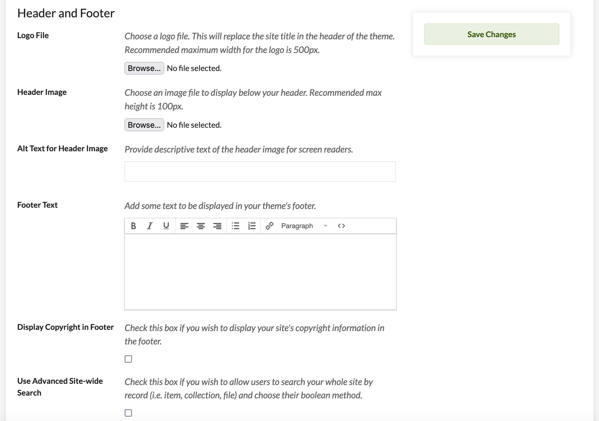
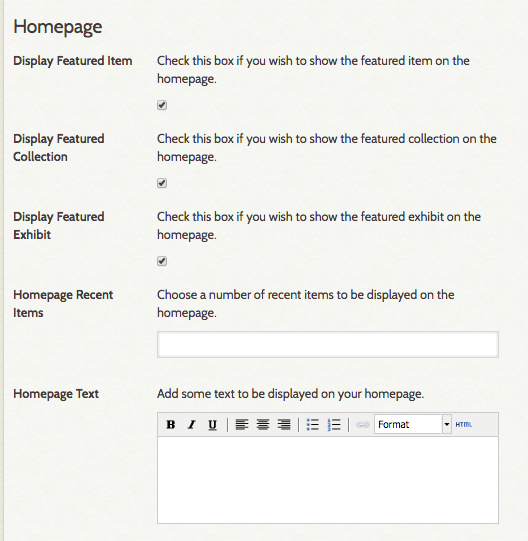

# Themes

[Themes determine the the look and feel](https://omeka.org/classic/themes/){target=_blank} of the public side of your Omeka site. Browse our themes and our [showcase directory](https://omeka.org/classic/showcase/){target=_blank} to see the variety of designs and customizations available to you.

Most themes have a number of settings which can be customized in the admin dashboard by superusers of the site. If you want to further customize a theme, or create your own, you can do so by editing the [files on the server side](https://omeka.readthedocs.io/en/latest/Tutorials/index.html#public-themes){target=_blank}.

Installing a Theme
-----------------------------------------------------------------
Watch the [screencast](https://vimeo.com/153819886){target=_blank} demonstrating the process of installing plugins and themes (with close-captioning).

To add and activate a new theme for your Omeka installation, follow these steps:

1. [Download and unzip the compressed theme file](https://omeka.org/classic/themes/){target=_blank} on your computer.
1. Open your FTP client and use your FTP login info to access your site. Or, if you are using cPanel File Manager, WebFTP, or another in-browser tool, log in there. 
1. Navigate to your Omeka folder (it should have the same name as your Omeka install), open it, then open the `/themes` folder.
1. Locate the theme folder on your computer and upload it into your Omeka website's `/themes` folder. 
    - Sometimes the theme unzips into a folder of the same name, so make sure to go inside it and upload the folder that only contains the theme name, not the version number. For example, you may have downloaded the `theme-minimalist-v2.5.2.zip` file and extracted it to a `theme-minimalist-v2.5.2` folder, which contains a `minimalist` folder. Upload the `minimalist` folder. 
    - You may also be able, or required, to upload the zipped file and unzip it here, if your file client does not allow you to upload a folder. Remember to watch for an extra folder level in this case.
1. In another browser window, log in to your Omeka admin panel (`https://youromekasite.org/admin`).
1.  Navigate to the Appearance tab in the upper navigation of the admin dashboard, which will display the Themes tab first, and scroll down to find the theme you uploaded. Themes are listed newest first.
    - If the theme is not visible, return to the 4th step and double-check that the folder is in the right location ('/themes') and that the folder name for the theme does not start with 'theme-'.
1. Click “Use this theme” under the theme thumbnail to finish the process.
1. Click “Configure theme” after the page reloads. Read the documentation for your chosen theme to understand what configuration options are available.

Selecting a Theme
-------------------------------------------------------------
You can browse the themes you have installed for your Omeka Classic site by going to the Appearance tab in the upper admin navigation. The Themes tab in the Appearance section will be the first to display. 

This page displays your active theme at top, with all available themes in a grid below. Three themes come pre-installed with every Omeka instance.

The active theme is displayed at top, with a preview of the the theme's appearance, a summary of its features, and a button to configure the theme (see below). 

If the active theme is out of date, you will see a message under the active theme summary stating "A new version of this theme is available. Get the new version." The phrase "Get the new version" is a link to the page where you can download the latest version of your theme. To update, simply follow the installation instructions above, replacing the outdated theme folder with the new one.

Inactive themes will not prompt you to update. You may wish to remove inactive themes to simplify your Omeka installation once you have finished customizing its design.

To select a new theme, find the theme you want among those installed on your Omeka Classic site, and click the green "Use this theme" button displayed between the theme's thumbnail and above its title. In the image below, the teal arrow is pointing at the button to activate Minimalist as the site's theme.

Configuring a Theme
----------------------------------------------------------------
Configurations let you make choices about the look of your site, including adding a logo and homepage text, managing featured elements, and adding footer text. 

The configuration settings you make are unique to each theme and will be saved with that theme. To configure your theme, click the "Configure Theme" button below the theme graphic to customize your site.  

Enable your chosen theme and view the configuration page to see if there is guiding text there. While not all themes have the same configuration options, most will have the following two sections: 

**Header and Footer** configuration options are:

- **Logo File**: You may upload an image that will replace the site title in the header of your website. In many themes, this logo will be left-aligned, with margins around it. Many themes recommend a maximum width for your logo of 500px, and some have a required maximum height of 150px. 
- **Header Background**: Upload an image file that will display across the top of your website, behind your site title or logo.
- **Footer Text**: An HTML-enabled text box where you can enter text for a site footer to appear on every page. Note that shortcodes will not work in this field, nor will HTML-coded images or other multimedia.
- **Display Copyright in Footer**:  Check this box if you wish to display your site’s copyright information in the footer. Site copyright information is found in the [General Settings](../Settings/index.md) section.
- **Use Advanced Site-wide Search**: Check this box to allow public-side site visitors to search the whole site, including items, collections, and files, and to use boolean methods when searching.

**Homepage** configuration options are:

- **Display Featured Item**: Check this box if you wish to show a featured item on the homepage.
- **Display Featured Collection**: Check this box if you wish to show a featured collection on the homepage.
- **Display Featured Exhibit**: Check this box if you wish to show a featured exhibit on the homepage.
- **Homepage Recent Items**: Choose the number of recent items to be displayed on the homepage. These will appear in the order in which they were mostly recently added to the archive.
-   **Homepage Text**: Add some text to be displayed on your homepage above the Featured Items. This is a good place to add a short tagline or description of your site. Note that shortcodes will not work in this field, nor will HTML-coded images or other multimedia. Save longer explanations for an [About page using the Simple Pages plugin](../../Plugins/SimplePages.md).

Additional configuration options may include:

- **Colors**: For themes including Thanks Roy, Center Row, The Daily, Big Stuff. These fields allow you to customize the color of specific parts of the theme (link text, buttons, etc). You must use a six-character [hexadecimal color value](https://www.w3schools.com/colors/default.asp){target=_blank}, including the `#`.
- **Style**: For the themes Seasons and Rhythm. Select a style sheet (color scheme) from a dropdown menu.
- **Items**: May include:
    - *Item File Gallery*: For the themes Thanks Roy, Seasons, Minimalist, and Emiglio. This box displays the files for each item as a gallery of square thumbnails rather than fullsize images. 
    - *Use Original Thumbnail Size*: Check the box if you want to use thumbnails' original sizes on the browse view. Otherwise, the thumbnails are restricted to 100px in height.
- **Exhibit Builder**: For the themes Seasons and Minimalist. Select an exhibit page navigation style: whether page navigation in exhibits is a full-width bar that stretches across the page or a sidebar that uses a small fraction of the page width.
- **Homepage Text position**: A dropdown menu to set whether the homepage text appears above or below featured items, exhibits, and collections.

Remember to save your changes on this page, and refresh the public interface to see your new settings applied.
