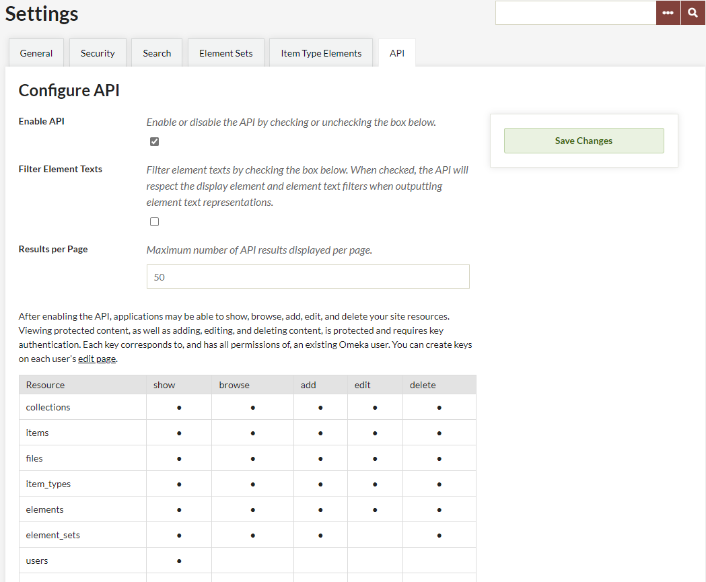
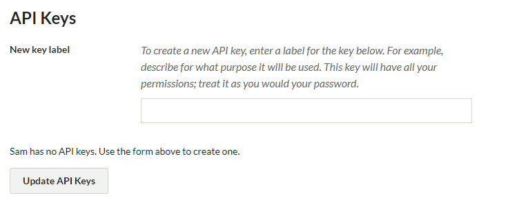

# API Settings

Versions 2.1 and above include an API ([application programming interface](http://en.wikipedia.org/wiki/Application_programming_interface){target=_blank}) that gives site administrators the opportunity to make their item, collection, tags, and exhibit data visible and usable by outside applications.

Some online collections are making their data available through APIs, such as the [Digital Public Library of America](http://dp.la/info/developers/codex/){target=_blank} and the [Brooklyn Museum](http://www.brooklynmuseum.org/opencollection/api/){target=_blank}, among others. APIs make your collections more accessible, and also contribute to the long-term sustainability by making it easier for your Omeka Classic data to communicate and be shared with other systems via web-based protocols.

### Enabling the API 
Superusers can choose whether to enable the API in the API tab under Settings in the top navigation of the Admin dashboard.

-   By default the API will be enabled, but you can un-check the box if you wish to disable the API.
-   Super users may also adjust the number of results per page (default: 50).

Plugins can also make their data available via the API. The chart shows what resources and actions can be performed via the API. In the screenshot, you can see that in addition to data about items,
collections, tags, etc. being available via the API, the Exhibit Builder plugin is also installed, and that information about exhibits and individual exhibit pages is exposed through the API.

### API Keys and Permissions

Permissions to modify any data are only given to existing users of your Omeka Classic site who have been given a key by an administrator. See more information on users at [Users](../Users.md).

The same permissions by role apply to the API, so users with the “researcher” role will not be able to do anything through the API that they cannot do through the regular admin interface. Users with admin or super levels can obtain keys that could allow their applications to show, browse, add, edit, and delete your site resources. Be careful when generating API keys.

The chart shows only what is possible via the API. So, for example, it shows that it is possible to delete an item via the API, if the user has sufficient permissions. However, even a super user interacting with the API will not be able to add or delete users.

- To give a user an API key, click on the Users tab in the top navigation bar when logged into the Omeka admin.
- Find the user, and click on *edit* for their profile.
- Click "API Keys" in the tabs at the top of the page.
- Give the new key a label (best practices are to describe how it will be used). Then click the green *Update API Keys* button.

- The page should reload with an API key generated.
