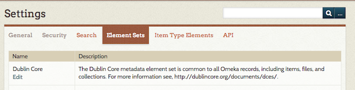
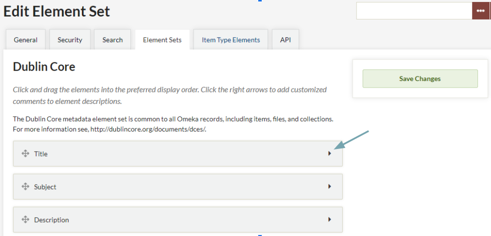
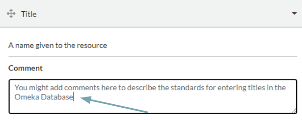

# Element Sets

Element Sets are standardized metadata categories that enable you to consistently classify, identify, and sort the digital resources in your Omeka Classic database. Element Sets include such things as Dublin Core metadata fields, enabling you to classify the items in your installation according to international standards.

Note that element sets can contain fields common to all item types, and fields particular to one or several item types. Item types are not bound to one element set (that is, a Dublin Core item type of "Moving Image" is not restricted to elements only from Dublin Core, but can include elements from VRA Core and other element sets). 

To manage your Element Sets in Omeka, select Settings in the top navigation bar. In the Settings screen, choose Element Sets.

You should see a table with the installed element sets on your Omeka Classic installation. Each row of the table will show the Name and Description for the element set. To edit an element set, click the "Edit" button under the element set name. To delete an element set, click the "Delete" button (note that you cannot delete the Dublin Core element set). 

You may wish to deactivate or uninstall a plugin that adds element sets to this page, rather than simply deleting them from the installation. Depending on the plugin, uninstalling it may leave information in these fields, which you can then delete from this page.

To add more standardized element sets to your installation, review our plugin offerings. Two common ones are VRA Core and PBCore. 

Other plugins also add metadata fields to this list, such as PDF Text, which creates a new field for holding the text extracted from files. 

These element-set names can display on public pages when viewing an item that uses any of their fields. This is the ["Show Element Set Headings" setting on the "Appearance" page's "Settings" tab](../Appearance/Appearance_Settings.md#display-settings). You can enable or disable this display.

Annotate elements
------------------------------------------------------

You may customize descriptions of element set metadata through adding comments to metadata fields. These comments will appear to logged-in users when editing an item, and can help give guidance on how to use a given field. Comments will not appear on your public site. 

To add comments to the metadata field descriptions, click on the arrow to the right of the name of the Dublin Core metadata element. Add your comment in the field below. Don't forget to save your changes.

Reorder fields
-------------------------------------------------------------

You may arrange the order in which the fields appear on your site.

To arrange the order in which the Dublin Core metadata fields appear on your site, mouse over the name of each element. Your mouse icon will become a hand. Click on the name of the element and drag and drop it to create an order appropriate for your Omeka database. Don't forget to save your changes.
