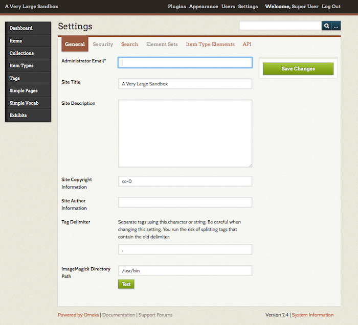

# General Settings

Find the general site settings by clicking on the Settings button in the top navigation bar of the admin view. Settings are only accessible by Super Users.

In the General Settings tab, you may edit the fields you filled in when you installed your site, and add other information.

The fields are as follows

-   **Administrator Email**: Address entered will send emails to new users, when created. This address will be the "from" in any administrative emails sent from the page. 
    - Some hosting providers may require this email to match your domain (you@yoursite.org).
-   **Site Title**: Appears as the name of your site on the homepage.
-   **Site Description**: Description text appears in the website's `head` tags, but is not published on the homepage.
-   **Site Copyright**: Fill in this text box if you wish for it to appear in the footer. Then, when configuring your theme, check the box to display copyright in the footer.
-   **Site Author Information**: Names of contributors to the website appears in the website’s `head` tags, but is not published on the homepage.
-   **Tag delimiter**: If you wish to separate tags by a space or a character other than a comma, specify in the Tag Delimiter field.
    - Be aware that if you change the setting after tags have been created, you run the risk of splitting tags. For example, if you have tags with hyphens already in them, such as "stone-age", changing the tag delimiter to a "-" may make those items tagged with "stone" and "age" instead. 
-   **ImageMagick Directory Path**: If you are receiving ImageMagick errors, click the Test button here to be sure that the path to its directory is properly routed. Some hosting services may also need you to enter this manually after installation. 