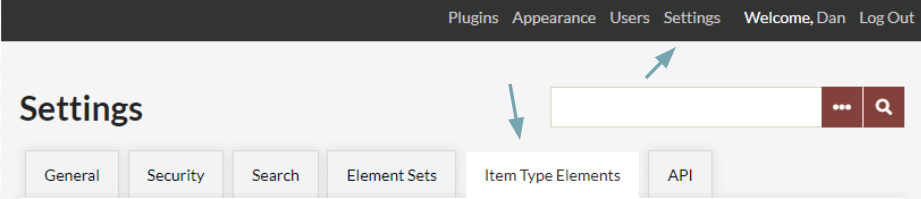
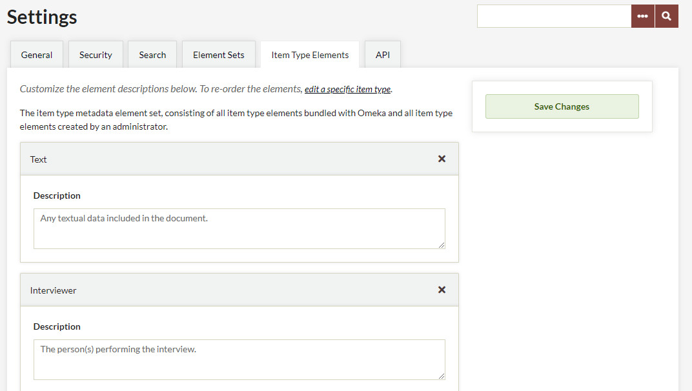
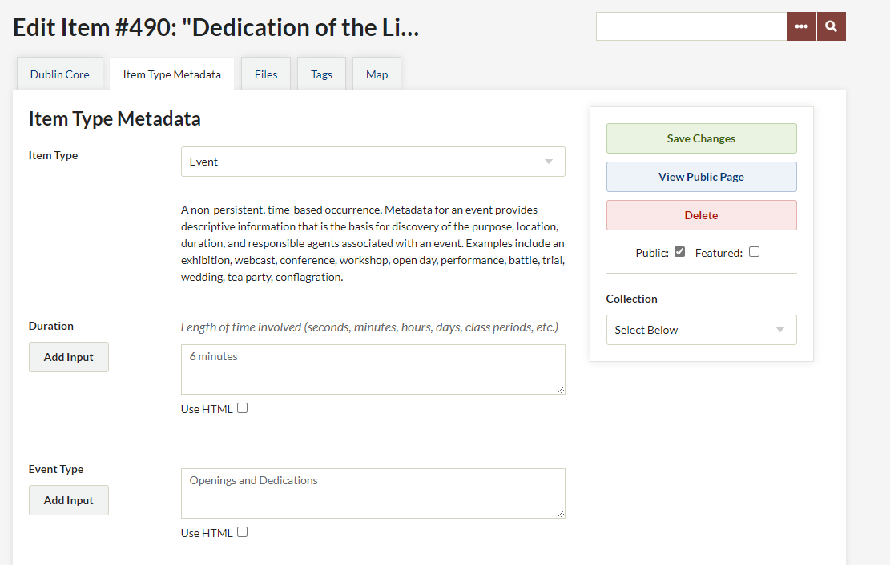

# Item Type Elements

<!--- The Item Types page has a subsection on elements there already and this seems mostly redundant. --->

Item Type Elements enables you to manage all the metadata fields associated with each [item type](../../Content/Item_Types.md) available in your site, e.g. Still Image, Oral History, Document.

You can add new item type elements or change the description of existing elements.

Add New Item Type Elements
------------------------
You can create a new Item Type Element when [editing](../../Content/Item_Types.md#edit-an-existing-item-type) or [creating](../../Content/Item_Types.md#creating-a-new-item-type) Item Types, through the Item Types tab on the left-hand navigation of the Admin dashboard. 

Edit Item Type Element Descriptions
-----------------------------------
From the Item Type Elements sub-tab of Settings page, you can add information about the content, the use, or the style of these fields. Please note that this is only accessible for Super Users.

To manage Item Type Elements, select Settings in the top navigation bar (marked with a 1 in the image above). Once the General Settings page loads, click the Item Type Elements sub-tab (marked 2 in the image above).

The Item Type Elements sub-tab should load with blocks for every Item Type Element in your site. Each block shows the label for the element (in the top of the block) followed by a description field which you can edit.

Enter any information about the Item Type Element here. This description will accompany any Item Type utilizing the metadata field you have just edited. Don't forget to Save Changes when you have finished.

To view your changes, select Item Types in the left hand navigation and select any Item Type containing the element you have just edited by. You can also see these changes by editing or creating a new item and using the Item Type containing that element (see image below for an example).

