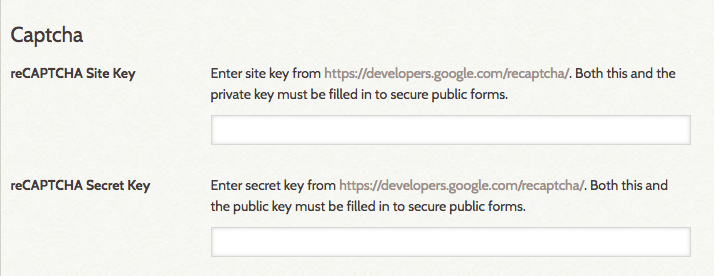

# ReCaptcha

A captcha is a program that can help ensure that only actual people, not spammers or robots, are using particular parts of your site. [reCAPTCHA](https://www.google.com/recaptcha/about/){target=_blank} displays an image of two words and asks the user to type them in before continuing.

Omeka Classic versions 1.3 and higher have built-in support for reCAPTCHA, a free captcha service from Google. Several Omeka plugins that used to handle captchas individually now all use Omeka's built-in support.

Configuring
---------------------------------------------------------------
In order to enable reCAPTCHA for your plugins, you need to do a little configuration.

- Go to [https://www.google.com/recaptcha/](https://www.google.com/recaptcha/){target=_blank} to sign up for a ReCaptcha key. Note that you will need to sign in with a Google account to acquire a reCATPCHA key.
- In the "register a new site" box, enter the url for your Omeka site and select the reCAPTCHA version you want. For more information, see [the reCAPTCHA documentation](https://developers.google.com/recaptcha/docs/versions){target=_blank}.
- You will need two keys for your Omeka site: a site (public) key and a secret (private) key.
	- Once you have registered the site, you should see a section called "Keys" under the heading "Adding reCAPTCHA to your site". This displays both the site and secret keys.
	- Either copy your keys to a secure location or leave this page open in one window and return to your Omeka installation in a new window.

 

- Return to you Omeka Classic admin dashboard and Settings in the top navigation.
- From Settings, go to the Security tab and scroll down to the Captcha section.

- In the fields provided, enter your site/public and secret/private keys (copy and paste should work).
- Be sure to click the green Save Changes button on the right hand side of the screen!

Plugins that use reCAPTCHA
---------------------------------------------------------------
The following plugins use Omeka Classic's reCAPTCHA support, and configuring reCAPTCHA as explained above should enable captchas for all of them:

- [Commenting](../../Plugins/Commenting.md)
- [Contribution](../../Plugins/Contribution.md)
- [Simple Contact Form](../../Plugins/SimpleContactForm.md).

Please make sure you are using the latest version of these plugins.

