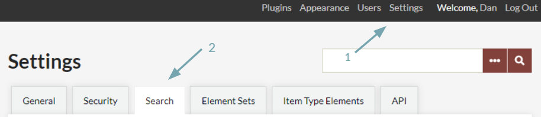
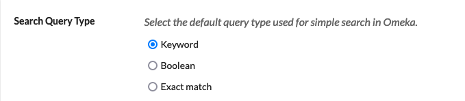
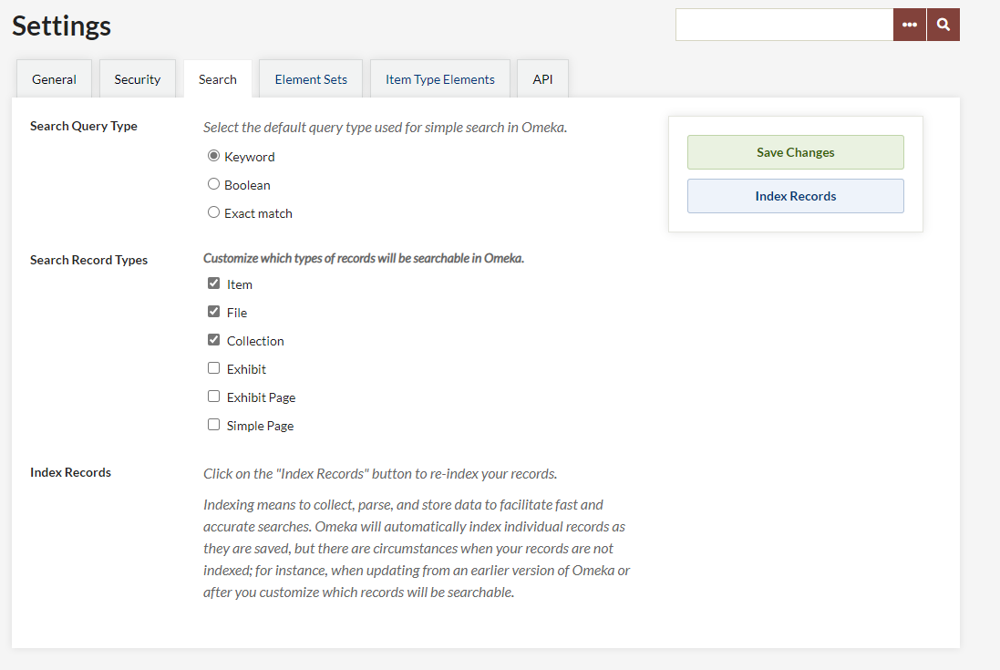

# Search Settings

This is information for managing your search settings on Omeka Classic. See [the Searching page](../../GettingStarted/Searching.md) for information on conducting searches.

The Search Settings options allow you to set which types of records are automatically searched when a user enters terms into the basic search bar on both the admin and public sides. You can also re-index your Omeka database to ensure that all selected content is searchable.

Access the Search Settings tab by going to the Settings link in the top navigation (1) and then clicking over to Search (2):

*Arrows labelled as above point to the tabs.*

## Search Query Type
An Omeka Classic Super Administrator account may specify the type of search query that runs when users interact with the simple search: Keyword, Boolean, or Exact match. 

*Search settings page, with Search Query Type selection active for Keyword.*

These options are explained on the [Searching page](../../GettingStarted/Searching.md#search-options) of this manual. 

## Select Record Types

You may choose which record types you wish to be searchable: items, collections, files. Remember that each of these types of content can have their own metadata text. 

*Search settings page, with Item, File, and Collection checkboxes active.*

Using the checkboxes found to the left of each record type, choose which ones you want discoverable by the site-wide search. 

The basic options are: 

- Item
- File
- Collection.

Additionally, if you are using the Simple Pages and Exhibit Builder plugins you may make that content available:

- Simple Page
- Exhibit
- Exhibit Page. 

Other plugins may also make their content available for searching, such as "User Profiles".

Please note that the "Exhibit" record type includes exhibit descriptive information, and an "Exhibit Page" is the actual content of the exhibit.

Be sure to save your changes if you check or uncheck boxes. 

Once records types are selected, searchers use the ellipsis button to choose from the options you have provided, in both admin and public site-wide searches.

## Indexing 

Indexing means to collect, parse, and store data to facilitate fast and accurate searches. Omeka Classic will automatically index individual records as they are created and saved. Re-indexing is necessary when updating from an earlier version of Omeka or after you customize which records will be searchable.

Click on the "Index Records" button to re-index your records.

