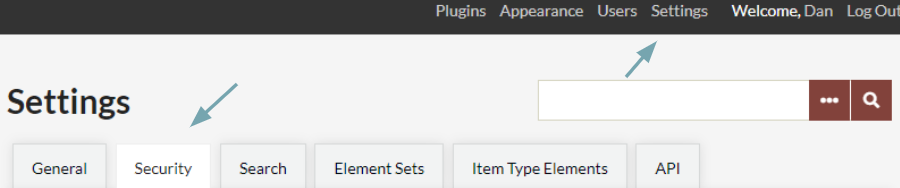
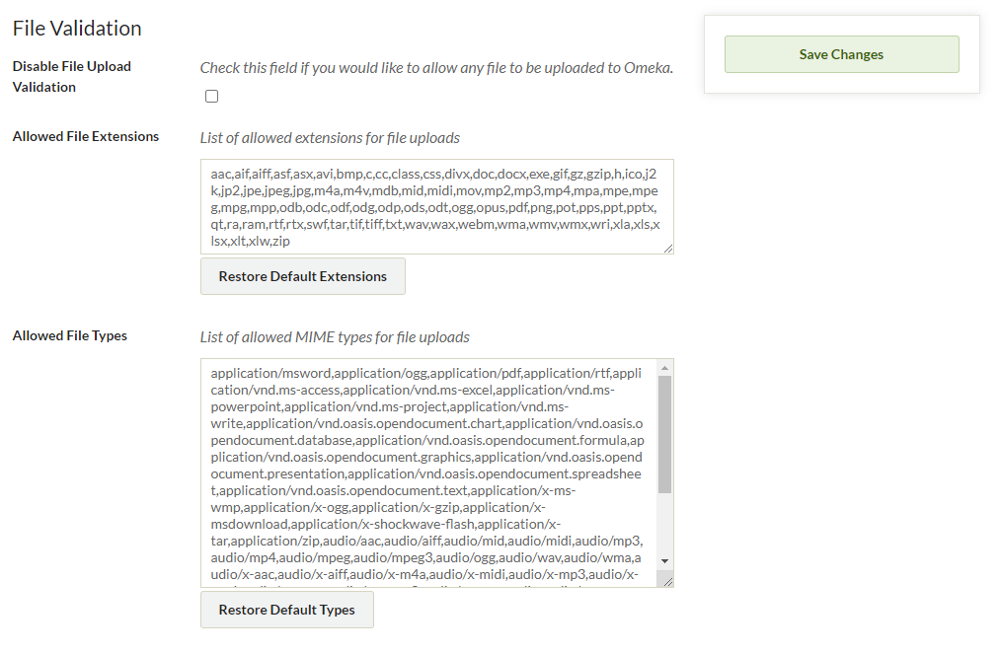
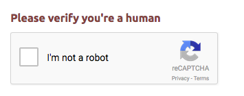
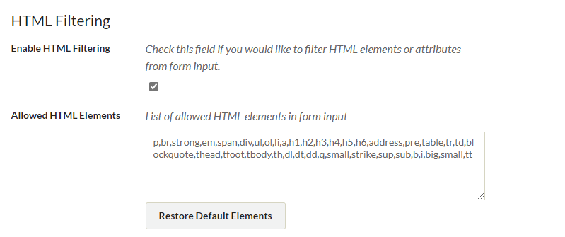

# Security Settings

To manage Security Settings, select Settings in the top navigation bar.

In the Settings section, choose Security. Only Super users may edit these settings.

Security settings enable you to determine the file formats and html markup allowed on your Omeka Classic site and to set Captcha controls to protect your site from automated spam.

The Security Settings page is divided into three sections: File Validation, Captcha, and HTML Filtering.

File Validation
-------------------------------
This section sets the rules for the files which can be uploaded to the Omeka Classic site. 

The **Disable File Upload Validation** box is unchecked by default. Leaving the box unchecked allows you to limit file uploads to specific extensions and Mime Types.

Checking this box allows upload of any file type to the Omeka site.

The **Allowed File Extensions** field designates the allowed file extensions for upload, provided the Disable File Upload Validation box is unchecked. 

-   The default list contains the most common file extensions. Only files with extensions included in this list may be uploaded to the Omeka site.
-   You may add or delete file extensions. Be sure that each file extension is separated by a comma.
-   You may restore the original listing of file extensions by clicking on the Restore Default File Extensions button. After you restore default listings, however, an Undo button allows you to reconsider and revert to your changes.

The **Allowed File Types** list contains common Mime Types associated with different types of files. Only Mime Types included on this list may be uploaded to the Omeka site (unless the Disable File Upload Validation box is checked).

-   If a Mime Type is not allowed, an error message results, e.g. "file could not be ingested because it has a disallowed MIME type (application/download)." Copy the Mime Type, in this case, `application/download`, and add it to the list of allowed File Types, separating each addition with a comma. Click Save Changes in the right hand navigation column.
-   You may restore the original listing of file types by clicking on the Restore Default File Mime Types button. After you restore default listings, however, an Undo button allows you to reconsider and revert to your changes.

Remember to press the Save Changes button.

reCAPTCHA
-----------------------------------------------------
reCAPTCHA is an option to reduce spam on your site if you are using a plugins requiring public forms on your Omeka site such as the [Contribution](../../Plugins/Contribution.md) plugin and [Simple Contact](../../Plugins/SimpleContactForm.md). 

In order to use reCAPTCHA, you will need to [sign up for a Captcha key](http://www.google.com/recaptcha){target=_blank} to reduce spam on your site. Once you sign up, you can enter your site and secret keys in their respective fields. 

The [reCAPTCHA page](ReCaptcha.md) has more detailed instructions for implementing reCAPTCHA.

HTML Filtering
---------------------------------------------------------------

You may choose whether to filter HTML elements and attributes utilized as you fill in forms and metadata fields on your Omeka site.

By default, all HTML elements and attributes are allowed in Omeka Classic when the box "Enable HTML Filtering" is unchecked.

If you would like to limit the use of HTML, place a check in that box. When you enable HTML filtering, only elements listed in the "Allowed HTML Elements" and the "Allowed HTML Attributes" fields will function on your site.

You may add or delete HTML elements and attributes in the "Allowed HTML Elements" field.

The "Restore Default Elements" button will return your allowed elements or attributes to the original listing. To revert to your edited selections, click the Undo button.

Remember to click Save Changes in the right hand navigation column when you have finished.

