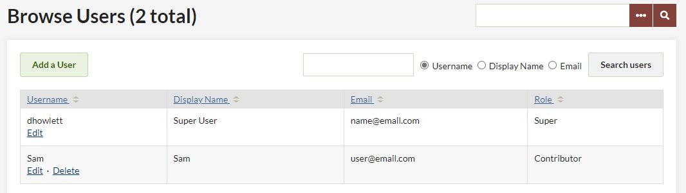
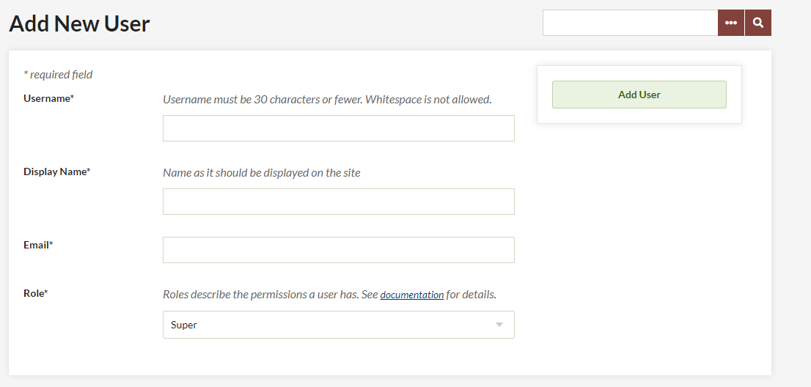
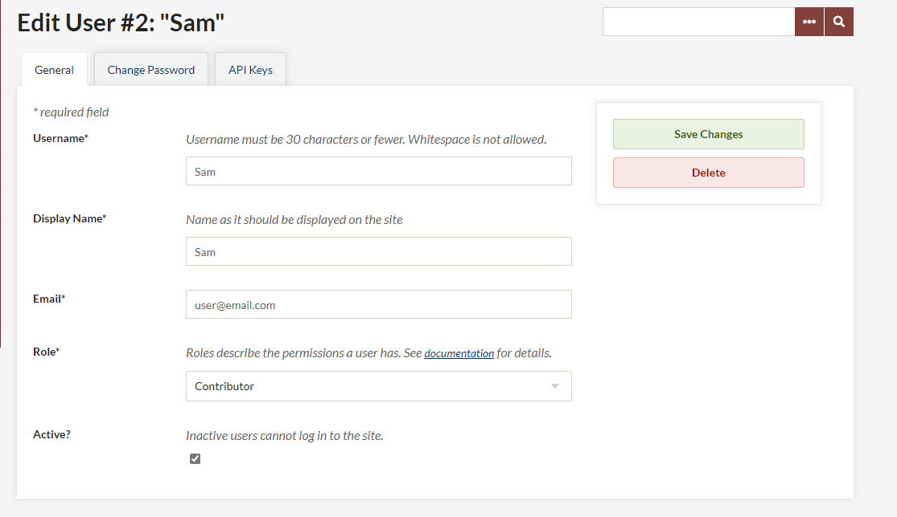
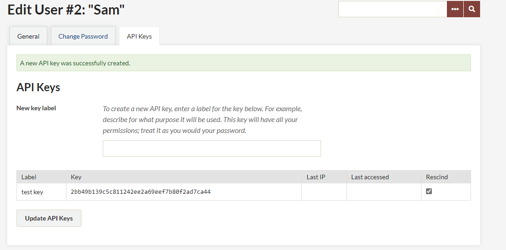

# Users

The Users section allows the Site Administrator to control who may access the admin section of the site and what they can do. You may add, delete, and assign categories of your users.

Manage users by clicking on the Users tab in the top navigation of your admin dashboard.

The Browse Users screen shows the number of users, as well as the username, display name, email, and role for each user. The table displaying users can be sorted by any of those values. From this page, you may edit user information, delete users, or search existing users.

To sort users, simply click on the column heading by which you would like to sort. If you want to sort descending rather than ascending, click twice on the heading. The small paired arrows beside the column heading indicate whether the sort is ascending (top arrow darker) or descending (bottom arrow darker).

You can search users by username, real name, or email address. Username and real name searches can include complete words or partial strings; for example, you could search for any username containing “jam.” Email searches only function with a complete email address.

User Levels and Access
------------------------------------------------------------

Omeka Classic allows you to give different backend users different levels of access to your archive. Read through the following list of actions available to users to determine what works best for your project team members.

All logged-in Super, Admin, Contributor, and Researcher users on each site can view non-public content (items, collections, Simple Pages, Exhibits, etc.) on the site.

**Super Users**  

-   Can do anything and everything in Omeka.
-   Supers are the only users with access to the top navigation tabs for Plugins, Appearance, Users, and Settings. 

**Admin Users**  

Admin users do not have access to the tabs for managing plugins, appearance, users, or site settings.

Admin users can:

- Add, edit, tag, and delete items, both their own and created by other users.  
- Make items, collections, exhibits, and other content public or not public.  
- Make items, collections, exhibits, and other content features or not featured.
- Add, edit, and delete Item Types. 
- Add, edit, and delete files.
- Interact with plugins installed and activated by a SuperUser.
- Add, edit, and delete tags. 

**Contributor Users**   

Contributor users have control over their own content but can only view content created by others. They cannot make their own content public. 

Contributor users can:
  
- add, edit, tag, and delete items which they created.
- cannot make their own items public.
- create their own exhibits from items that are public.

**Researcher Users**

Researchers can log in to the admin side of an Omeka site and see the content, but cannot interact with it in any way. They cannot add, edit, delete, or tag any items. 

Add a User
-------------------------------------------------------------

To Add a User, select the green button in the upper left hand corner.

-   Fill in the fields for the new user. Assign a role to the user, and click the green Add User button below the form. 
-   The new user will receive an email at the address you provide with their username and a link that takes them to a form to create a password. Until the new user activates his/her account, and inactive status appears after the Username.
-   To edit user information, including changing passwords, Super and Admin users may click on the "edit" button on the right side of the username.

Edit Users
----------------------------------------------------------------
To edit a user, click on the word Edit beneath the username in the Browse Users page. This will direct you to a new page with tab options labelled General, Change Password, and API Keys.

On the General tab you can edit the username, display name, email, and role of the user. You can also toggle whether a user is active or inactive. Inactive users are not deleted, so the items, collections, and tags created by that user remain associated with their account, but the individual can not longer log into the site to make changes or create new data.

The Change Password tab requires you to enter a new password twice, but does not require the user’s original password.

To add an API key for a user, enter text for a label for the key in the field provided and then click “Update API Keys.” An API key will be generated and added to the page. To remove a key, click the checkbox in the Rescind column of keys.

Note: you must save changes before switching tabs.

Delete Users
----------------------------------------------------------------

Find the user you wish to delete from `/admin/users/browse`, and click the "delete" button found beneath the username. You will be asked to confirm the action before you permanently delete the user. Items, collections, and tags created by this user will remain in the system, but will no longer be associated with this user.
