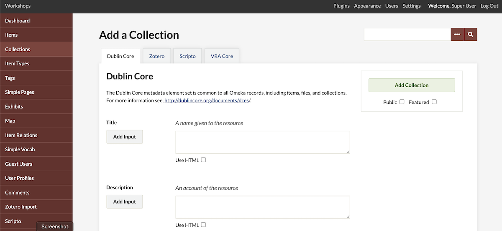
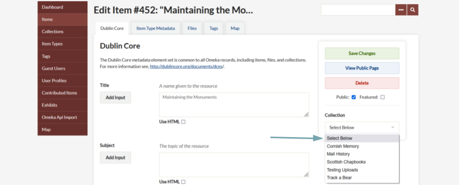
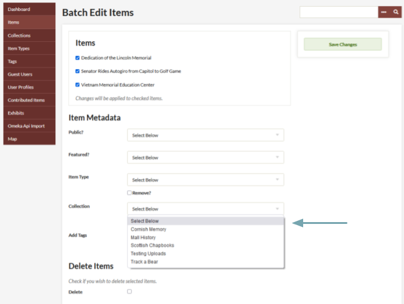

# Collections

Collections are groups of Omeka items. Collections may be used in a variety of contexts that make the most sense for your archive.

In Omeka Classic, an item can only belong to one collection. Collections can, of course, have multiple items. The concept of Omeka collections originates from museum and archives collections; one cannot put a document into more than one box. It is not necessary to follow a traditional interpretation of a collection, say by owner or donor. 

Collections have no hierarchy, unless you install the [Collection Tree plugin](../Plugins/CollectionTree.md) in order to have a nested collections.
You can also use [tags](Tags.md) to organize similar items into categories.

Create a Collection
-----------------------------------------------------------
1.  Click on the "Collections" tab in the left navigation bar from the Dashboard. Any collections you have created will be listed on the `admin/collections` page.
2.  To create a new collection, click, "Add a Collection.".
3.  You may assign a full complement of Dublin Core metadata to any collection, or simply create a title and description.
4.  To make your collection public, check the "Public" box under the "Add Collection" button. Likewise, to feature your collection, check "Feature."
5.  When you are finished adding metadata, clicking "Add Collection."

Now that you have created a collection you may associate an item with this collection, from the `items/add` or `items/edit` pages. Read more below.

Adding Items to Collections
-------------------------------------------------------------

To add items to collections, you must first create the collection. See the [Items documentation](Items.md) to read more about associating an item with a collection. An item may only belong to one collection a time. You may switch an item from one collection to another at any time.

Items can only be added to a collection from the Item's edit page or the browse items page.

From the item edit page, use the dropdown menu on the right hand side, under the "Save Changes" button, to select a collection.

From the "Browse Items" page, you can use the batch edit option to add multiple items to a collection, again using a dropdown menu to select the existing collection.

Edit a Collection
---------------------------------------------------------------

To edit a collection, click the Edit link underneath the title from the Browse Collections page, at `/admin/collection`. Edit in any fields you wish, and click the "Save Changes" button to the right of the screen.

By default, the most recently added item's primary file will serve as the thumbnail image for the collection. However, if you have installed the [Item Order](../Plugins/ItemOrder.md) plugin, you can choose a different item by making that item the first in the collection.

Browsing Collections
---------------------------------------------------------------

By clicking the Collections tab, you may browse through the collections in your archive. They are listed with very basic metadata: Title, Contributors, Date Added, and Total Number of Items. You may sort collections by clicking Title or Date Added.

