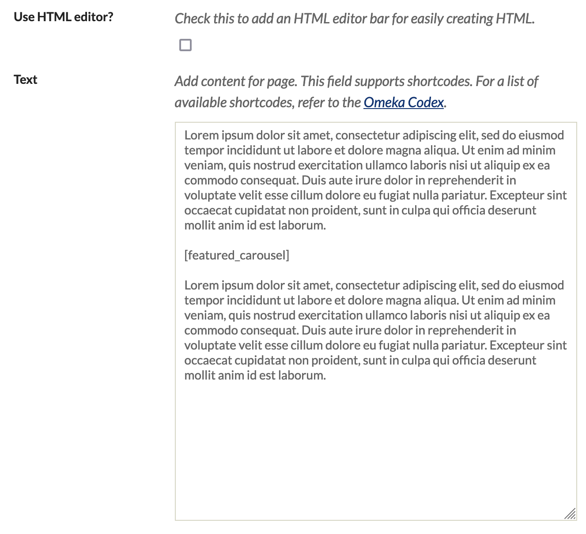

# Shortcodes

A shortcode is a snippet that can be included in any body of text that works like embedding a multimedia object: a shortcode can insert an image, a video, a timeline, a form, or something else interactive or dynamic. 

In Omeka, shortcodes work in basic text fields (not using the HTML editor) in specific places on Omeka Classic sites: on [Simple Pages](../Plugins/SimplePages.md), and on [Exhibit pages](../Plugins/ExhibitBuilder.md). 

There are several built-in shortcodes that come with a basic Omeka install, and many more shortcodes that are added via plugins. You must install the needed plugin and follow its directions for use. 

!!! Note 
    This page is a user’s guide to shortcodes. For help with developing shortcode functionality through plugins, see [Working with Shortcodes](http://omeka.readthedocs.org/en/latest/Tutorials/shortcodes.html){target=_blank} on Omeka’s Developer Documentation site.

General
--------
Shortcodes can be added into text fields on **pages**. You cannot put a shortcode into the "Footer Text" field or the "Homepage Text" field in your theme. The general syntax in a text field would look like this:

```
Lorem ipsum dolor sit amet, consectetur adipiscing elit. 
[shortcode key=value]
Ut enim ad minim veniam, quis nostrud exercitation ullamco laboris nisi ut aliquip ex ea commodo consequat. 
```

Values can be wrapped in single or double quotes, making the following variations valid as well: `[shortcode key='value']` or `[shortcode key="value"]`. 

**Shortcodes will not work with smart/curly quotes** (“ and ”). 

When using shortcodes on a Simple Page, do not use the HTML editor. Put the shortcode in the basic text field:



<!--- replace this image with spellcheck turned off --->

When using a shortcode in an Exhibit Builder block, place the code directly into the text editor:


If the shortcode results in an image being displayed (from an item or file), the shortcode will display the filename or the file's Dublin Core title field as the `alt` text, and as the `title` (which appears when a user hovers the mouse over the image). You may wish to edit the file title with this in mind.

### To Find an Item or File ID

To find an item ID, go to the Items page. You can hover over each item title in turn to view its URL at the bottom of your browser, or click on the link, and look at the number that appears at the end of the URL; for example `https://youromekainstallation.com/admin/items/show/482`.

To find a file ID, navigate to the admin page for the item it is attached to. At the top of the Item page is a thumbnail display of the files associated with that item. Clicking on one will bring you to the file page; for example `http://youromekainstallation/omeka/admin/files/show/752`. 

At the top of the page is a header containing the file ID \# and file title; for example File \#752: "The File Title". The integer following the \# sign is the ID; in this instance it would be 752. To return this file, the shortcode would be `[file id=752]`.

Built-in Shortcodes
--------


<!--- could be reordered, alphabetically or by something else --->

The following short codes are built in to Omeka versions 2.2 and higher. For more guidance on the options and parameters, [see the table below](#shortcode-options).

### Recent Items
The recent items shortcode returns a list of items most recently added to the database.

The shortcode is `[recent_items]`. Without any parameters, it will return five items.

Options:
- `num` to define a different number of items to display (default is 5).

### Featured Items
The featured items shortcode returns a set number of items marked in the admin as featured.

The shortcode is `[featured_items]`. Without any parameters, it will return one item at a time.

Options:

- `num`
- `has_image`

### Items
The items shortcode returns one or multiple items.

The shortcode is `[items]`. Without any parameters, it will return a list of the oldest 10 items in your archive.

Options:

- `num`
- `ids`
- `is_featured`
- `collection`
- `item_type`
- `tags`
- `user`
- `has_image`
- `sort`

Examples:

To return a single, random item from a set of items tagged "baseball". 

`[items num=1 tags=baseball sort=random]`

To return a list of five most recent items added by the user with the id 3. 

`[items num=5 user=3 sort=added order=d]`

To return all of the items tagged "baseball" from the collection with the id 5, sorted by title (ascending). 

`[items num=0 collection=5 tags=baseball sort="Dublin Core,Title" order=a]`

### Collections
The collections shortcode returns one or multiple collections.

The shortcode is `[collections]`. Without any parameters, it will return a list of the oldest 10 collections.

Options:

- `num`
- `ids`
- `is_featured`
- `sort`

### Featured Collections
The featured collections shortcode returns a number of collections marked as featured.

The shortcode is `[featured_collections]`. Without any parameters, it will return one collection at a time.

Options:

- `num`

### Recent Collections

The recent collections shortcode returns a list of the most recent collections created.

The shortcode is `[recent_collections]`. Without parameters, it will return five collections.

Options:

- `num`

### File
The file shortcode will return a file of a specified ID.

The shortcode is `[file id=#]`. It will not function if it is not provided a file ID.

Options:

`id` (*required*): specify the ID number of the file you wish to retrieve. E.g. `[file id=362]`

`size`: specify the image size for image files. Values are:

- `thumbnail` - thumbnail version of the image
- `square_thumbnail` - a squared and centered thumbnail of the image
- `fullsize` - the fullsize version of the image

`link_file`: specify whether to link the file to its file show page; default is ‘1'. Values are:

- `1` or `true` - links to the original file 
- `0` or `false` - removes all links to the file 
- `thumbnail` - links to the thumbnail file
- `square_thumbnail` - links to the square thumbnail file
- `fullsize` - links to the fullsize file

`width`: specify the pixel width of the audio or video player; available for most audio and video types; defaults vary.

`height`: specify the pixel height of the audio or video player; available for most audio and video types; defaults vary.

Examples:

To return a thumbnail of an image, that links to the original file, with the file ID of 5:

`[file id=5 size=thumbnail]`

To return a square thumbnail of an image, that links to the fullsize image, with the file id of 12:

`[file id=12 size=square_thumbnail link_file=fullsize]`

### Shortcode Options
Most shortcodes have options that will modify the content they return. The following table explains some of the options which are shared across multiple shortcodes. 

| Option | Purpose | Settings | Example |
| --- | --- | --- | --- |
| `num` | Specify the number of items returned | Must be a whole number | `[recent_items num=10]` |
| `has_image` | Can be use to require that the called item have an image | `True` (return items with images) or `False` (return only items without images) | `[featured_items has_image=false]` |
| `ids` | Return an item or a list of items by item IDs | Multiple items separated by comma, or a range separated by hyphen. | `[items ids=10,76,432]` `[items ids=30-55]` | 
| `is_featured` | Specify whether to return only items that are featured or not featured | `1`: Featured; `0`: Not featured | `[collections is_featured=1]` | 
| `collection` | Return items only from a specific collection, using the collection ID number | Only one collection may be specified. | `[items collection=7]` |
| `item_type` | Return only items of a specific [item type](Item_Types.md) | | `[items item_type="still image"]`
| `tags` | Return only items from a specific tag | Multiple tags can be entered,separated by a comma, without any spaces. | `[items tags=baseball,math]` |
| `user` | Return only items added by a specific user, using the user ID number | Only one user may be specified. | `[items user=3]` |
| `sort` by Elements | Specify the element with double quotes, no space after comma | The syntax is `"Element Set,Element"`| `[items sort="Dublin Core,Title"]` |
| `sort=added` | Sort by date added | | `[items sort=added]`|
| `sort=modifed` | Sort by date modified | | `[items sort=modifed]`|
| `sort=random` | Randomly choose from the set of returned items | | `[items num=1 collection=3 sort=random]`|
| `sort` option `order` | Specify the order of the sorting | Note: order requires a sort value to have been specified. `a`: ascending; `d`: descending | `[items num=5 sort=added order=d]` |

## Plugin Shortcodes

### Exhibit Builder
These shortcodes require the [Exhibit Builder](../Plugins/ExhibitBuilder.md) plugin.

#### Exhibits
The exhibits shortcode will return one or multiple exhibits.

The shortcode is `[exhibits]`. Without parameters, it will return ten exhibits, beginning with the oldest one.

Options:

- `num`
- `ids` 
- `is_featured`
- `sort` by 
  - `title`
  - `random`
  - `added`
- `order` (with sort)

Exhibit IDs can be found at the end of the Edit page url for an exhibit; e.g. yoursite/admin/exhibits/edit/11 -the exhibit ID is 11.

#### Featured Exhibits 
The featured exhibits shortcode will return one or multiple exhibits that have been marked as featured.

The shortcode is `[featured_exhibits]`. Without parameters, it will randomly return one exhibit from all of the ones marked as featured.

Options:

- `num`

### Geolocation
The [geolocation](../Plugins/Geolocation.md) shortcode will create a Google map of items based on parameters it is given.

The shortcode is `[geolocation]`. Without parameters, it will return a map of all items that contain geolocation data, limited by the records per page as set in the Geolocation plugin configuration.

Options:

`fit`: specify whether to allow the Google map to automatically center and zoom the map to fit all of the markers. This is on by default.

To manually specify the map/location zoom, use the following options. Note, to use these options, fit must be set to `0` or `false`.

`lat`: specify the latitude of the map’s initial center point, in degrees. Must be between -90 and 90.

`lon`: specify the longitude of the map’s initial center point, in degrees. Must be between -180 and 180.

`zoom`: specify the initial zoom level of the map. 0 is the most zoomed out.

If any of `lat`, `lon`, or `zoom` are not specifically set, and ‘fit' is set to `0` or `false`, the settings from the Geolocation plugin configuration page will be used.

`type`: specify the type of google map that appears. Defaults to the setting from the Geolocation plugin configuration page. Values are:

- `roadmap` - displays the road map view
- `satellite` - displays Google Earth satellite images
- `hybrid` - displays a mixture of road map and satellite views
- `terrain` - displays a physical map based on terrain information.

`collection`: limits the map’s items to those from a specific collection, using the collection ID number. Only one collection may be specified. For example: `[geolocation collection=5]`.

`tags`; limits the map’s items to those from a specific tag. Multiple tags can be entered, separated by a comma, and without any spaces. For example: `[geolocation tags=baseball,math]`.

`height` set the map height. Can be set in pixels or percentages, but requires specification with either px or %; defaults to 436px. For example: `[geolocation height=300px]` or `[geolocation height=50%]`.

`width`: set the map width. Can be set in pixels or percentages, but requires specification with either px or %; defaults to 100%. For example: `[geolocation width=200px]` or `[geolocation width=75%]`.

Examples:

To print a map of all geotagged items, simply use: `[geolocation]`.

For a map that gets all of the items from your first collection, that are also tagged ‘baseball'. Ex. `[geolocation collection=1 tags=baseball]`.
 
A shortcode that leveraged all of the possible parameters would look like `[geolocation lat=42 lon=117 zoom=7 type=hybrid collection=4 tags=baseball,math,oakland height=500px width=500px]`.

### Shortcodes Carousel

Requires the [Shortcode Carousel plugin](../Plugins/ShortcodeCarousel.md).

The plugin adds a shortcode to create a carousel of items using [jCarousel](http://sorgalla.com/jcarousel/){target=_blank}.

The basic shortcode is `[carousel]`.

`[recent_carousel]` and `[featured_carousel]` are shortcuts to creating a carousel of recent and featured items, respectively.

The same [options available for the Items shortcode](#items) are available for the carousel, with the exception that `has_image` is always assumed to be true.

Options:

`speed` sets the speed for the scrolling animation. May be "fast", "slow", or a time in milliseconds. Default is 400. For example: `[carousel speed=slow]` or  `carousel speed=500]`.

`autoscroll`: setting autoscroll=true will make the items automatically scroll interval. When autoscroll is on, interval sets the interval between scrolling in milliseconds. Default is 3000. For example: `[carousel autoscroll=true interval=700]`.
