# Tags

Tags are keywords or phrases that create links to describe a piece of data. They are non-hierarchical labels that classify your content so that it is easily found - textual metadata values without an associated metadata field. You can add tags to [items](Items.md) and [exhibits](../Plugins/ExhibitBuilder.md).

You can watch the following video to learn more about adding access points to your Omeka items with tags:

<iframe src="https://player.vimeo.com/video/102040465?h=00bd26943c" style="position:absolute;top:0;left:0;width:100%;height:100%;" frameborder="0" allow="autoplay; fullscreen; picture-in-picture" allowfullscreen></iframe>

<a href="https://vimeo.com/102040465">Omeka Classic: Managing Collections and Tags</a> from <a href="https://vimeo.com/omeka">Omeka</a> on <a href="https://vimeo.com">Vimeo</a>.

Browse Tags page
---------------

To manage your tags, select "Tags" from the left-hand navigation bar of the Omeka Classic administrative interface. This page display all the tags associated with records in your Omeka Classic installation. You may edit and delete tags, sort tags, and view items associated with individual tags.

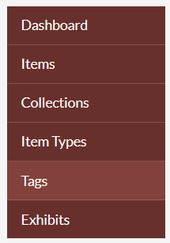

The "Browse Tags" page displays an explanation of the tag display. 

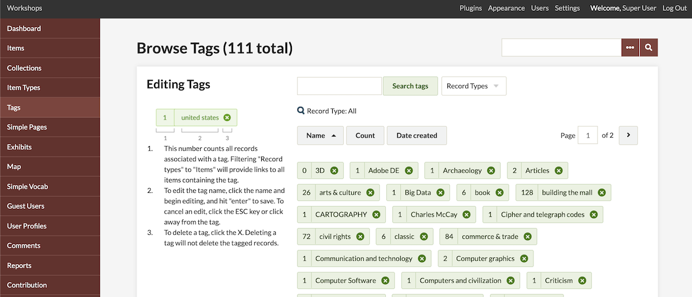

Each tag used on your site appears as a unit which gives you the following (per the number labels in the above image): 

1. The number of items with that tag
2. The text value of the tag
3. The option to delete the tag.

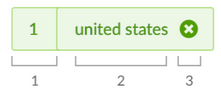

Next, the "Browse Tags" page displays a list of all tags used in your installation. This includes tags that are not currently associated with any items. The list includes options for sorting and searching your tags. 

### Sort tags
There are four button options for sorting the tags, found above the tag cluster. 

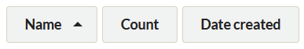

From left to right, they are:

- **Name:** The default sort for tags; sorts in alphabetical order (A-Z) by tag name. Click again to sort in reverse alphabetical order (Z-A) (the arrow will point down).
- **Count:** Initially sorts tags by number of associated records with the largest number first. Click again, so that the arrow which appears next to it points up, to sort with the smallest number occurrences first, including tags with zero current items assigned. 
- **Date Created:** Sorts tags by the dates they were created, oldest tags first. Click again to see newest tags first.

An upward pointing triangle indicates an ascending sort. A downwards pointing triangle indicates a descending sort. 

In addition, there is a drop-down menu to the right of the sort options to limit the tags displayed by **Record Types**.

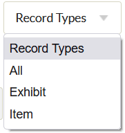

If you have tags on your [exhibits](../Plugins/ExhibitBuilder.md) as well as items, you can narrow down the tags displayed to show only those associated with items or those associated with exhibits.

From the Record Types dropdown, select from the following options:   

- All
- Exhibit
- Item.

Note that if you do not have any exhibits tagged, you will still see the dropdown for Record Types - your options will be "All" and "Items".

When you have restricted display by record type, it will not show up in the dropdown but will display near the top of the page. To reset, either select "All" from the dropdown or click the blue "Reset results" button next to the Record Type message.

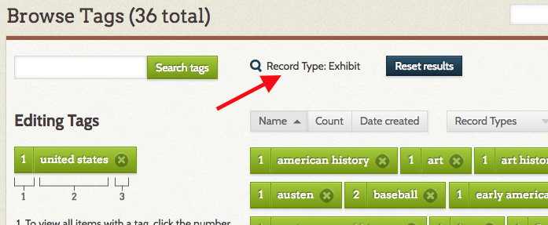

### Search tags
In addition to the site-wide content [search](../GettingStarted/Searching.md), you can search exclusively tags using the "Search tags" field in the upper left of the browse tags page, near the left-hand navigation bar.

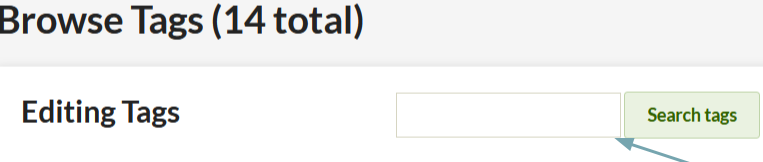

Enter your search terms in this box. This is a broad search for tags containing the search term: a search for "century" will return both "19th century people" and "twentieth century."

Once your search is complete, the search box will appear empty. Your search term is displayed above the tag browse, to the right of the tag search. 

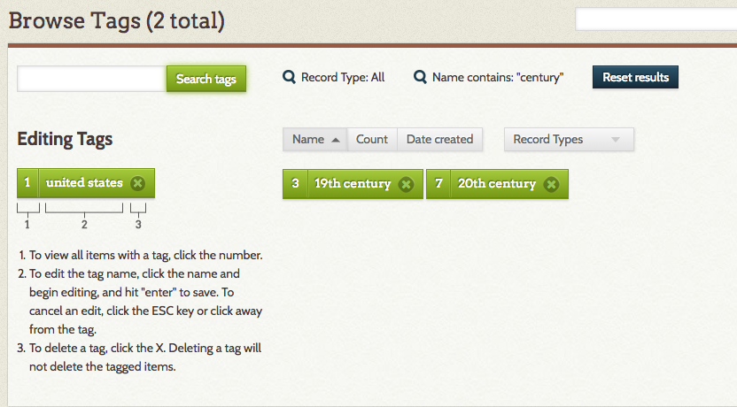

Clear your search terms and return to the default browse by clicking the "Reset search" button. 

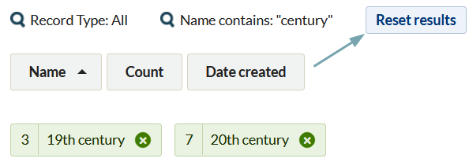

If you have restricted record types to Exhibit or Item tags, the search will return results for those record types only. 

### View tagged items
To view items associated with an individual tag, you need to be viewing only tags associated with Item record types. 

1. From the Record Type filter, choose Items.
2. Find the tag whose items you want to view.
2. Click on the number to the left of the name of your tag.
3. A browse page opens displaying only items tagged with the tag you clicked.

## Edit a tag 
You can rename a tag from this page. This tag edit will affect all attached resources across the site wherever they appear.

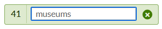

To edit a tag:

-   Click on the name of the tag you wish to edit.
-   Enter the changes you would like to make in the field.
-   Hit the enter key on your keyboard, and the tag is saved with its new name.

When editing, you cannot use an existing tag. For example, if you have 5 items tagged with "banana" and 2 items tagged with "bananna", you cannot edit the misspelled tag to the correct spelling. You would need to edit the items with the tag you want to remove, adding the desired tag and deleting the undesired tag. You can use the batch-edit function to add tags to items, but not to delete tags.

## Delete a tag 

Deleting a tag removes all occurrences of that tag across all resources.

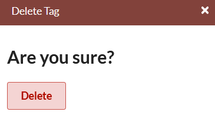

To delete a tag:

-   Choose the tag you wish to delete from the select menu.
-   Select the "X" to the right of the tag.
-   A window will open with the question "Are you sure?" 
-   Click "Delete", and that tag is permanently deleted across your Omeka items and exhibits. (If you change your mind, close the query window by clicking on the "X" in the upper right hand corner.)

## Public view

Visitors to your site can browse tags by going to the "Browse Items" page and selecting the "Browse by Tag" option. The URL for this page is `/items/tags`. Depending on the theme, the tags may appear as a cluster or a group, and may be scaled according to use.

For example, in Thanks, Roy, the default theme, the most frequently used tags are in a larger font:

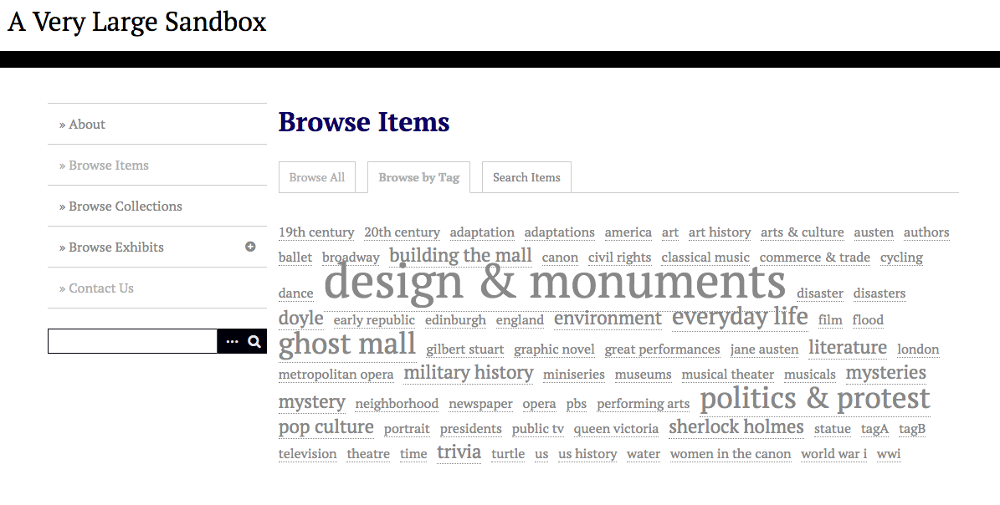

In Center Row, the tags simply display in a list:

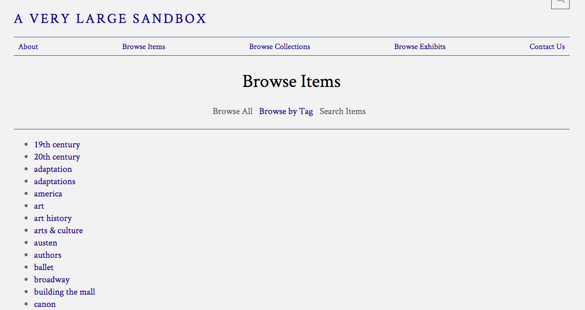