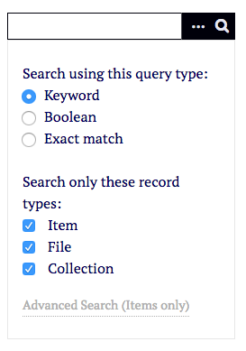
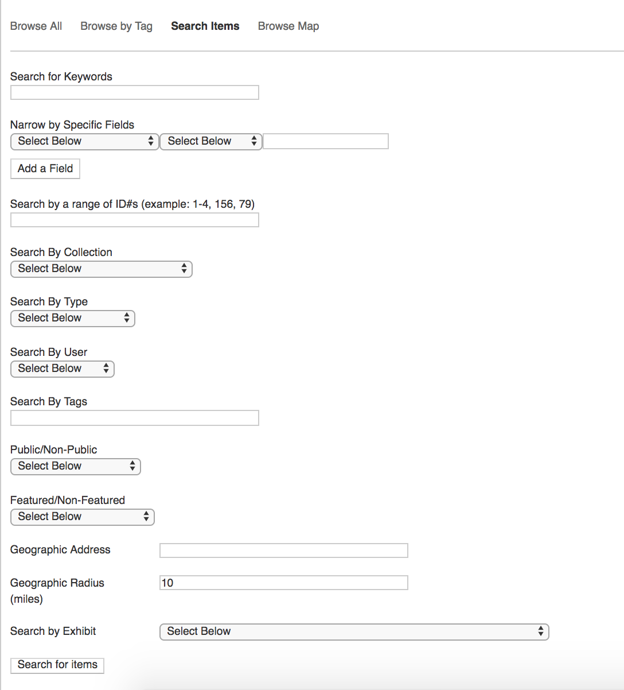

# Searching

This page explains the search functions in Omeka Classic on the public and admin sides, and how to use them. If you are looking for information on how to [manage search settings, please see that documentation](../Admin/Settings/Search_Settings.md).

Basic Search
-------------
The simplest way to search an Omeka Classic installation is using the simple search bar. On the admin side, this is always present in the upper right hand area of the window, under the top navigation bar. The exact location of the search bar on the public side varies by theme, but is generally close to the navigation menu. 

To perform a basic search, type the keyword you want to search for in the field and either hit enter on your keyboard or click the search button (the magnifying glass icon). Depending on the [search settings](../Admin/Settings/Search_Settings.md), content in this search might include item, file, and collection metadata, the text on Simple Pages, exhibit summary pages, and exhibit pages. 

### Search Options
To access the options for a basic search, click on the ellipsis (...) button to the right of the search bar, next to the search button (magnifying glass).

The first set of options allows you to select a query type:

- Keyword, or general search
- Boolean, in which you can add Boolean operators like AND and NOT
- Exact match, which will only find exact matches to the word or phrase you enter.

The second set of options are a series of checkboxes for content to include in the search. These checkboxes populate based on the site's [search settings](../Admin/Settings/Search_Settings) and can include:

- Item
- File
- Collection

as well as options provided by plugins, such as:

- Simple Page
- Exhibit Page
- Exhibit summary.

Advanced Search
----------------
Advanced Search, which will only search the items in your Omeka Classic installation, is available on the admin side, and on the public side if the *Use Advanced Site-Wide Search* option is checked in the [theme settings](../Admin/Appearance/Themes.md#configuring-a-theme). 

To access the advanced search, click on the ellipsis (…) button to the right of the basic search bar and then click the link reading “Advanced Search (Items Only)”.

The “Search Items” page will load. It presents a variety of options for advanced searching across all items. You do not need to complete all fields, only as many as you want.

Advanced Search options are:

- **Search for Keywords**: a general search.
- **Narrow by specific fields**:
    - Select a field from the first dropdown.
    - From the second dropdown, select from the following options:
        - contains
        - does not contain
        - is exactly
        - is not exactly
        - is empty
        - is not empty
        - starts with
        - ends with
        - matches
        - does not match.
    - In the text area, enter the terms for the field search.
    - You can add additional field searches using the green “add a field”. Additional field searches include a dropdown to select **AND** or **OR** for these terms. Use **AND** to narrow the search, requiring it to find items which meet both field criteria. Use **OR** to broaden the search, including items which meet either field criterion.
- **Search by a range of item IDs**: a text field in which you can enter item IDs. You can describe a range, such as “1-7”, or a sequence separated with commas, for example “1,5-7,11”.
- **Search by collection**: a dropdown of collections in your installation.
- **Search by type**: a dropdown of existing item types in your installation.
- **Search by User**: a dropdown of users in the installation.
- **Search by tags**: a text field.
- **Public/Non-Public**: a dropdown with each option. If you are logged in, you may see unpublished or private items in results on the public side.
- **Featured/Non Featured**: a dropdown with each option.

If you have [the Geolocation plugin](../Plugins/Geolocation.md) installed, Advanced Search will also include the following options:

- **Geographic Address**: search for items at an address (text field).
- **Geographic Radius**: set a proximity to the address given above, in miles.

If you have [the Exhibit Builder plugin](../Plugins/ExhibitBuilder.md) installed, advanced search will include the following option:

- **Search by Exhibit**: a dropdown with all public exhibits. This will find all items used in the specified exhibit.

Troubleshooting
---------------------------------------------------
**Seeing private items when searching on the public side**:
If you are logged in to your Omeka Classic installation, you will see all items and exhibits on the public and admin side - private and public. Try logging out, copying the page URL to a private browser window, or visiting the site in a browser where you are not logged in.

**If you are having trouble finding words you know are in your install, the following may be part of the problem:**

-   MySQL by default does not index any words shorter than 4 letters long.
-   Exact match searches will look for the exact string given by the user, anywhere in the record. For example a search for “poe” would also return “poem”.
-   MySQL considers terms that appear in over 50% of indexed items to be so common that it excludes them from keyword searches. The easy way to tell if a term meets the 50% threshold is to choose the “Boolean” search, as MySQL does not apply the 50% limitation to Boolean searches.
