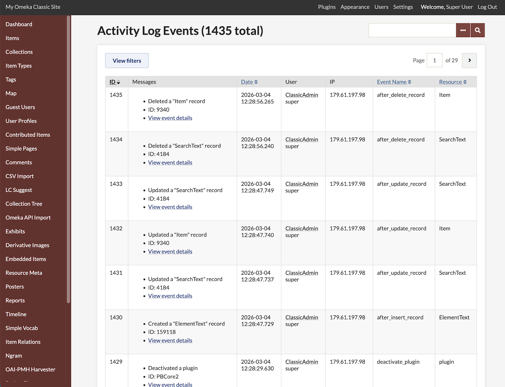
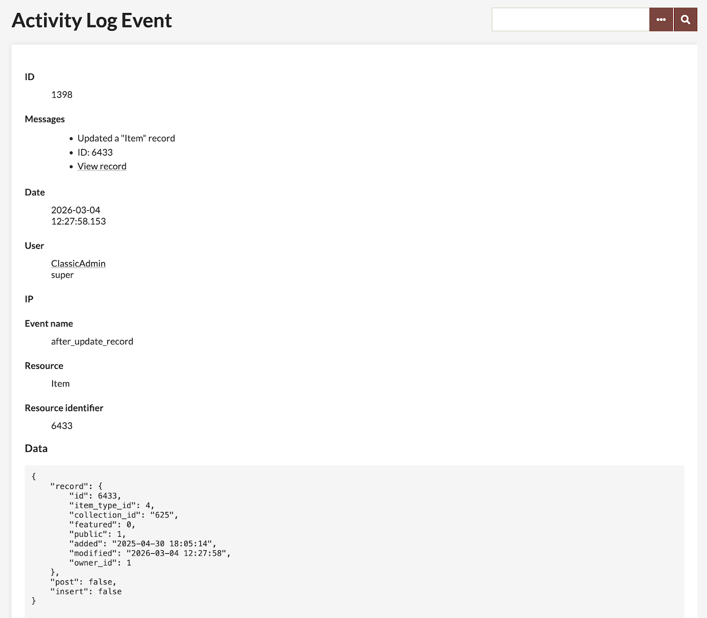
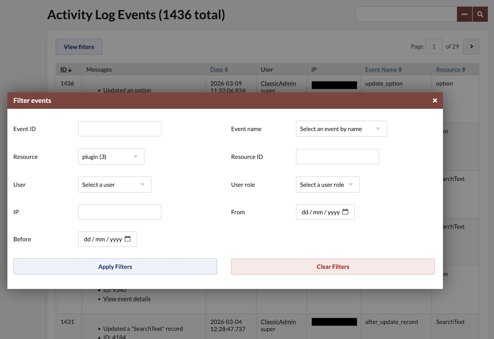
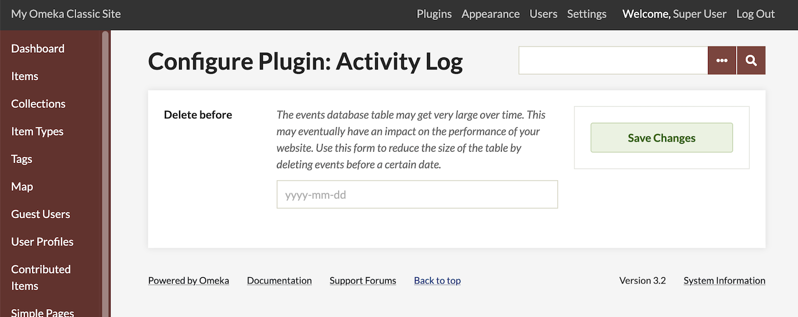

# Activity Log

The [Activity Log plugin](https://omeka.org/classic/plugins/ActivityLog/){target=_blank} allows you to gather information about changes made in the Omeka interface into one table. The plugin will show many changes made to items, collections, installation settings, users, and plugin-added data points. 



Once activated on the Plugins tab of the admin dashboard, Activity Log has no required configuration. It adds an entry to the Plugins list in the left-hand sidebar, which takes users to the table of events. 

Only users at the Super and Admin levels can view Activity Log data. Only Super users can erase Activity Log data.  

## View events

Activity Log will record events when it is active. The table will reflect all changes made in the installation, by all users. The table is displayed in reverse-chronological order (newest events at the top). It only lists events that modify (create, update, and delete). It does not include read-only events (such as searching). 

The table includes the following columns, which can be used to sort the table:

- **ID**: The internal identifier of the event (set to sort the table by default)
- **Messages**: Any messages that describe the event, in list form
- **Date**: The date/time of the event, using the installation's time zone
- **User**: The user who triggered the event, and the user's role. Where no user is logged in (such as submissions made using the Contribution plugin's public forms) this space will be blank. 
- **IP**: The IP address of the user, at the time of the event
- **Event name**: The type of event that was triggered by the user
- **Resource**: The type of the resource that was modified by the user. 

An event can be seen in more detail by clicking the "View event details" link in each table entry. This will take you to a new page with more specific information about each activity. 



This page repeats the information from the table of events, and includes a JSON reflection of the API content being read by the plugin. For example, an event in which an item (IDs 9340) is deleted could read:


```
{
    "record": {
        "id": 9340,
        "item_type_id": 2,
        "collection_id": 4,
        "featured": 0,
        "public": 1,
        "added": "2026-01-01 12:26:58",
        "modified": "2026-01-01 12:28:47",
        "owner_id": 1
    }
}
```

Some events, when related to a specific resource, will provide a link to that resource as well as a link to see more information.

### Filter events

You can filter events out of the table view. Click the "View filters" button at the top of the table to open a superimposed screen: 

- Filtering by event name will allow you to narrow down by the types of changes made: creation, deletion, updating, batch-updating, setting changes, etc.
- Filtering by resource will allow you to select from the resources inside the installation: item, file, collection, user, exhibit, exhibit page, plugin, etc.
- Filtering by user will allow you to choose from the list of users who have made changes to the installation within Activity Log's collection range. You can also filter by actions based on user role. 
- Filtering by date will allow you to select one or two dates by calendar - a start date for events (on and after) and an end date.



Users may filter the events using the multiple available filters (you will see the count of each entry in parentheses):

- **Event ID**: Filter events by event ID
- **Event name**: Filter events by event name
- **Resource**: Filter events by resource name
- **Resource ID**: Filter events by resource ID
- **User**: Filter events by user
- **User role**: Filter events by user role 
- **IP**: Filter events by IP address
- **From**: Filter events by date from (on and after)
- **Before**: Filter events by date before.

Set the filters and click "Apply filters". The resulting page will show the filtered results. Click "Clear filters" to return to the default list.

#### Events captured

By default, the plugin will record the following event types. Plugins may add more events, but they are not listed here.

!!! note
	Note that some of these events cannot be captured when using Omeka Classic 3.2. Some will only work after the next update is released (accessible by using [the Github repository of Classic, on the `master` branch](https://github.com/omeka/Omeka){target=_blank}). This includes `after_insert_record`, `after_update_record`, and `after_delete_record`.

- `after_insert_record`: logs after a user creates a new object (e.g. Item, Collection, File) (development only) 
- `after_update_record`: logs after a user saves an object (development only)
- `after_delete_record`: logs after a user deletes an object (development only)
- `insert_option`: logs when a user inserts a new option
- `update_option`: logs when a user updates an existing option
- `delete_option`: logs when a user deletes an option
- `install_plugin`: logs when a user installs a plugin
- `uninstall_plugin`: logs when a user uninstalls a plugin
- `activate_plugin`: logs when a user activates a plugin
- `deactivate_plugin`: logs when a user deactivates a plugin
- `upgrade_plugin`: logs when a user upgrades a plugin.

The nature of this plugin's event logging is that often an action in Omeka Classic can trigger multiple different events. So you may see a large number of events that reflect a relatively small number of human actions. 

#### Export events

Administrators can export the data using the API. This will only work after the next update of Classic is released (for now, [the `master` branch of Omeka Classic on Github](https://github.com/omeka/Omeka){target=_blank}), and for the plugin to be installed using Github and switched to the `index-acl-resource` branch:

```
/api/activity_log_events?key=<your-api-key>

```

## Delete events

A Super user can use the plugin configuration screen to delete old events. From the "Plugins" link at the top of the administrative dashboard, select "Configure" in the Activity Log entry. This offers the ability to delete all Activity Log entries before a given date. Enter a date formatted as "YYYY-MM-DD".

