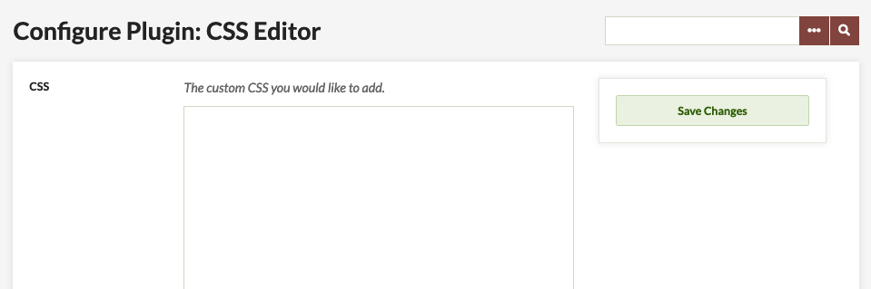

# CSS Editor

The [CSS Editor plugin](https://omeka.org/classic/plugins/CSSEditor/){target=_blank} allows users to make changes to the CSS (code which controls appearance) of their Omeka Classic installation without going into the server-side files.

This plugin will be most helpful to people with experience using CSS and designing sites.

CSS Editor requires Omeka Classic 2.0 or higher.

## Configuration

Once you have [installed](../Admin/Adding_and_Managing_Plugins.md) the plugin, you can access it from from the Plugins menu in the top navigation bar of the Omeka Admin. Click the blue Configure button to go to the CSS Editor.

The CSS Editor configuration page contains a large text field in which you can write your custom css. Type your code as you would in a css document. Be sure to save changes.

The [W3C has an excellent CSS tutorial and reference](https://www.w3schools.com/css/){target=_blank} to help you find the individual elements you wish to customize on your site.
