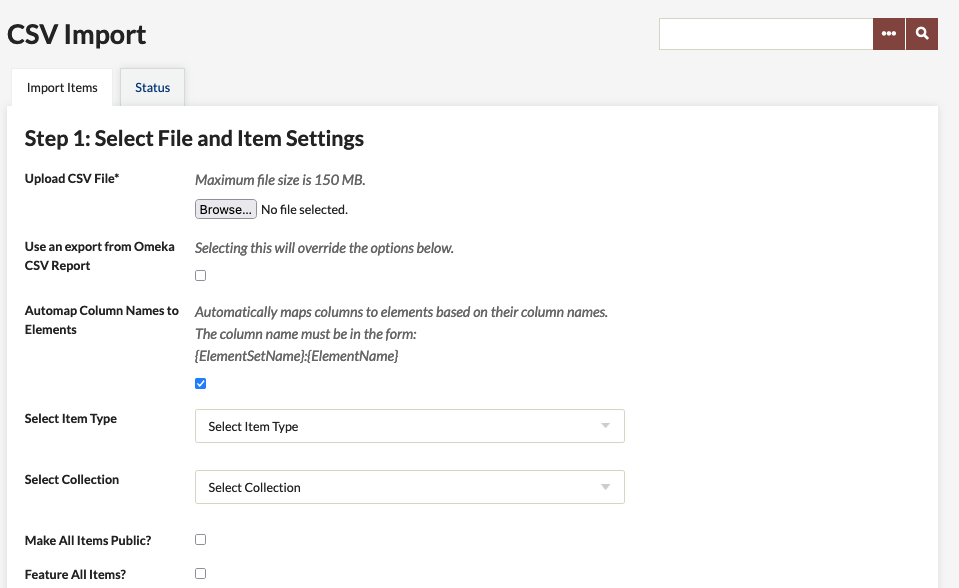
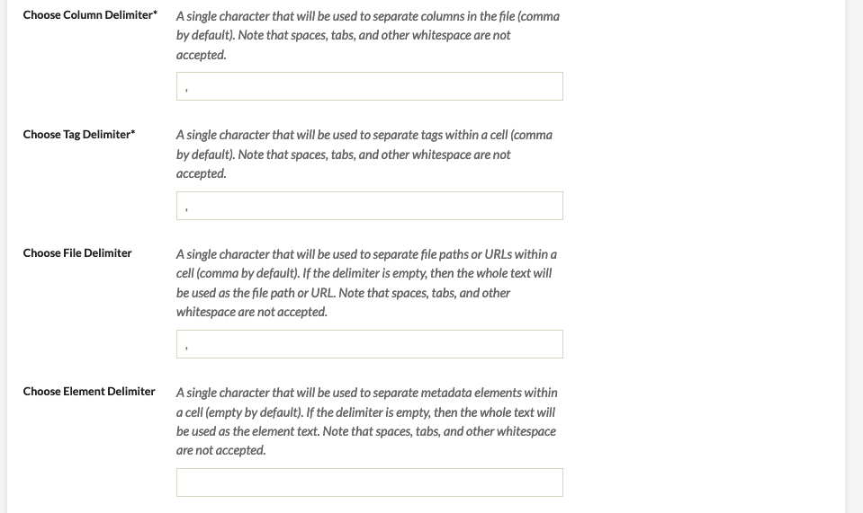
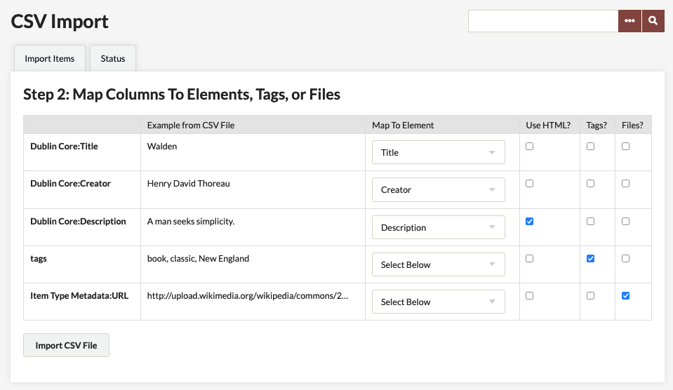
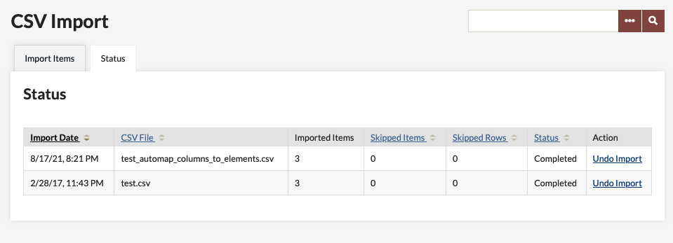

# CSV Import

The [CSV Import plugin](https://omeka.org/classic/plugins/CsvImport/){target=_blank} allows users to import items from a simple CSV (comma-separated values) file, and then map the CSV column data to multiple elements, files, and/or tags. Each row in the file represents metadata for a single item.

When using this plugin, if you plan to map to specific Item Type metadata fields, then you may only import one item type (document, still image, sound, etc.) at a time. You may perform multiple imports.

The plugin has the following features:

-   File importing: If you specify permanent file URLs in a column, the importer will download and attach a file to each created item. Note that file import only works for files hosted and publicly available online; you cannot import files from a local source (that is, your computer), or from a password-protected location. You may have difficulty importing files from a storage service such as Google Drive or Dropbox unless you can supply a stable URL to each file. 
- Automap Column Names to Elements: If you supply column names in the format {ElementSetName}:{ElementName}, such as `Dublin Core:Description`, CSV Import will automatically map those recognized columns for you. This does not work for [Item Types](../Content/Item_Types.md), only [Element Sets](../Admin/Settings/Element_Sets.md). 
-   Tag imports: You may include [tags](../Content/Tags.md) in your CSV, and those words will be imported as tags, using a separator that you specify in the import process.
-   Choose custom delimiters: Set separate delimiters for columns, tags, files, and elements.
-   Undo imports: The "Undo" option lets you delete all the items and files added in an import.

## Preparing for CSV Import

The best option is usually to use spreadsheet software (Excel, Google Sheets, Numbers) to create and organize your data. These programs can export a spreadsheet into CSV format, and will handle all the necessary escaping and quoting for you. When a file is saved from Google Sheets, it will automatically be put into the UTF-8 character set necessary for CSV Import.

However, if you're creating or editing your data by hand, there are a few things to keep in mind:

-   You will need to normalize your data before importing. Check to be sure that the first row of your CSV file contains column names, and that every row has the same number of columns. Every column must have a unique name or you will see an error message. You can only have one header row; every row after the first row will be imported as an item.
-   Many spreadsheet programs will automatically enclose CSV entries in double-quotes if they contain commas. If you are using a spreadsheet program, check the CSV that is exported by opening it in a plain-text editor to see if the double-quotes are being added automatically. If not, surround every cell containing a comma with double-quotes. 
-   You can specify a unique delimiter for columns, files, tags, and elements. Once you do, be sure to be consistent in formatting. 
-   Remember, every row represents one item, and all items in the file must be the same item type.
-   Look over the [Dublin Core](../Content/Working_with_Dublin_Core.md) and [Item Type](../Content/Item_Types.md) metadata to be sure you can easily map the fields in your CSV file to the Omeka installation. Make any modifications in fields or types as necessary.
-   It is possible to import files housed in a digital repository by adding the URL to that specific file in a column representing a file. You may import more than one file per item, by comma separating the urls within a cell. You must use a permanent link for this step.
- Note that Omeka cannot accept metadata entries that include emojis. You will see the import process stop with and "Import Error" and the [`errors.log` file](../Troubleshooting/Retrieving_Error_Messages.md) will show "Incorrect string value". You may also see the process stop if PDF Text is enabled and has difficulty processing a PDF that has emojis.

## Importing

A quick note about CSV formats and importing: The column delimiter is the basic building block of the CSV file, and it is a comma by default.

Each of the remaining delimiter inputs simply accepts a character that's used to separate multiple values within one "cell" of the CSV.

If you are placing multiple values in single cells, the character you're using to separate those values is the delimiter. The plugin allows you to specify different delimiters for cells that contain tags, links to files, or normal element data.

To import, go to the CSV Import tab in the left navigation bar in the admin Dashboard.

**Step 1: Select File and Item Settings**

- Select a CSV file from your computer using the "Choose File" button.
- If using an export from an Omeka CSV report, click the next checkbox, which will override all of the following options. 
- You can use "Automap Column Names to Elements" if you have formatted your column names as follows: "Element Set Name:Element Name", for example `Dublin Core:Title`.
- "Select Item Type" of the sheet to be imported. Note that you can only import one item type at a time. 
- You can also "Select Collection" to which to add the imported items. You can only import to one collection at a time. 
- There are two checkboxes to make all of the imported items "Public" and/or "Featured".

- The next four fields are for those who are not using a standard CSV for their data:
    - If you are not using commas to separate your columns, enter the character you are using instead in the "Choose Column Delimiter" field. Note: You may not use a tab or an empty space.
    - If you have used a character other than a comma to separate tags within individual cells in your CSV file, you must indicate that in the "Choose Tag Delimiter" field. Note: You may not use a tab or an empty space.
    - If you have used a character other than a comma to separate multiple URLs within a cell (if you are importing items from an outside repository, for example), indicate that in the "Choose File Delimiter" field. Note: You may not use a tab or an empty space.
    - If any of your metadata fields has more than one element (if your item has more than one creator, for example), indicate what character you used to separate the elements. If you have more than one element in a a field but leave this blank, the plugin will treat the entire text block as one element. Note: You may not use a tab or an empty space.

Click the "Next" button once you have filled out the above options to your satisfaction. 

**Step 2: Map Columns to Elements, Tags, or Files**
On this next screen, you will see a table which includes each of the Dublin Core fields in Omeka, the text from your CSV file that is designated for that field. The "Example from CSV file" column in the table shows the data from the first row of data in your CSV, after the column headings. 

For each row in the table (which corresponds to a column in your original CSV) you have the following options: 

- **Map to Element**: Select an element (all of your element sets should be represented) to which to map the column.
- Click the **Use HTML?** checkbox if this data includes HTML markup.
- Click the **Tags?** checkbox (and do not map to an element) to map this data as [tags](../Content/Tags.md)
- Click the **Files?** to map this data as a [file](../Content/Files.md) import. 

!!! note 
	Note that at this time you cannot use CSV Import to add location data for use by the [Geolocation plugin](Geolocation.md). Map pins can only be added manually.

Click the "Import CSV File" button to complete the import.

You may check on the progress of your import using the "Status" tab.

Undo an Import
----------------------------------------------------------------
To undo an import:

-   Click on the "CSV Import" administrative tab.
-   Click the "Status" tab.
-   Click the "Undo Import" link for the import you want to undo. This will delete all items for this import. You can then "Clear History" to remove this line from the "Status" table.

If your import hangs without completing for an extended period but the link to undo the import does not appear, you can enter the link directly into your browser address bar according to the following example: `http://yourinstallurl/admin/csv-import/index/undo-import/id/idnumberforimport`.

For example, if your Omeka installation was at the root of `example.com` and this was your third CSV import, you would use
`http://example.com/admin/csv-import/index/undo-import/id/3`. You can hover over the links for previous or subsequent imports to deduce the Import ID.

## Troubleshooting

If you are having trouble with a CSV consistently not importing, try checking for these common issues:

- Are your jobs starting and not completing? You might need to [set the path for PHP](../Technical/Setting_PHP_Path.md) so that your system can perform the background process to make the items.
- Are your file links readable? Try copying and pasting them into the address bar of a browser to see if the link resolves with a file.
- Check the encoding on your CSV file. It should be UTF-8. Ensure there are no emojis.
- Open your CSV file with a different program than the one you created it with, and make sure that every row has the same number of columns.
- Open your CSV file in a text editor and ensure that text blocks are contained in double quotes.
- Test an import with other plugins disabled. Some plugins, such as PDF Text, run when items are imported and can cause their own issues with the process.
