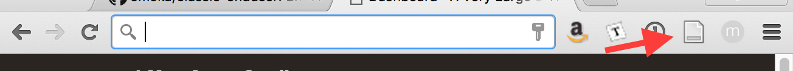
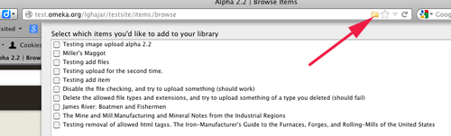

# COinS

The [COinS plugin](https://omeka.org/classic/plugins/Coins/){target=_blank} embeds citation metadata into the pages of your Omeka Classic site for each item. COinS (ContextObjects in Spans) is "a simple, ad hoc community specification for publishing OpenURL references in HTML."

When activated, the COinS plugin makes your items viewable to certain [online bibliographic tools such as Zotero](http://www.zotero.org/){target=_blank} by automatically embedding citation metadata in your website. This plugin facilitates online research and interoperability with other systems.

Using the COinS plugin, you may add individual items from any Omeka Classic site to your Zotero library and batch process the addition of multiple items to your Zotero library.

## Add Items to Zotero

When on an items/show page, you may add that item to your Zotero library, by clicking the Zotero icon. For example, in Firefox, this should appear in the address bar; in Chrome it will be in the buttons to the right of the address bar.

  
*Firefox*

  
*Chrome*

Click on the icon, and the item is then sent to your Zotero library. A notification at the bottom of the screen tells you the operation was successful.

To batch process the addition of multiple items to your Zotero library from an Omeka Classic site, browse items on the public site. A file folder appears in the URL field at the top of your webpage. Click the file folder and a dropdown menu enables you to check multiple items to add to your Zotero library. 

After you've selected those items, click okay at the bottom of the dropdown menu and a notification at the bottom of the screen tells you the operation was successful.

