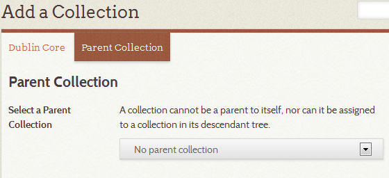
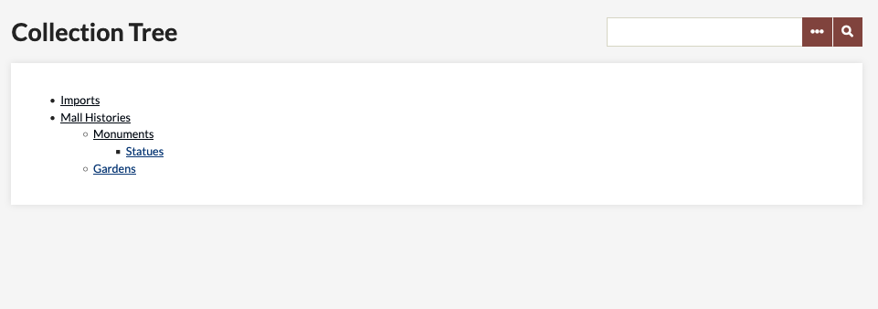
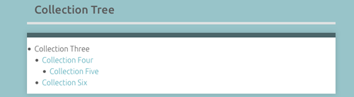

*Current version: 2.0.2*

Collection Tree plugin allows Omeka sites to have nested [collections](../Managing_Collections.md). One collection can have at most one parent collection, but a collection may have zero or multiple child collections.

Once you have [installed](../Managing_Plugins.md) collection tree, the plugin will create a tab on the left-hand navigation of the admin side of the site. This tab allows you to view your collection hierarchy. To create a child/parent relationship between collections, you must edit the collection.

Nesting Tree
-------------------------------
You can only nest collections once you have at least two collections. 

To create a new child collection:
1. Go to the Collections tab on the left hand navigation of the admin dashboard. 
1. Click the *Add a Collection* button
1. Add the metadata as needed
1. Go to the *Parent Collection* tab across the top of the Add Collection menu
1. From the dropdown menu, select the parent collection for the current collection. 

To nest an existing collection:
1. Go to the Collections tab on the left hand navigation of the admin dashboard. 
1. Click *Edit* below the title of the collection you want to edit.
1. Go to the *Parent Collection* tab across the top of the Add Collection menu
1. From the dropdown menu, select the parent collection for the current collection. 

Viewing Collection Trees
---------------------------------------------------------

To view your collection tree, select Collection Tree in the left Admin navigation available from the Dashboard.

If you wish, you may make the Collection Tree's hierarchy viewable to the public, go to the Appearance tab in the top Admin navigation bar. Then, click on [Navigation](../Managing_Navigation.md), and check or uncheck the Collection Page. 

This is what a sample public page looks like:

