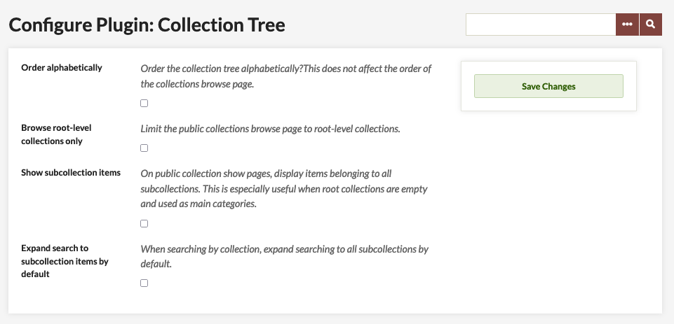
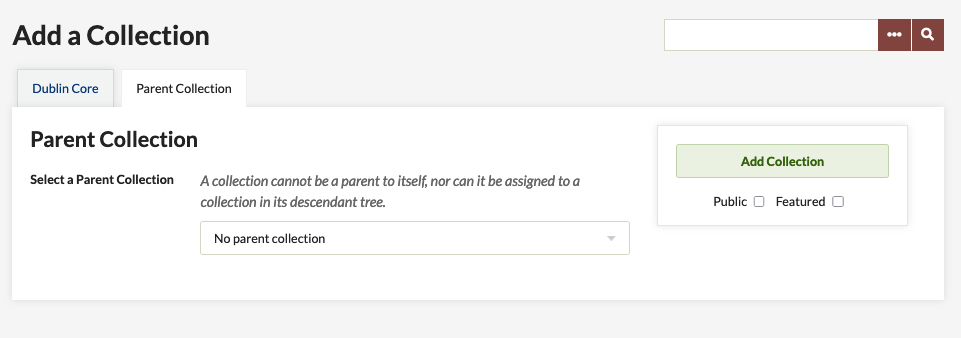
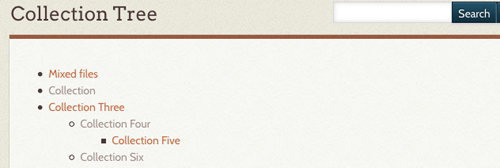
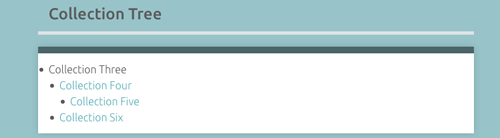
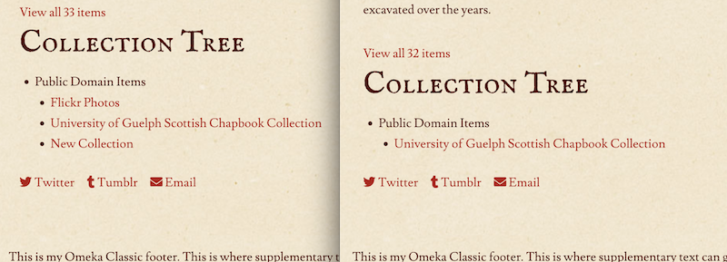

# Collection Tree

The [Collection Tree plugin](https://omeka.org/classic/plugins/CollectionTree/){target=_blank} allows Omeka Classic sites to have nested [collections](../Content/Collections.md). One collection can have at most one parent collection, but a collection may have multiple child collections. 

This screencast includes information on how Collection Tree can modify your collections:

<iframe src="https://player.vimeo.com/video/194553469?h=015e0c53a1" style="position:absolute;top:0;left:0;width:100%;height:100%;" frameborder="0" allow="autoplay; fullscreen; picture-in-picture" allowfullscreen></iframe>

<a href="https://vimeo.com/194553469">Managing Collections in Omeka Classic</a> from <a href="https://vimeo.com/omeka">Omeka</a> on <a href="https://vimeo.com">Vimeo</a>.

Once you have [installed](../Admin/Adding_and_Managing_Plugins.md) Collection Tree, the plugin will create a tab on the left-hand navigation of the administrative dashboard. This tab allows you to view your collection hierarchy. 

To create a child/parent relationship between collections (that is, to nest one collection inside another), you must edit the child collection itself.

You can configure the plugin to adjust the display by checking the following options:

**Order alphabetically**: This setting orders the Collection Tree alphabetically, but does not affect the order of the collections browse page. By default collections will be ordered by creation date, i.e. by collection ID. Each level of the hierarchy will be alphabetized with this setting. Note that this may not work as expected if you use text formatting, such as italics or bold, inside your collection titles. 

**Browse root-level collections only**: This setting limits the public collections browse page so it only includes top-level (parent) collections and does not show subcollections (any collections nested inside others).

**Show subcollections items**: This setting includes all of the items from the subcollections in the list of items on the parent collections' show page. For example, a top-level collection with 10 items contains another collection that itself has 29 items. Check this to make the top-level collection appear to contain 39 items instead.

**Expand search to include subcollection items by default**: This setting will mean that a search performed inside a top-level collection will also look through all the items of its subcollections.

## Nest your collections

You can nest collections once you have at least two collections. 

To nest a new or existing collection:

1. Go to the Collections tab on the left hand navigation of the admin dashboard. 
1. Make a new collection, or click "Edit" below the title of the collection you want to edit.
1. Go to the "Parent Collection" tab across the top of the Add Collection menu.
1. From the dropdown menu, select the parent collection for the current collection. 

## View the collection tree

To view your collection tree, select Collection Tree in the left Admin navigation available from the Dashboard.

Each collection that is not inside any other will be treated as a "root" or parent collection, displayed at the first level of hierarchy. 

If you wish, you may make the Collection Tree's hierarchy viewable to the public by adding a page to your navigation. Go to the Appearance tab in the top Admin navigation bar. Then, click on [Navigation](../Admin/Appearance/Navigation.md), and check or uncheck the Collection page. 

This is what a sample public page looks like:

## Resource visibility

You can make items and collections private or public. When a root-level collection is made private, its entire hierarchy will not display on the Collection Tree page. If users navigate to a child collection, the individual branch of the collection tree will display and be linked, but with "[Unavailable]" at the root and no link. Depending on your combination of settings above, this may mean that sub-collections do not display anywhere on your site except in places where you link them intentionally. 

![Collection tree displayed on logged-in and logged-out browsers, showing "[Unavailable]" in the place of a parent collection.](../doc_files/plugin_images/collectionTree_unavailable.png)

If a child collection is private, it will not display in any hierarchy. Its (public) items will not be available in parent collections, regardless of your "Show subcollection items" setting. 

We recommend you double-check your collection tree display on a logged-out browser, as logged-in users will see different content than the general public browsing your website. 