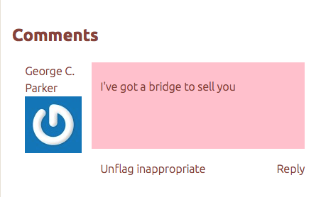

The Commenting plugin allows site viewers to leave comments on items and collections in an Omeka Classic site. The plugin also permits administrators to moderate those comments.

It is also possible to add commenting to pages generated by plugins such as Exhibit Builder and Simple Pages. Please see the [instructions in the plugin's README file](https://github.com/omeka/plugin-Commenting#displaying-comments) for more information on how to do so.

Configuring
---------------------------------------------------------------
Before you can use the Commenting plugin, you must activate and configure it from the Browse Plugins page. To configure, click the blue “Configure” button beside the plugin on the Browse Plugin page. You will be prompted to select your security, moderation, and commenting preferences.

The configuration options are:

**Use Threaded Comments?**: Check to allow threaded comments, or comments that allow users to respond to another user by replying with additional comments. 

**Text for comments label**: If you wish to use a label other than “Comments,” you may enter the text here. If the field is empty, the section on the page will simply be called "Comments."

**Allow public commenting**: Check this box to allow anyone, including non-registered users, to make comments. 

**Require moderation for all public comments**: Check this to hide public comments until they have been reviewed by a moderator (see below). If unchecked, comments appear immediately (but moderators can still delete).

**User roles that can moderate comments**: Select at least one user role to moderate comments. The list will include all possible user roles, from admin to guest.

**WordPress API key for Akismet**: If you are allowing public, unmoderated commenting and you have a WordPress account, you can use your [Akismet](http://akismet.com/) API key for spam management. You may use a key you are currently implementing on a blog or another site that collects public feedback, provided that that key is not site-specific in the key settings on the Akismet site. 

In addition to Akistmet, you may want to set up [reCAPTCHA](../Admin/Settings/ReCaptcha) for your Omeka site, found in the [Security Settings](../Admin/Settings/Security_Settings). 

**New comment notification emails**: Use this field to enter the emails to which a notification of new comments should be sent. Enter one email per line. 

Commenting
--------------------------
On most themes, the fields for leaving a comment will appear below item metadata. 

Moderating Comments
------------------------------------------------------

Administrators may delete offensive or unwanted comments from the newly-added Comments tab. Find all comments posted to your site on this Comments browse page where you may filter them by Approved and Needs Approval for ease of moderation.

**Comment Actions**: Users with permission to moderate comments may approve, unapprove, flag or unflag comments as spam, and flag or unflag comments as inappropriate.

**Moderate Single Comment**:

-   Select the checkbox to the left of the comment you wish to moderate.
-   Find the action you wish to complete by clicking on its term, Approve or Unapprove, Report Spam, Flag Inappropriate.

**Batch Moderating**: You may also batch approve or unapprove and flag submissions as spam.

-   Check the "Select All" box found just below the Comments heading, or select multiple comments from the list.
-   Then select the appropriate status you wish to assign to all of the comments.
-   These changes will be automatically saved, and may be changed at any time

User Flagging 
-------------------------------------------------------

Logged-in users may flag any comments they feel are inappropriate or may be spam. To do that, logged-in users should click the 'Flag Inappropriate" link for the comment in question:

That comment will be flagged as potential spam and/or inappropriate. It will only be visible to users with permission to manage comments. From the public interface, users with permission to manage comments can simply unflag the comment if it is not acceptable. If further action is needed, those users can go to the admin interface to unapprove or delete the comment if it is indeed inappropriate, report it as spam, or unflag it if it not spam or inappropriate.

Site builders might also consider defining and publishing a set of community standards so that everyone will have guidance about what is and is not considered inappropriate.
