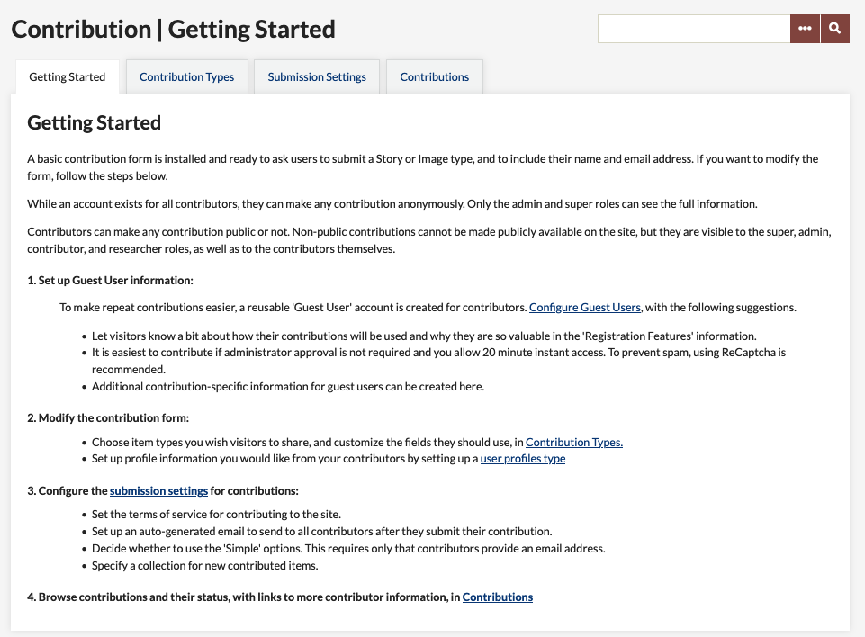
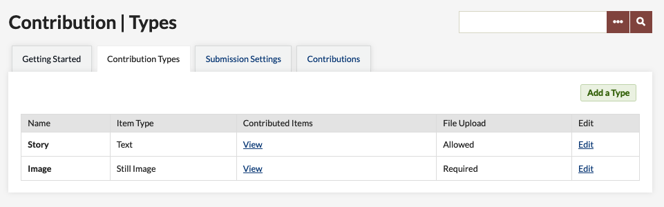
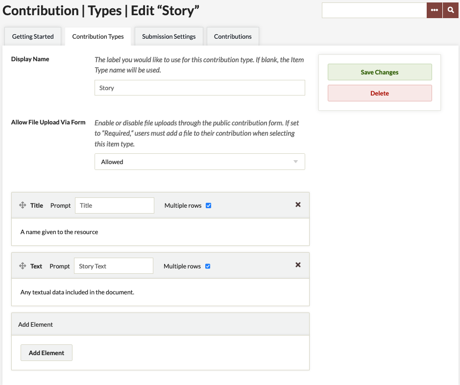
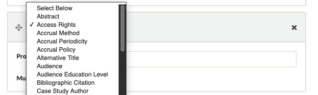
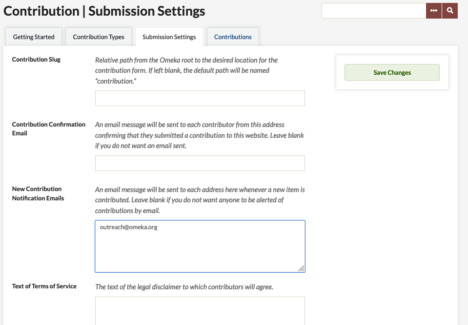
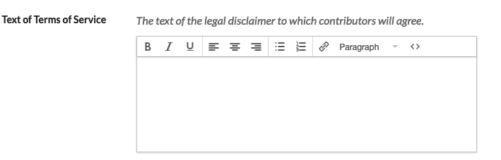
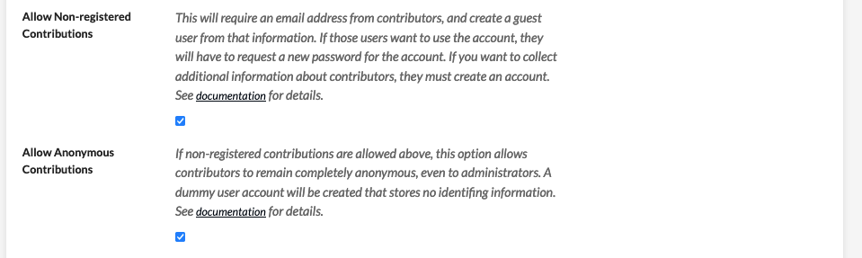
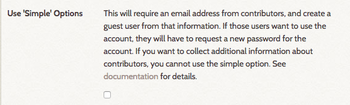
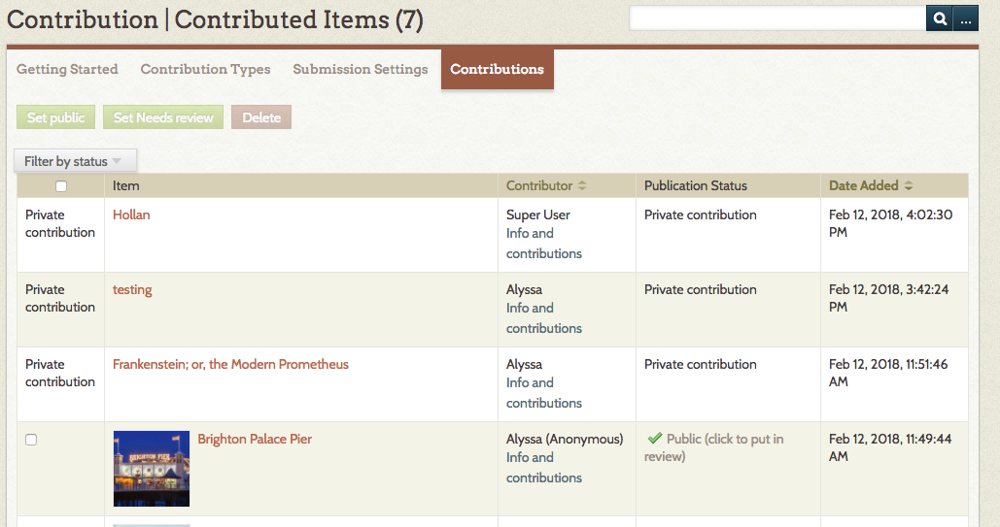

# Contribution

The [Contribution plugin](https://omeka.org/classic/plugins/Contribution/){target=_blank} provides a form to collect stories, images, and other files from the public and manage those contributions in your Omeka Classic site as items. Contributors may share and upload content anonymously, and their information will only be available to site administrators. All contributions are private by default and require a site administrator to review and make them public on the Omeka site. 

The plugin can also automatically add a reCAPTCHA box at the bottom of each form to prevent spam-bots from spamming your website. Contribution also offers options for users to create guest accounts that make it easier for one user to submit multiple items. 

Other plugins can be integrated into the Contribution form, such as [Simple Vocab](SimpleVocab.md) for creating dropdown menu choices, and [Geolocation](Geolocation.md) for inviting users to map their submissions or locations. 

Installing and configuring the Contribution plugin requires a few steps. Please read through the documentation carefully. 
Watching the [screencast](https://vimeo.com/165200216){target=_blank} we created for using and configuring this addon can be helpful as you think through each step.  - please note that the screencast is [version 3.0.1](#older-versions) and not the most current version of the plugin.

An Omeka site with the Contribution plugin requires you to upload and install two separate plugins:

-   [Guest User](GuestUser.md) (required)
-   Contribution (required)

If you want to collect any information from your contributors, install these two additional plugins:

-   [Record Relations](RecordRelations.md) (optional, only required for collecting user information)
-   [User Profiles](UserProfiles.md) (optional, only required for collecting user information)

## Screencast

Contribution is a somewhat complex plugin to set up. In addition to the written instructions below, please see the [screencast on this plugin and Guest User](https://vimeo.com/165200216){target=_blank}. Note that there is also a screencast for the [User Profiles](https://vimeo.com/165052886){target=_blank} plugin.

## Installing

**Note** You must upload and [install](../Admin/Adding_and_Managing_Plugins.md) the Guest User plugin before installing and activating Contribution! If you have uploaded the other plugins first, you will see in the plugin directory that you cannot install other Contribution-related plugins until Guest User is installed first.

### Guest User Configuration
After installing the plugin, click the Configure button. For more information go to the [Guest User documentation](GuestUser.md).

### Installing Contribution

1. Upload and install the Contribution plugin in the plugin directory.
2. Contribution settings: A new tab will appear in the left side navigation bar labeled, “Contribution.” Click on Contribution to configure the form and submission settings.
    - Note: a link to the contribution form will automatically be added to the site’s navigation. If you wish you draft the form first, go to the site’s Appearance tab at the top of the Dashboard and click on Navigation. Uncheck the “Contribute an Item” link. At this point you can edit the label, or do that later.

## Setting up Contribution
Contribution is managed from the plugin's tab on the left-hand navigation of the admin dashboard. 

The Contribution section has four tabs: Getting Started, Contribution Types, Submission Settings, and Contributions. 

### Getting Started
The *Getting Started* tab offers instructions for setting up for the form and submission settings.

### Contribution Types
The *Contribution Types* tab is where you choose what type of items users can share through this form (still image, audio, video, document/story, etc), and what information you want to capture about these items. The tab has a table with a row for each type. Every row shows:

- the type's *name* (the label you give it); 
- its *type* (corresponding Item Type from your Omeka install);
- the number of *Contributed Items* (which also acts as link to those items);
- whether *File Upload* is allowed, disallowed, or required; and
- an *Edit* button. 

Click *Edit* to add or change data collection for a specific type. Click *Add* to create a new type to collect. 

On the Add/Edit screen for Contribution Types, there are fields for the display name and form upload, and a series of element inputs for the data you will collect from contributors. 

Options are:

- *Display Name* is the label for the contribution type - how it will appear on the public side. If left blank, the form will use the Item Type name.
- *Allow File Upload Via Form* lets you decide whether to allow, require, or disallow file upload. If this is set to "required," users will not be able to submit the contribution form without attaching a file. 
- *Elements:* each element appears as a block. 
    - The block is labeled with the Dublin Core field name
    - *Prompt* is what appears on the form. Use this field to ask question or describe what you seek from users, ie, "Share your story" or "When did you take this photograph?"  
    - The *Multiple Rows* checkbox sets whether the entry field on the form has a single row (indicating a short answer) or allows for multiple rows (making it easier for contributors to write paragraphs of text).

To add an element (question) to the contribution form:

1. Go "Add Element".
2. Select an element from the dropdown list (this includes all the Dublin Core fields as well as all Item Type elements.)
3. Type a prompt or question in the Prompt field.
4. If you want contributors to be able to enter longer blocks of text, click the *Multiple rows* checkbox. 
5. Save changes.

You can edit any element's prompt or multiple row setting at any time.

To delete an element, click the X button in the right corner of the block and save changes. If you accidentally click the delete button, you can click again (the X changes to an undo arrow) to restore the block.

In the above image, the upper block has marked for deletion - note that the header for the block is highlighted in red. The lower block is the add element block option with the dropdown open.

If you want users to select from a drop-down instead of entering text, use [Simple Vocab](SimpleVocab.md) to set up a controlled vocabulary for the element which will be applied on the admin side when adding/editing an item and in contribution forms. 

If you want users to be able to assign a location to their contributions, use the [Geolocation](Geolocation.md) plugin and check the *add map to contribution form* in its configuration settings.

### Submission Settings
This tab is where you set the contribution options for your form, including an option for user anonymity, and provide the text for the email confirmations sent to contributors. 

- *Contribution Slug:* customize the end of the url for the contribution form (`youromekasite.net/slug`). If you leave this blank, the url for the contribution form will be `youromekasite.net/contribution`

**Email settings**

- *Contribution Confirmation Email:* An email message will be sent to each contributor from this address confirming that they submitted a contribution to this website. Leave blank if you do not want an email sent.
- *New Contribution Notification Emails:* Add emails to which you want a notification sent when new contributions are received. You can enter multiple email addresses, separated by a comma.

**Terms of Service field**  
Paste in text of language of consent for anyone contributing to the site, or make a short statement linking to a [Simple Page](SimplePages.md) with a longer terms of service statement. Note that this field allows for text formatting, including basic html and lists. 

**Contributor anonymity settings**  
These two checkboxes allow an Administrator to set the user requirements for submitting contributions. 

These settings work together to permit varying levels of anonymity for your contributors. For instance, you may require users to sign up and have an approved account before contributing, or you may require them to provide an email before contributing, or you may permit completely anonymous contributions.

- *Allow Non-Registered Contributions* requires that contributors only provide an email address. Select this option if you have set up the Guest User plugin enabling “instant access.” These contributors will get an email that allows them the option of creating a password for their user account. 
- *Allow Anonymous Contributions* makes it possible for users to make contributions without providing any personal data (no email address). This option can only be used if *Allow non-registered contributions* is checked. You cannot allow anonymous contributions without allowing non-registered contributions. 

The boxes work together as follows:

- No boxes checked: site visitors have to create a Guest User and wait for their account to be approved before they can make contributions to the site.
- "Allow non-registered" checked: visitors can make a contribution without creating a Guest User account but must provide an email address; they then have the option of completing registration by creating a password. They can also create an account as above.
- Both "Allow non-registered" and "Allow anonymous": visitors can still create accounts or just provide an email, but they have the option to contribute items completely anonymously, without providing an email address or any other identifying information. 
 
**Additional Settings**

- *Email text to send to contributors*: the text of the email sent to contributors when they contribute an item. 
- *Contribution Collection*: If you want, you can specify a collection to which all new contributed items will be added (note that you must create the collection before you can select it from this dropdown).
- *Default Contribution Type*: If you select a type, it will automatically load when someone navigates to the public contribution form.

**If User Profiles is installed**

- If you’re collecting user data with the [User Profiles](UserProfiles.md) plugin, you must select which profile to make available for your contribution users. See below for more information about creating a user profile.

Remember to save changes. 

#### Older versions
If you are running Contribution versions 3.0.3 or lower, the required Contributor user data settings will be a single checkbox instead of two:

*Use 'Simple' Options*: requires that contributors only provide an email address. Select this option if you have set up the Guest User plugin enabling “instant access.” 

The Simple Options are equivalent to selecting "Allow non-registered contributions" but not "Allow anonymous contributions" on newer versions of the plugin. 

### Contributions
This  tab is where you manage and view all submissions. From this screen, it is possible to review and make items public or change their status. All contributions through the form will also be visible to browse and search on from the Items tab in your Omeka site.

## Collecting Information from Contributors (optional)

To ask for additional information about your contributors, you will need to install 2 additional plugins. If you do not wish to collect contributor information, you do not need to install Record Relations or User Profiles to use Contribution.

1. Upload and install the [Record Relations plugin](RecordRelations.md)
2. Upload and install the [User Profiles plugin](UserProfiles.md). Once Record Relations is installed, the User Profiles plugin will become available to install. Follow directions for creating user profiles in that plugin's documentation.

## Adding Contribution link to Site Navigation

- A link to the contribution form is automatically added to the main site navigation.
    - Go to the site’s Appearance tab at the top of the Dashboard and click on Navigation. You may rename the public link to the Contribution form, the default label is “Contribute an Item.”
-   Drag and drop the links if you wish to re-order the navigational elements of your site.

## Vetting and Managing Contributions

All new contributions will be private, and by default will be marked as “Needs Review.”

To review, go to the **Contributed Items** tab in the left navigation (once you start collecting, this tab changes name from Contribution to Contributed Items).

Go to the **Contributions** tab and browse contributions.

You may filter by status to see what Needs Review. Any item you wish to approve, you must make public and save changes.

* Users have the option to contribute an item that they do not wish to be made public. You will not be able to override this request from the user, so you cannot make those items "public." These items will have the phrase "private contribution" instead of a checkbox in the first column of the contributed items table.
* Contributors can also make their contributions anonymously. In that case, contributor information is only visible to site administrators.

Upgrading from 1.x to 2.x 
---------------------------------
*Be sure to make a copy of the plugin’s files and a backup copy of the database before upgrading.*

1. Follow upgrading process for all [Omeka sites](../Installation/Upgrading.md).
2. Upload and install the following plugins, following all of the steps above for installing plugins and configuring the form above.
    - [Guest User](GuestUser.md)
    - Contribution
    - [Record Relations](RecordRelations.md)
    - [User Profiles](UserProfiles.md)
3. If you have asked Contributor Questions on a version 1.5 form, go to User Profiles plugin page. Locate the check box asking if you want to import Contributor settings: check the box and save changes.
4. Contributor pages should be linked to a Contributor’s profile, and the questions you asked before should be available in the User Profile.
5. If you have modified the text on the Contribution form itself, those changes will not be transferred. You will need to modify the text on the contribute.php form again in the plugin directory on the server.

