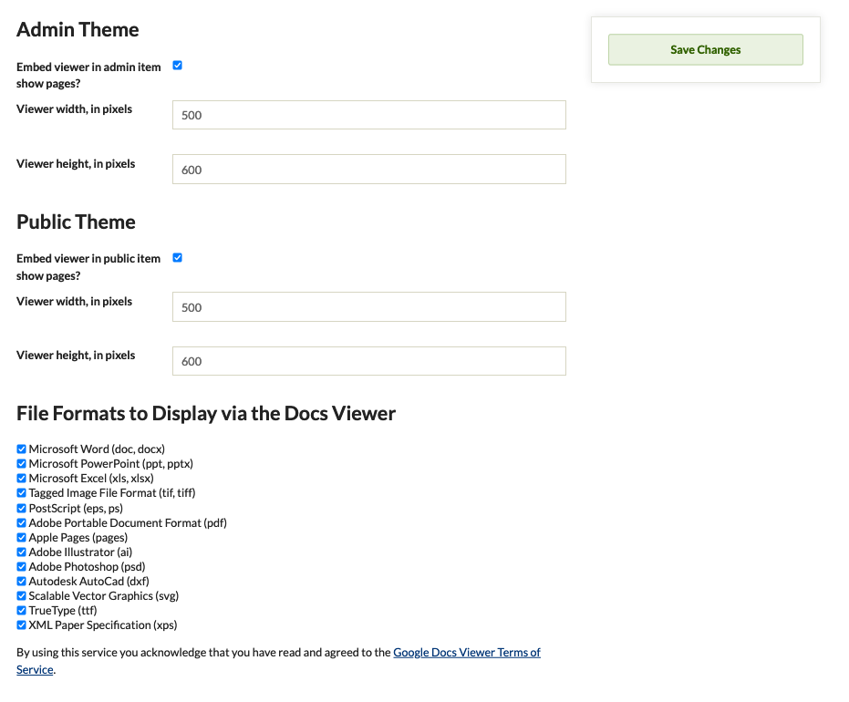

# Docs Viewer

The [Docs Viewer plugin](https://omeka.org/classic/plugins/DocsViewer/){target=_blank} embeds a Google document viewer into item show pages that [supports a variety of file types](http://docs.google.com/support/bin/answer.py?hl=en&answer=1189935){target=_blank}.
Note that some files may take a long time to load, and some may not load at all, depending on file size, connection speed, and other variables.

When you use this service you are acknowledging that you have read and agreed to the [Google Docs Viewer Terms of Service](https://policies.google.com/terms?hl=en){target=_blank}.

## Configuring

Once you have [installed](../Admin/Adding_and_Managing_Plugins.md) the Docs Viewer plugin, select Plugins in the top navigation of your admin. Activate your plugin and select Configure.

The configuration page gives you options for where you'd like the Docs Viewer plugin to appear on either or both the Admin or the public views of your site.

Under Admin Theme and Public Theme, select whether to embed the view in your item show pages and adjust the width and height of your viewer (in pixels).

Finally, the plugin gives you the options to select the file formats that you would like to display using the Docs Viewer:

- Microsoft Word (doc, docx)
- Microsoft PowerPoint (ppt, pptx)
- Microsoft Excel (xls, xlsx)
- Tagged Image File Format (tif, tiff)
- PostScript (eps, ps)
- Adobe Portable Document Format (pdf)
- Apple Pages (pages)
- Adobe Illustrator (ai)
- Adobe Photoshop (psd)
- Autodesk AutoCad (dxf)
- Scalable Vector Graphics (svg)
- TrueType (ttf)
- XML Paper Specification (xps). 

Save Changes to finish the configuration process.