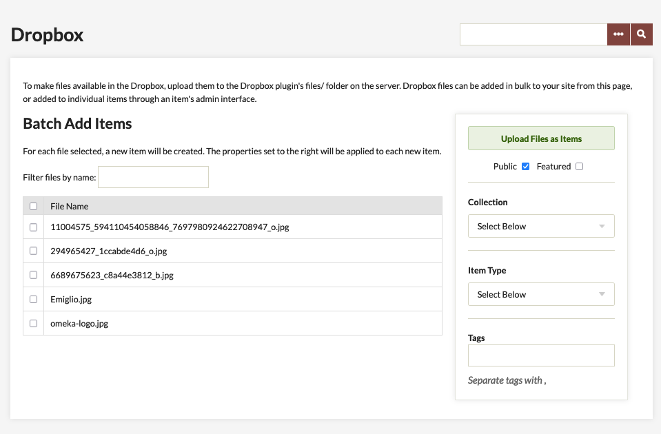
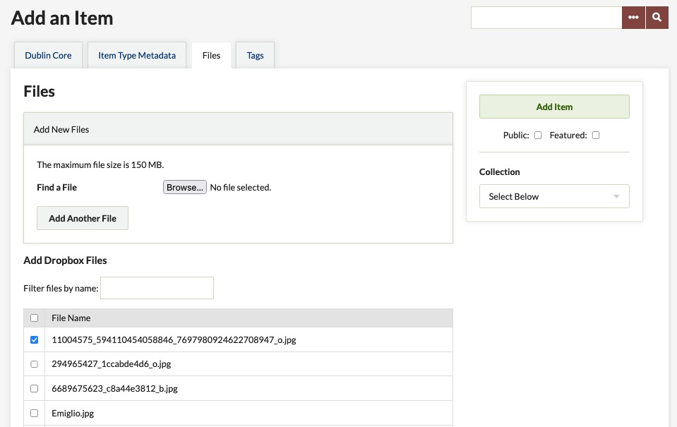

# Dropbox

**Please note that this plugin is not affiliated with the Dropbox service.**

The [Dropbox plugin](https://omeka.org/classic/plugins/Dropbox/){target=_blank} allows Omeka Classic users to batch upload a large quantity of files at one time, and may allow you to circumvent file size restrictions imposed by your server administrator. Once installed, you may create unique items from each file, and you may associate numerous files with pre-existing items.

## Using the Dropbox plugin

1.  [Install](../Admin/Adding_and_Managing_Plugins.md) the Dropbox plugin
2.  Make 'files' folder located in the /Dropbox plugin directory writable to the Apache server. For most servers, you can use the follow command to make the file writable: `chmod -r 775 files`.
3.  Once activated, the Dropbox plugin creates a tab found on the left side menu under Dashboard in admin.
4.  FTP files you wish to upload to the /files folder located on the server (/plugins/Dropbox/files/). The list of files will appear in files tab when adding or editing items,and under the Dropbox tab available from the /admin screen (.../admin/dropbox).

## Batch Adding Files As Items 

From the Dropbox box tab (.../admin/dropbox) you may select files to batch add as individual items - note that one file creates one item). When selecting files, you may also add them to a collection and associate the same set of tags, make the items public or feature them.

Click "Upload Files as Items." Items are created from each file and titled with the file name. This can modified later if you wish to edit the item's title.

- Are your jobs starting and not completing? You might need to [set the path for PHP](../Technical/Setting_PHP_Path.md) so that your system can perform the background process to make the items.

## Adding Files to Items 

To add dropbox files to items, add or edit an item(.../items/add or .../items/edit) and click on the Files tab.

Check the box, or boxes, of the file(s) you wish to associate with that particular item. You may associate multiple files with that item. Click Add Item or Save Changes button to complete the file adding process.

You may add files from the dropbox at any point during the adding or editing process.

## Security Settings

It may be necessary to add specific mimetypes to the Allowed File Types in the admin section. See [Security Settings](../Admin/Settings/Security_Settings.md) for more information.

