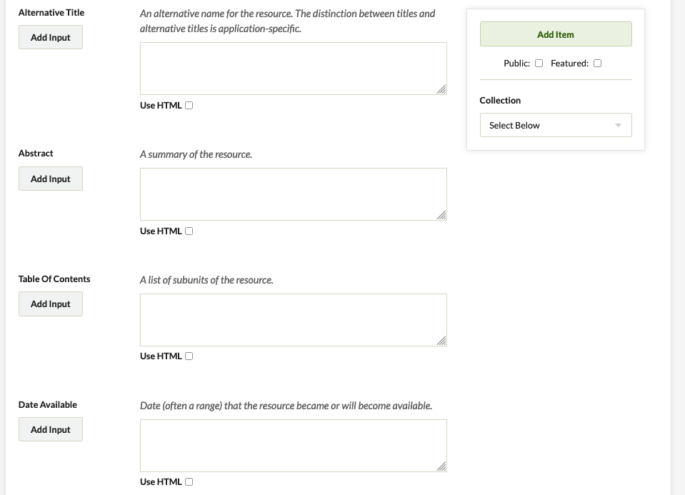

The Dublin Core Extended plugin adds the full set of Dublin Core properties to the existing Dublin Core element set, including element refinements and supplemental elements. See the Dublin Core website, under ["Properties in the terms namespace."](http://dublincore.org/documents/dcmi-terms/#H2)

If you are using Omeka.net, see [instructions for the plugin in the Help section of Omeka.net](http://info.omeka.net/build-a-website/manage-themes-and-plugins/dublin-core-extended/).

Elements Added to the Dublin Core Element Set 
---------------------------------------------------------------
The full set of DC elements are added to item metadata below the initial 20 fields available without this plugin. To reorder the elements in this extended Dublin Core set, see
[the documentation on element sets.](../Admin/Settings/Element_Sets.md)

-   Abstract
-   Access Rights
-   Accrual Method
-   Accrual Periodicity
-   Accrual Policy
-   Alternative Title
-   Audience
-   Date Available
-   Bibliographic Citation
-   Conforms To
-   Date Created
-   Date Accepted
-   Date Copyrighted
-   Date Submitted
-   Audience Education Level
-   Extent
-   Has Format
-   Has Part
-   Has Version
-   Instructional Method
-   Is Format Of
-   Is Part Of
-   Is Referenced By
-   Is Replaced By
-   Is Required By
-   Date Issued
-   Is Version Of
-   License
-   Mediator
-   Medium
-   Date Modified
-   Provenance
-   References
-   Replaces
-   Requires
-   Rights Holder
-   Spatial Coverage
-   Table Of Contents
-   Temporal Coverage
-   Date Valid

Uninstalling Plugin 
-------------------------------------------------------------
After installing, if you wish to deactivate the plugin so that the extended DC fields are not visible in the items, you must also click the "uninstall" button in the admin/plugins page to get rid of those additional fields. Remember, you will also lose any data from those fields.

The dc-rdf Output Format 
---------------------------------------------------------------
The plugin also introduces the [dc-rdf](http://dublincore.org/documents/dc-rdf/) output format for expressing Dublin Core metadata using the Resource Description Framework. Omeka already comes with the [dcmes-xml](http://dublincore.org/documents/dcmes-xml/) output format, which dc-rdf supersedes. To view this output, simply add `?output=dc-rdf` to the end of the URL on the items browse and show pages.
