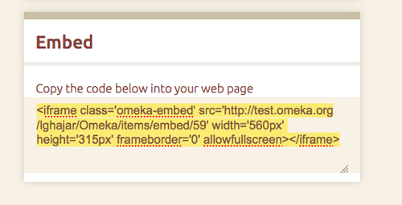
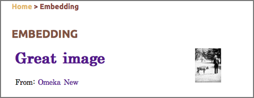

# Embed Codes

The [Embed Codes plugin](https://omeka.org/classic/plugins/EmbedCodes/){target=_blank} enables you to share individual Omeka items as an iframe in other webpages and blogs, including Wordpress installations and Omeka Simple Pages.

## How to Embed Omeka Classic Items in Other Sites

Once you have [installed and activated](../Admin/Adding_and_Managing_Plugins.md) the plugin, the Embed Code field then appears in the public view of individual items in your website. No further configuration is required.

Highlight and copy the entire code in the Embed field.
 

Paste the embed code into the appropriate section of the website where you want your selected item to appear. A thumbnail of the item and item title are linked from the page where you pasted the embed code.

## Track Embeds

The Embed Code plugin allows you to track which items from your Omeka Classic site have been embedded, where they are embedded, dates of first and latest views, and number of views. In admin, select Embedded Items in the left hand navigation list to track embedded items from your Omeka site.

