# Exhibit Builder

The [Exhibit Builder plugin](https://omeka.org/classic/plugins/ExhibitBuilder/){target=_blank} allows you to develop online exhibits, or special web pages, that combine items from your Omeka Classic site and may include narrative text.

Exhibits are composed of pages, generally an initial page that introduces your exhibit and subsequent pages composed of the items from your Omeka Classic database that you wish to highlight and/or relate to each other. Exhibit Builder exhibits may be as short as one page or consist of multiple pages. You can make the pages of an exhibit hierarchical.

The layout of exhibits in Exhibit Builder is highly customizable, with the pages composed of smaller units called blocks. There are four basic content block types which come with Exhibit Builder: file with text, gallery, text, and file.

Other plugins may include their own Exhibit Builder block layouts, if the developer has created them.

## Configuring

This plugin is included in your downloaded Omeka Classic installation and does not require a separate download. Select Plugins in the top navigation of your admin. Activate your plugin and select Configure to choose the sequence in which your exhibits appear. Exhibits may be ordered by date added, alphabetically by name, or most recent.

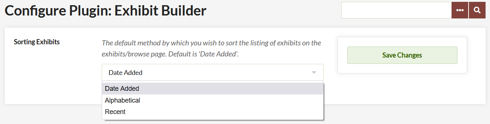

-   Choose the order of your Browse Page Exhibit display from the dropdown menu. 
-   Don't forget to save your changes.

## Getting Started

Once you have activated and configured the Exhibit Builder plugin, Exhibits should appear in the left navigation bar. Clicking on it will take you to the Browse Exhibits page (admin/exhibits in your installation).

To create an exhibit, go to the Exhibits tab and click the green button labeled "Add an Exhibit". 

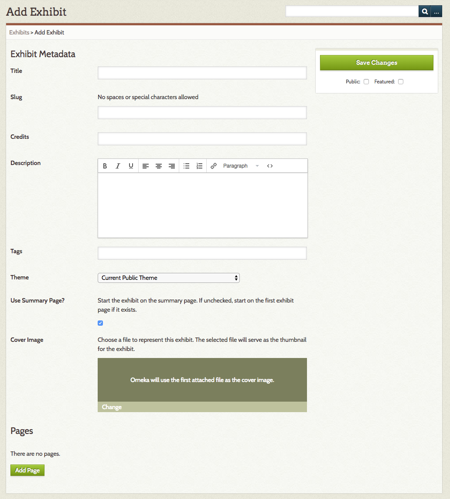

On the Add Exhibit page, enter the following metadata:

-   Title: the name of your exhibit, which will be displayed to users
-   Slug: the abbreviated exhibit name which appears in the url, for example `http://youromekasite/exhibits/show/slug`
-   Credits: acknowledgements which will be visible to the public
-   Description: an introduction or overview for the exhibit
-   Tags: keywords or themes that give users another option for finding exhibits.

Once you have entered the data, click Save Changes to create your exhibit.

There is an option to select a theme for the exhibit (see below).

The *Use summary page* checkbox allows you to decide whether or not to use a summary page. An exhibit summary page displays the exhibit description and navigation options. If this box is unchecked, users navigating to the exhibit will start on the first page of the exhibit.

Upload a *cover image* to represent the exhibit on browse pages and elsewhere on your site. 

### Theme
By default, your exhibits will display using the same theme as the rest of the site. You may choose a different theme for each exhibit. To do so, select a theme from the dropdown, which will default display "Current Public Theme."

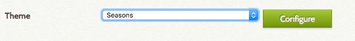

If you select an option other than "Current Public Theme" for your exhibit, you can configure the theme settings for the exhibit by clicking the Configure button which will appear next to the dropdown.

After selecting a specific theme for exhibit, you can configure that theme by adding a logo, header image, footer text, and copyright information which displays only for that exhibit. 

Note that if you change the theme, you must click Save Changes before you configure the theme. So if you have been using Berlin and you want to change to the Winter version of Seasons, you will have to click Save Changes after switching from Berlin to Seasons in the Theme dropdown before you can configure the Seasons theme.

## Pages

Once you have created an exhibit you can add pages to it by clicking the Add Page button at the bottom of the Exhibit Metadata page.

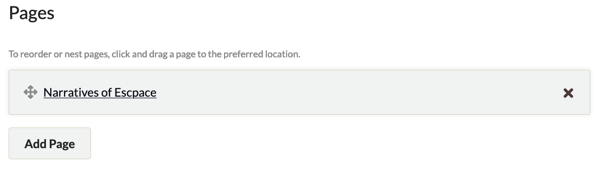

Once on the Add Page screen, add the following:

-   Page Title: visible to users, used for navigating through the exhibit.
-   Page Slug: an abbreviated exhibit name that appears in the url, for example `http://youromekasite/exhibits/show/exhibit_slug/page_slug`

To save the page information and continue editing that page, click the Save Changes button. To save the basic information for that page and add another page, click the Save and Add Another Page button.

### Organizing Pages

An exhibit in Omeka Classic can have multiple pages. You can reorder these pages by dragging and dropping, and you can use drag and drop to set up an exhibit page hierarchy. Note that these hierarchies cannot be more than three levels deep.

You can also delete pages from the Exhibit Metadata page through a two-step process. First, click the large black X on the display bar of the page you wish to delete. Once you click the X, the bar will turn red (see the bar for the page Edward in the image below). Clicking the arrow will undo the delete action. To confirm deleting a page, you must click the Save Changes button. Once pages have been deleted, they cannot be restored.

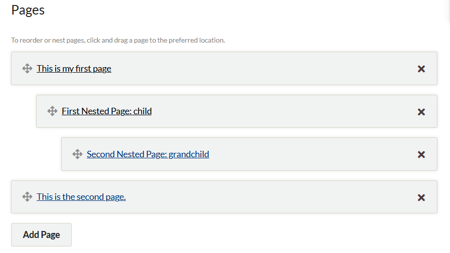

## Content

Pages are made up of combinations of smaller content units called 'blocks.' There are four basic kinds of blocks: item(s) with text, an item gallery, text only, and file only. Each page can have one or more content blocks.

The **File with Text** block allows you to pair fullsize or thumbnail files of your items with a block of text. The item files will all be the same size. Text will appear either to the right or left of the item(s). You can use a single item file paired with text, or have multiple item files to the right or left of a block of text.

The **Gallery** block creates a gallery of item files, generally large square thumbnails. You can add text to the gallery, which will display left or right of the gallery. In a gallery block, you can specify a showcase file, which will appear fullsize either to the right or left of the text. The other gallery images can be placed below the showcase image or beside it, over the text.

The **Text** block allows you to create a section of text which spans the width of the entire page.

The **File** block allows you to add larger files as a separate block.

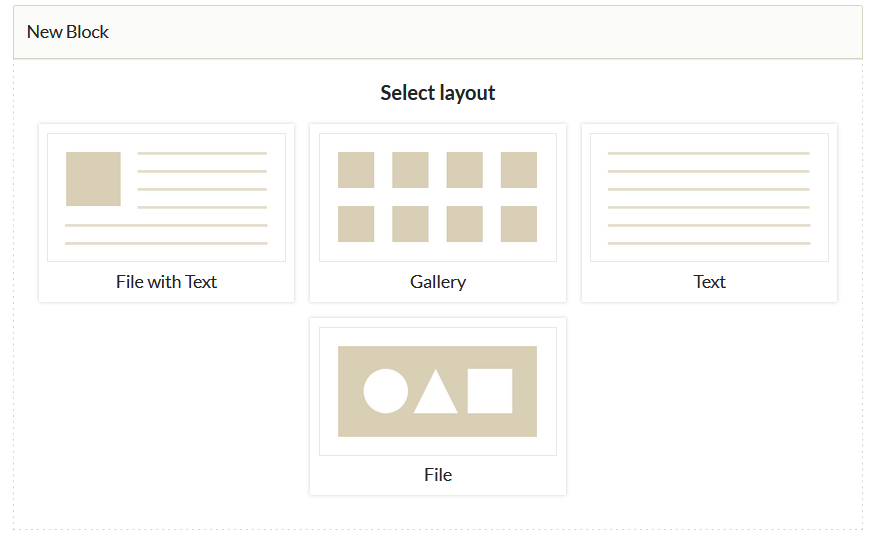

To add a content block, select the layout you want in the New Block dialog box. Once you have selected the kind you want, click the "Add new content block" button. You will have a new block on the page to configure your content.

Some plugins, such as [Geolocation](Geolocation.md) and [Exhibit Image Annotation](ExhibitImageAnnotation.md), will create additional block types which you can select when building a page.

### Adding Items
- If you have selected any block other than Text, choose an item by clicking the large plus sign button titled *Add Item* appearing in the Items area.

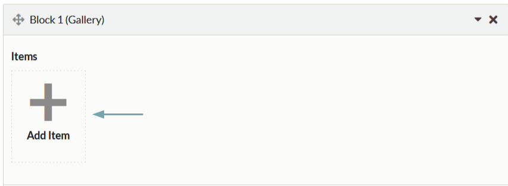

- An items browse dialog box pops up showing all of your items.
   - You can browse using the back and forth arrow buttons in the upper right corner of the dialog box. 

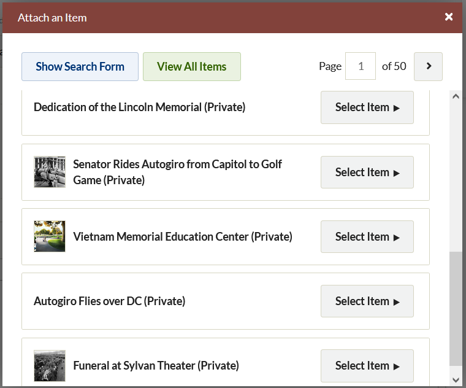
  
- Clicking *Show Search Form* will take you to an advanced item search. 

- To select an item, click on the bar representing it in the Attach an Item window. The right end of the bar will highlight a dark brown "Select Item" button. 

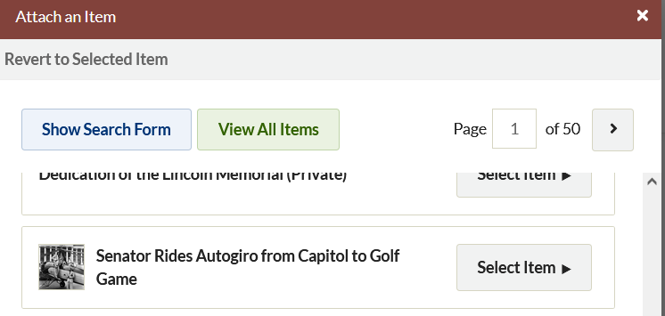

- Click Select Item to find options for selecting a file and creating a caption for the item. 
    - If you have more than one file uploaded for an item, you will be able to select which you want to use by clicking on it.
    - Add a caption in the text field. This will appear in smaller font below the file, not as part of a larger text block. Best practice is to keep it short.
   
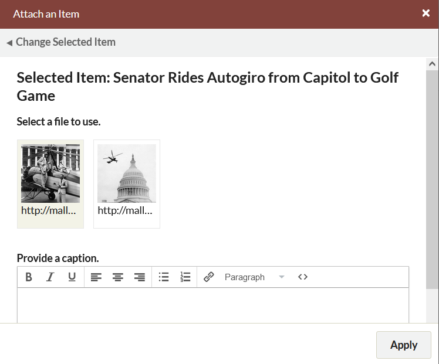

- Click Apply to add the item to the block.

Click the X in the upper right corner of the Attach an Item window at any time to exit the process.

Once you have added an item, you can change the caption or selected file by clicking the edit button which sits across the bottom of the item icon. 

To add multiple files from the same item, simply add the same item to the block, choosing a different file to represent the item each time.

To delete items, click the X in the upper right hand corner of the item icon; this will gray out the icon, indicating that it will be deleted the next time you save changes. If you decide not to delete the item, you can click the curved arrow which replaced the X, but you must do so before you save your changes.

In the image below, the middle item has been marked for deletion. A red arrow points to the X to delete the third item.

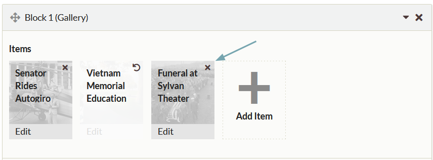

Exhibit text can be formatted using the [text editor bar](../Content/Using_HTML_Editor-TinyMCE.md). To write your own HTML, or paste from somewhere else, click the blue HTML button in the formatting toolbar at the top of the text entry box. This will open up an HTML Source Editor window in which you can work.

### Layout Options

Both the File with Text and Gallery blocks include layout options to change the look of the exhibit page. To access these options, click the black triangle button to the right of the Layout Options text at the bottom of the block. This will reveal dropdown menus with options for changing the layout.

The **File with Text** block has the following options, all of which are drop-down menus (options listed in parentheses after the dropdown label):

- File Position (left, right): position of the file relative to the text block.
- File Size (full-size, thumbnail, square thumbnail): 
- Captions position (center, left, right): the position of the file's caption relative to the file (not the text block)
Whatever you select affects all of the files for that block equally. The text in this block will stay fixed to the right or left of the file, but will wrap below if the length of the text exceeds the height of the file.

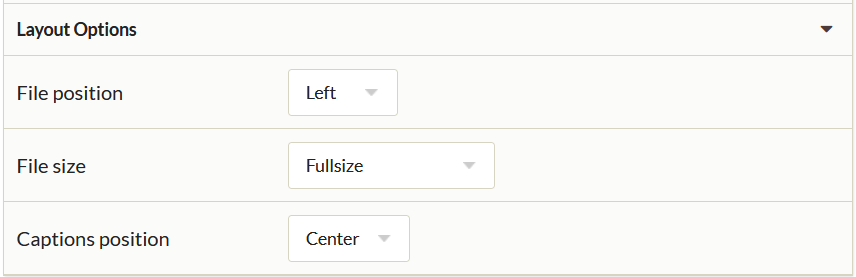

The **Gallery** block has the following options, all of which are drop-down menus (options listed in parentheses after the dropdown label): 

- Showcase File Position (no showcase file, left, right): a showcase file is full-size, while the rest of the gallery files are thumbnails. 
- Gallery position (left, right): position of the gallery files relative to the showcase file. If there is no showcase file, the gallery will use the full width of the page.
- Gallery File Size (square thumbnail, thumbnail): for all files in the gallery except the showcase file.
- Captions Position (center, left, right): the position of the file's caption relative to its file.

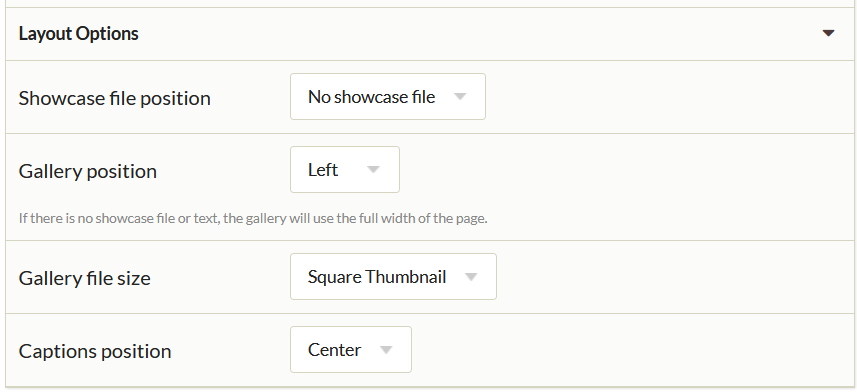

The **File** block has the following options, all of which are drop-down menus (options listed in parentheses after the dropdown label): 

- File Position (left, right, center): position of the file relative to page margins.
- File Size (full-size, thumbnail, square thumbnail): 
- Captions position (center, left, right): the position of the file's caption relative to page margins (not the file)

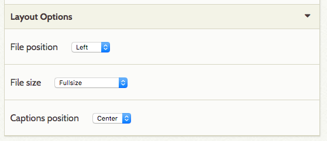

### Additional Layouts
Some plugins include their own Exhibit Builder content block layouts.

If you have installed the [Geolocation](Geolocation.md) plugin, you will have the
**Geolocation Map** block as an option in your exhibits. This block has no text. Select items which already have been geolocated using the plugin in their item edit page. This block displays as a map across the full width of the page, with markers for the items you select. Any captions you enter will appear in a pop-up inside the map when the item marker is clicked, as will the item file and title.

This image shows a Geolocation block with items added:
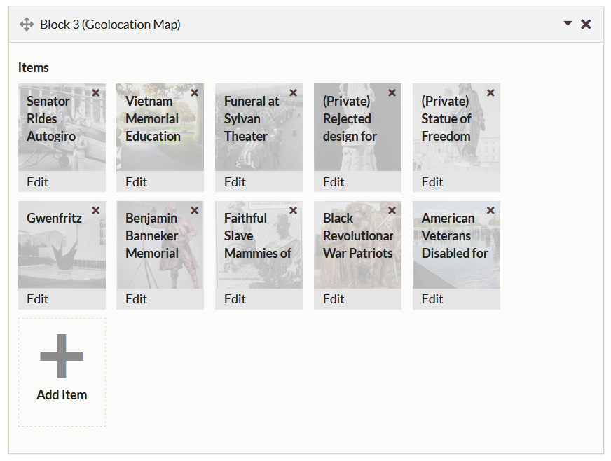

And this is how the map looks on the public view of the exhibit page:
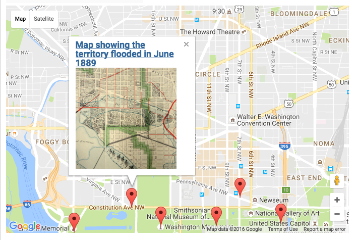

## Shortcodes

Exhibit Builder adds specific [shortcodes](../Content/Shortcodes.md) to your install, which allow you to call specific exhibits or featured exhibits. 

### Previous Exhibit Builder Layouts

The following is a list of layouts from previous versions of Exhibit Builder showing how the old layouts can correspond to new content blocks. These correlations are how pages built in previous versions of Exhibit Builder will be imported when upgrading.

Although it is possible to reproduce previous layouts using Exhibit Builder 3.0, the content blocks allow for a much wider variety of layouts. For example, rather than having all the files on one side, as in image list left or right, files could alternate sides. You can also combine a Gallery block with File with Text Blocks, or stack multiple Galleries with interpretive text for each set. 

NB: You cannot change one kind content block (ex. Gallery) to a different kind of content block (ex. File with Text). However, because you can move content blocks around, adding a new block to replace an existing one is less work than in previous versions of Exhibit Builder.

Block layout options are in *italics* for Exhibit Builder 3.0 blocks.

| Exhibit Builder 2 Layout | Exhibit Builder 3.x Layout |
| --- | --- |
| Gallery-full-left  | One gallery block, showcase file position *left*, gallery position *right*. 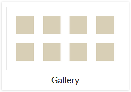  |
| Gallery-full-right  | One gallery block, showcase file position *left*, gallery position *right*.   |
| Gallery-thumbnails  |  One gallery block, no showcase file.   |
| Gallery-thumbnails-text-bottom | One gallery block with text added, or one gallery block with no text and one text block.   |
| Gallery-thumbnails-text-top  | One text block above one gallery block.  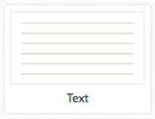 +  |
| Image-list-left  | Series of File with Text blocks, file position *left*, files *full size*   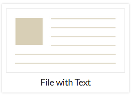 |
| Image-list-left-thumbnails  | Series of File with Text blocks, file position *left*, files *thumbnail* or *square thumbnail size*.   |
| Image-list-right  | Series of File with Text blocks, file position *right*, files *full size*.   |
| Image-list-right-thumbnails  | Series of File with Text blocks, file position *right*, files *thumbnail* or *square thumbnail size*.   |
| Text  | One text block   |
| Text-image-left  | One File with Text block, file position *left*.   | 
| Text-image-right  | One File with Text block, file position *right*.   |
