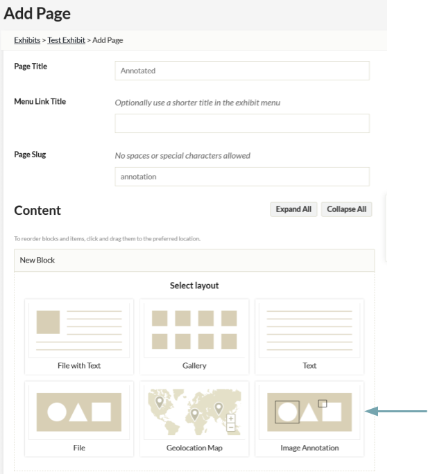
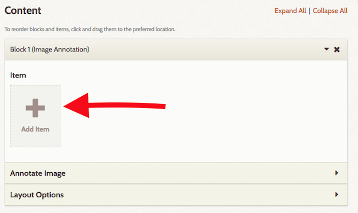
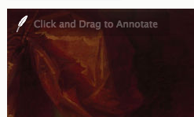
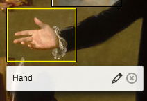

# Exhibit Image Annotation

The [Exhibit Image Annotation plugin](https://omeka.org/classic/plugins/ExhibitImageAnnotation/){target=_blank} adds a content block type to [Exhibit Builder](ExhibitBuilder.md) that allows you to create annotations on an image file. The annotation will be visible on both the public and admin views of the exhibit.

Content blocks are the pieces which are used to create exhibit pages. If you have used Exhibit Builder, you have already worked with the following block types: file with text, gallery, text, and file.

There is a [screencast](https://vimeo.com/245756433){target=_blank} for this plugin.     

## Annotating an Image
To add an image annotation, create a new page in an  exhibit, or go to an existing page on which you want the annotation bloc to appear.

First, add an image annotation block: 

1. In the New Block selection, click Image Annotation and click "Add new content block."
2. This will add a new block with the label *Image Annotation*.

Next, add an image to the block by clicking the Add Item button. Select from the image files in your site, just as you would adding content to any exhibit page block.  

Please note that each Image Annotation block can only have a single image, but you can put multiple blocks on a page.

Once you have selected an image, open the section of the block labeled *Annotate Image* (you may need to click the small triangle on the right hand side of the header bar to do this). 

Click *Load selected image* to load a large version of the image you will annotate. This may take a moment. NB: You will need to do this every time you work with the image.

The image will load with a quill feather icon in the upper corner to indicate that this is an annotation-friendly image. You *do not need* to interact with the quill feather. 

To create an annotation on the image: click and drag anywhere on the image to create rectangles. Once you have created a rectangle, an annotation box will appear where you can add a comment. Type your text in this annotation box. 

It will expand to fit the text you enter, allowing you to seen entire paragraphs. You can, if you choose, hand-code basic html into the annotations. Click Save to preserve the annotations, and cancel to abandon them.

To edit an existing annotation, hover over on its rectangle; the rectangle will highlight in yellow and you will see two icon buttons: a pencil, to edit the annotation, and an X to delete it.

Note that you can overlap annotations if you choose.

To delete an existing annotation, hover over it and click the X button in the menu which appears.

## Viewing Annotations
On the public side, image annotation blocks will appear as a full-size version of the image, with the rectangular outlines of the annotations visible. When a visitor hovers over the annotation outline, the text you have entered will appear.

