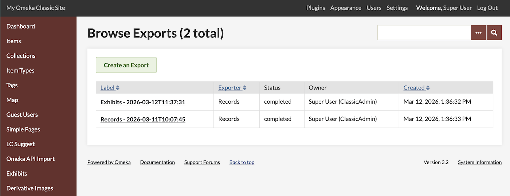
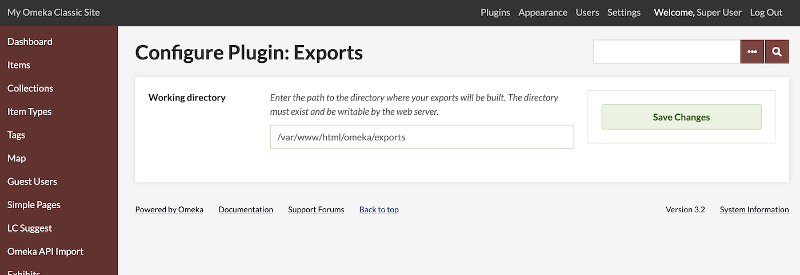
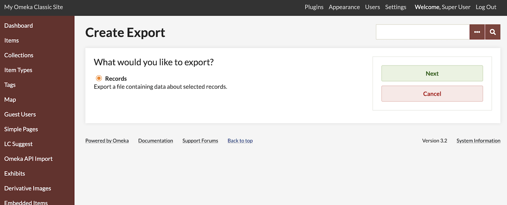
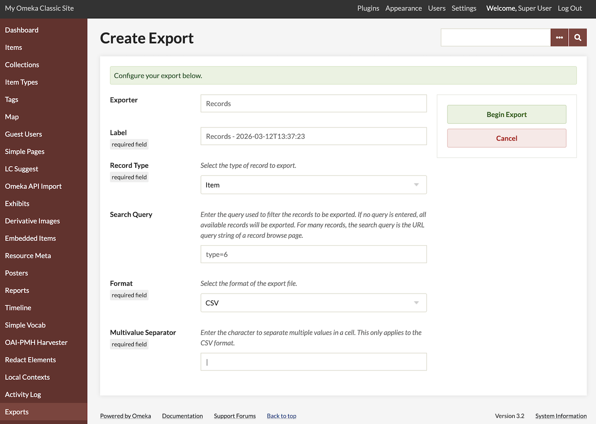
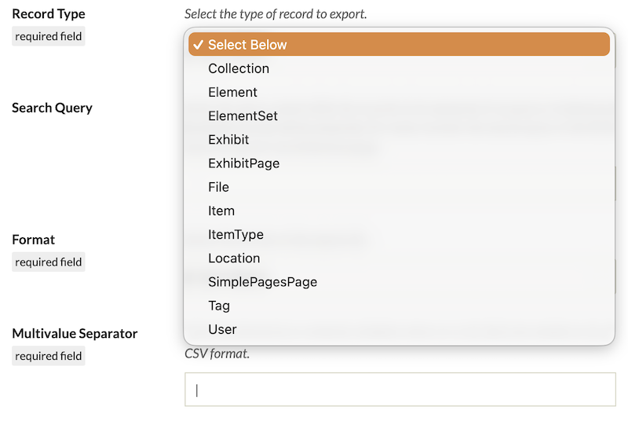
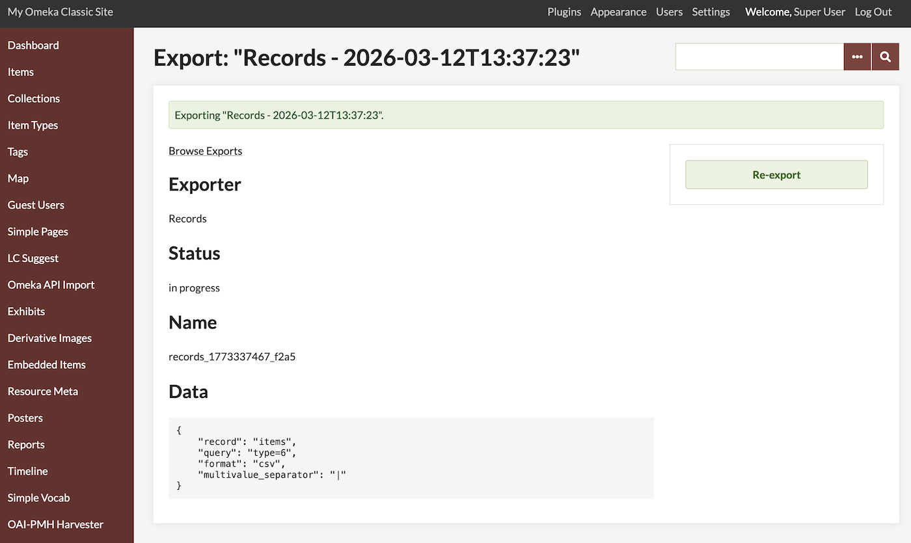
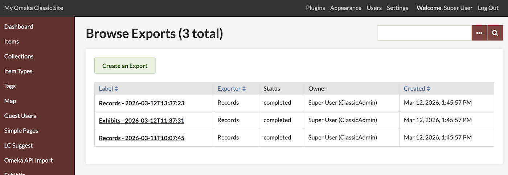
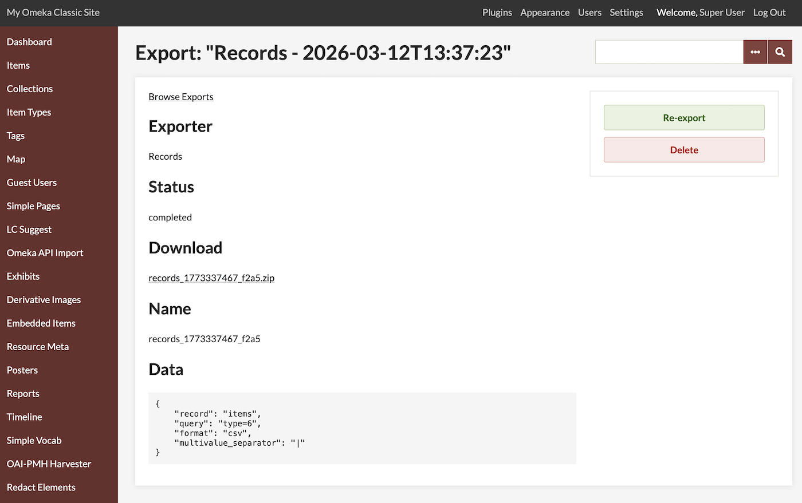

# Exports

The [Exports plugin](https://omeka.org/classic/plugins/Exports/){target=_blank} allows logged-in users to create a downloadable export of metadata associated with Omeka Classic items, collections, files, and exhibits. This can be in CSV or JSON format. 



## System requirements

The plugin requires two folders inside your installation to be writeable. One is a "working" folder you need to create, where the export files are assembled, and is set in the plugin configuration. Create and set the permissions for this directory in the process of installing the plugin. The other is the permanent place where the export output will be stored and made available for you to download. This folder will be inside the `/files` folder of your installation, called "exports". 

The plugin will not create `/files/exports` upon installation, but when you start your first export. If you encounter errors, you may need to either change permissions on your `/files` directory to allow this creation, or manually create the `/files/exports` directory and set its permissions. 

### User permissions

This plugin can be used by any user at the Admin or Super User level. Both Admin and Super accounts can see the table of past exports, and generate new exports. 

Note that these users can export information about **private** exhibits, items, collections, etc. using this plugin. 

## Configuration

When the plugin is first installed, you will be brought to the Configuration screen. This can later be accessed from the "Plugins" tab at the top of the administrative dashboard, in the list of plugins, with the "Configure" button. 



On this page you must set a folder on your server, inside your Omeka S installation directory, for temporary files to be created. Enter in the absolute path from your server root. 

You must create the directory first on your server, and set its permissions to writeable, before you save this page. The plugin will check that the folder exists and is writeable when you save the page, and give an error message if there is a problem. 

## Export resources

Find the "Exports" entry in the left-hand sidebar of your administrative dashboard, and then click "Create an Export" in the top-left corner to set up your export. 


At this time the screen only offers one option. Future or third-party versions of this plugin may add more exporting options. 



On the next page you will set up your export to pull information from your chosen entries in the installation's database. 



**Label** (Required): While the plugin fills in a default name for this export, you can specify something easier to remember, such as the type of information you are exporting (such as "Exhibits 2026-01-01"). 

**Record Type** (Required): Select one type of information to export. Besides items, collections, or files, you can also choose users, tags, item types, and element sets. You can use a query to filter specific types of these resources, such as by item type, date range, etc. 

You can also choose other information in the databse of your installation, including data stored by plugins. This can include exhibits from ExhibitBuilder, pages from SimplePages, and location data from the Geolocation plugin (coordinates that are attached to items). More may be added by other plugins. 

The options, excluding additional options added by modules, include:

- Collection
- Element
- Element Set
- File
- Item
- Item Type
- Tag
- User. 



**Search Query:** Once you have chosen an option to export, you can narrow the results with queries. You can manually enter in a text query that you have copies from the URL of a search run in the administrative or public site. For example, you can enter the following to narrow down your assets according to the owner:

```
owner_id=2
```

Note that most exports will include data about private objects, including drafts or duplicates in the process of being edited. You can use the search query `public=0` to return only private materials, or `public=1` to return only public materials. 

**Format** (Required): You can export information into a CSV or into a JSON-LD file (file extensions `.csv` or `.json`). Either choice will come wrapped in a ZIP file for download. 

**Multivalue Separator** (Required): This field is an option for CSV exports. The default character is a vertical pipe (|) character. You can change this if desired. Other common separators include commas and semi-colons; we recommend choosing a character that does not appear in the dataset. 



Once you start the export, you will see a page with information about the export. You will see a green bar at the top of the screen indicating that the job has begun. If you go back to the Exports main screen, using the "Browse Exports" link at the top of the page, you can see the status in the table. 

## The Exports table



When an export has started, you will see its entry in the table. Its label will be a link where you can review the settings you used, and download the resulting file if the process has completed. 

You can re-run an export from this page with the "Re-export" button, or delete both the table entry and its downloadable file with the "Delete" button. This will bring up a confirmation window.  



## Exported files

The plugin will output all metadata associated with the chosen resource type, including internal information such as the item owner and links to all the attached files and their derivatives. 

You will see, if you export a CSV, column headings such as `Dublin Core:Creator` for items, as well as internal information such as `owner_id`, etc. 