# Geolocation

The [Geolocation plugin](https://omeka.org/classic/plugins/Geolocation/){target=_blank} allows you to assign a location to items in your Omeka Classic site. The locations are displayed on maps on individual items page and on a browsable map of all geolocated items.

There is a [screencast for Geolocation (version 2.2.4) demonstrating its basic functionality](https://vimeo.com/156298642){target=_blank}.

## Configuring

Once you have [installed](../Admin/Adding_and_Managing_Plugins.md) the Geolocation plugin, go to the Plugins tab in the top navigation of your admin dashboard. Scroll down to the listing for Geolocation and click *Configure* (if you do not see Configure you may need to click the *Install* or *Activate* buttons.

### General Settings
The first section for configuration are the general settings for the appearance of your map on the public and admin sides of your site.

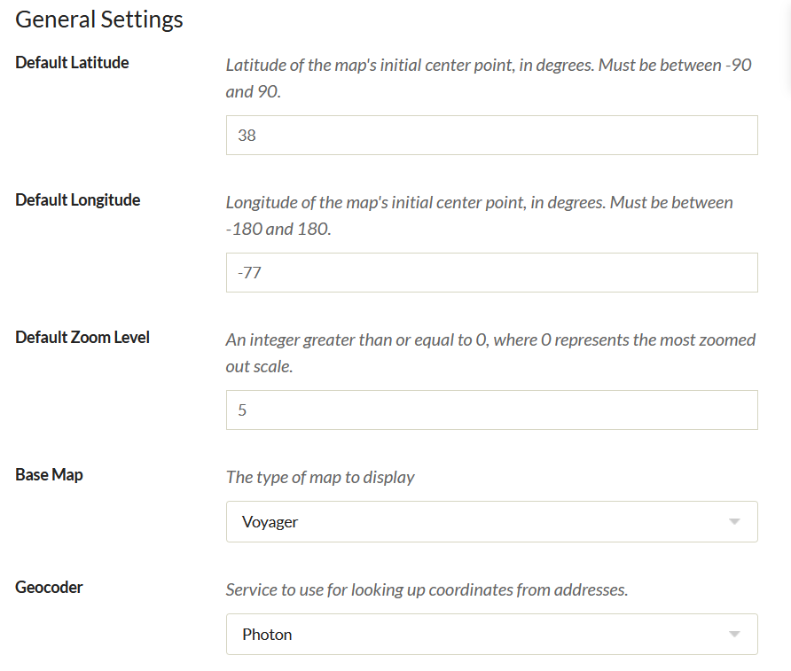

- *Default latitude*: set the center point of the map's latitude (North/South value), in degrees. Using numbers after the decimal point will pinpoint the location more precisely.
- *Default longitude*: set the center point of the map's longitude (East/West), in degrees. Using numbers after the decimal point will pinpoint the location more precisely.
- *Default Zoom Level*: Use a whole number of 0 of greater. 0 is the most zoomed out. A value of 15 will result in a map showing roughly one square mile
- *Base Map*: select a map from the dropdown to serve as the base map in the display. All base maps except those served by Mapbox can be [previewed courtesy of Leaflet](http://leaflet-extras.github.io/leaflet-providers/preview/){target=_blank}.

If you select Mapbox from the dropdown for Base Map, two additional fields will appear under general settings. 

- *Mapbox Access Token*: in order to use Mapbox, you need to sign up for their service. Once you have done so, you can go to your [account page](https://www.mapbox.com/account/){target=_blank} and copy your access token to paste into this field. 
- *Mapbox Map ID*: The "map ID" that goes here is the part of a Mapbox "Style URL" that comes after "mapbox://styles/". You can use your own maps or one of the [globally available styles](https://docs.mapbox.com/api/maps/#mapbox-styles){target=_blank}. Leaving this input blank will use the default Mapbox street map.

  As of June 1, 2020, Mapbox has deprecated older-style maps. Geolocation 3.2 and up support the newer Mapbox API, and the plugin will automatically update your selected Map ID if you were using one of the "standard" map types. If you had specified a custom map ID, you may need to update it after upgrading Geolocation.

You can use MapBox to create your own map tiles, for example a historic map layer. Please refer to the [MapBox documentation](https://www.mapbox.com/api-documentation/#introduction){target=_blank} for more information.

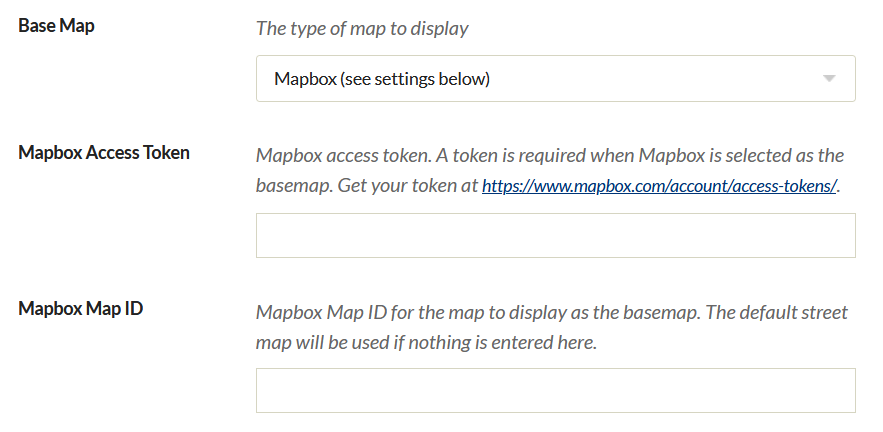

### Browse Map Settings
These settings are for the map through which users can browse all geolocated items, and for the "Search by Address function" that Geolocation enables in advanced item search. 

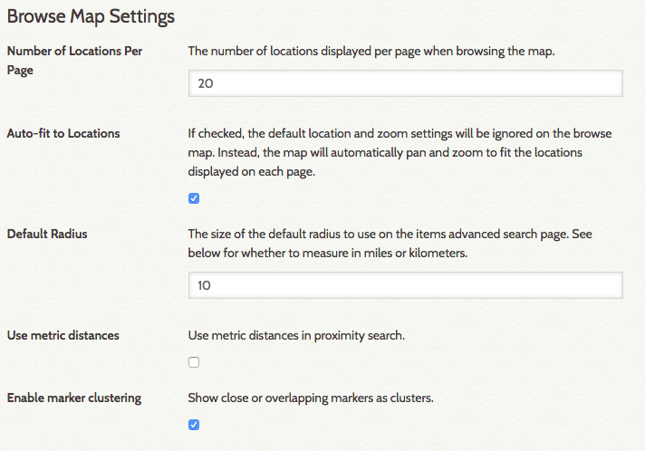

-   *Number of Locations Per Page*: The browsable map has pagination; set the number of items per map page with a whole number.
-   *Auto-fit to Locations*: If checked, the browse map will ignore default location and zoom settings designated in General Settings and instead auto fit to the locations of the items displayed (on that page).
-   *Default Radius*: for the Search By Address function in the advanced items search.
-   A checkbox to *Use metric distances* for radius search, rather than miles.
-   A checkbox to *Enable marker clusters*. When checked, markers that are very close to each other will cluster together and be represented by a number (indicating the number of markers).

A map with Enable marker clusters unchecked:  
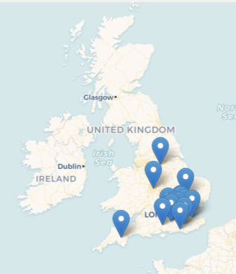

The same map with Enable marker clusters checked:   
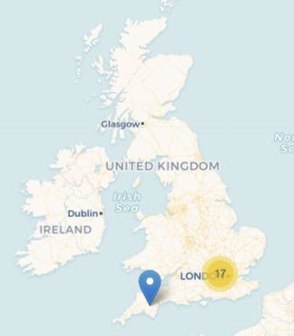

### Item Map Settings
These settings are for the map display on an item/show page.

- *Width for Item Map*: set in percent, defaults to 100% if left blank.
- *Height for Item Map*: set in pixels defaults to 300px if left blank. 

### Map Integration
These settings are for integration of the geolocation map into the site menu and the [contribution](Contribution.md) plugin's form. 

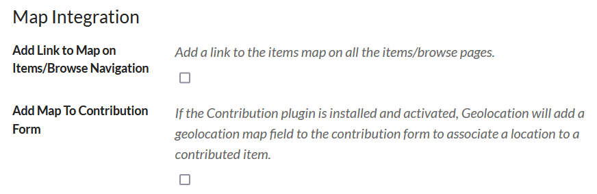

- *Add link to map on Items/Browse navigation*: click to make active. 
- *Add map to contribution form*: click to make active. Note that this will only work if you have the Contribution plugin installed and active.

Adding Location to an Item
----------------------------------------------------------------
After you have activated and configured the Geolocation plugin, you can add a location marker to your items. Note: an item can only have a single location marker; you cannot have an item associated with more than one location at a time.

Geolocation adds a Map tab to the options for adding or editing an item (`admin/item/edit` and `admin/item/add` pages).  When adding metadata for an item, click on the Map tab to add a location.

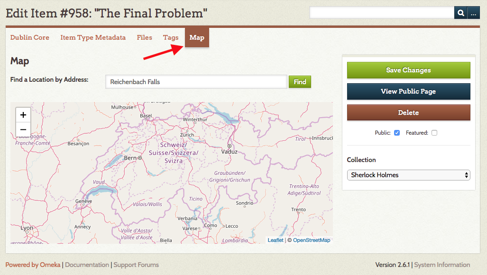

On the tab there is a field for you to *find a location by address* and a map which you can drag to move around, zoom in and out with the plus and minus options (or the scroll wheel on a mouse), and toggle between road and satellite maps. 

To find the location you want to assign to the item, you can:

- Enter the address where you want the marker for the item to be placed. The plugin will automatically add a marker at that location. You can use a street address (ex `100 First St SE, Washington, DC 20543`) or geocordinates in decimal form (ex `38.888611, -77.004722`).
- Zoom and scroll to navigate to where you want to place the marker, then click directly on the spot on the map where you want to place the marker. 

To change the location of an item, type in the new address or click on the new location. You'll be asked if you are sure you would like to change the item location. Select OK or Cancel.

To remove geolocation from an item, click directly on the marker. A dialog box will ask you to confirm that you want to delete the location assignment. 

Don't forget to save your changes.

## Viewing Items on the Public Map 

Visitors to your Omeka site may use a map to browse through all of your geolocated items.

When configuring the plugin, if you selected "Add Link to Map on Items/Browse Navigation," a "Browse Map" link will be added automatically to the secondary navigation on the items/browse page.

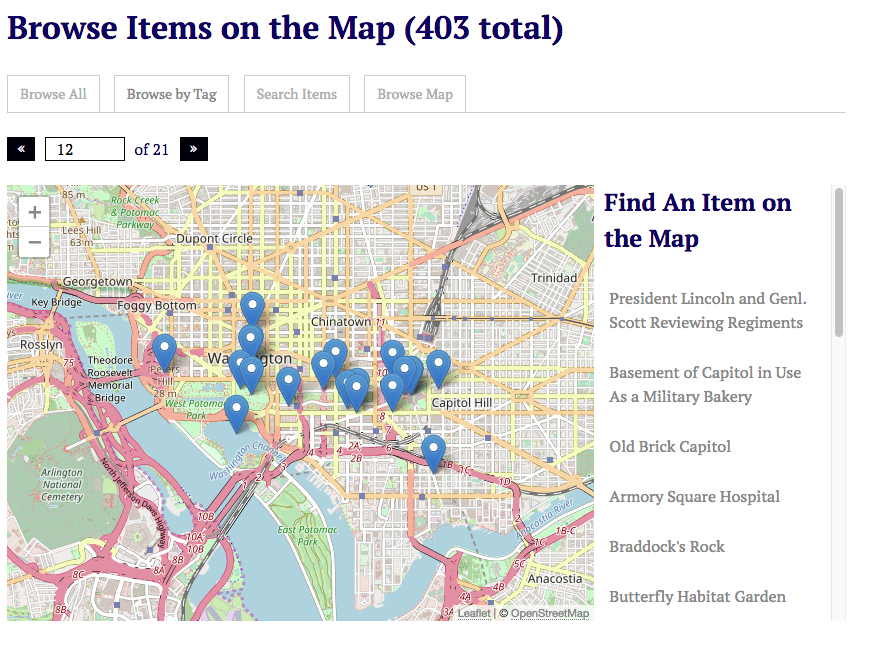

From this view, visitors may browse all mapped items, browse by tag, search for items and browse the map.

They may also locate a mapped item by clicking on the items listed in the right column of the map.

## Browse and Search Items on Admin Map

A Map tab appears in the left navigation bar located on the left side of the Dashboard. Clicking on the Map tab takes you to a map that displays all items geolocated in your Omeka site--public and not public, and an advanced search form to locate specific items.

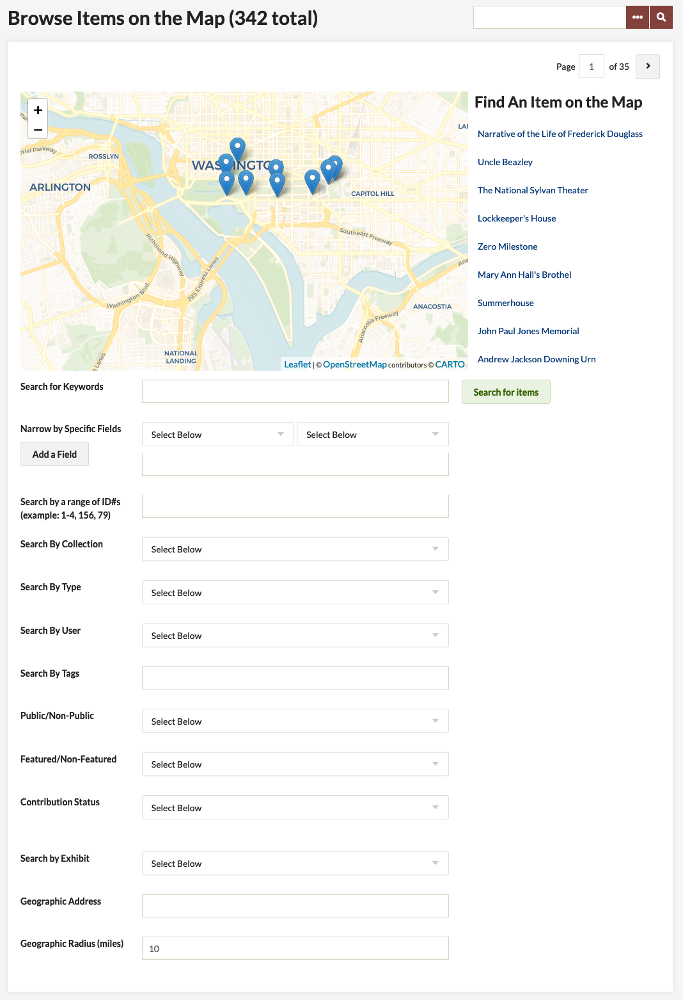

From this view, you may also search mapped items using the item advanced search. Search results appear directly on the map.

## Geolocation and Exhibit Builder

If you have [Exhibit Builder](ExhibitBuilder.md) (version 3.x or greater) installed, Geolocation will add a Map block to the options when building pages. 

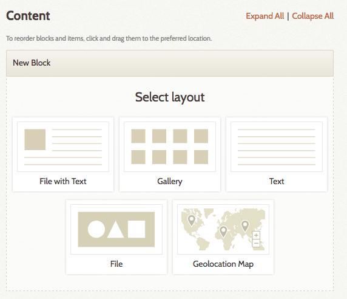

You can add items with geolocation markers to the map block by [adding items](ExhibitBuilder.md#adding-items) as you would with any other Exhibit Builder block. Only items to which you have added a location will show up on the map; the map will ignore items without a location.

The exhibit will display a single map with the markers for those specific items, centered to display all the items within the map view.

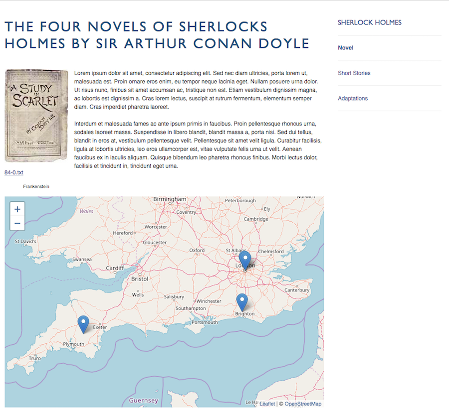

## Shortcodes

The geolocation [shortcode](../Content/Shortcodes.md#geolocation) will create a map of items based on parameters it is given.

The shortcode is `[geolocation]`. Without any additional parameters, it will return a map of all items that contain geolocation data, limited by the records per page as set in the Geolocation plugin configuration.

**Options**

`fit`
:   specify whether to allow google map to automatically center and zoom the map to fit all of the markers. This is on by default.

To manually specify the map/location zoom, use the following options. Note, to use these options, fit must be set to ‘0’ or ‘false’.

`lat` 
:   specify the latitude of the map’s initial center point, in degrees.
:   Must be between -90 and 90.

`lon` 
:   specify the longitude of the map’s initial center point, in degrees.
:   Must be between -180 and 180

`zoom` 
:   specify the initial zoom level of the map. 0 is the most zoomed out.

If any of `lat`, `lon`, or `zoom` are not specifically set, and ‘fit’ is set to `0` or `false`, the settings from the Geolocation plugin configuration page will be used.

`type` 
:   specify the type of google map that appears. Defaults to the setting from the Geolocation plugin configuration page.
- roadmap - displays the road map view
- satellite - displays Google Earth satellite images
- hybrid - displays a mixture of road map and satellite views
- terrain - displays a physical map based on terrain information

`collection` 
:   limits the map’s items to those from a specific collection, using the collection ID number. Only one collection may be specified.
:   For example: `[geolocation collection=5]`

`tags`
:   limits the map’s items to those from a specific tag. Multiple tags can be entered, separated by a comma, and without any spaces.
:   For example: `[geolocation tags=baseball,math]`

`height`
:   set the map height. Can be set in pixels or percentages, but requires specification with either px or %; defaults to 436px.
:   For example: `[geolocation height=300px]` or `[geolocation height=50%]`

`width` 
:   set the map width. Can be set in pixels or percentages, but requires specification with either px or %; defaults to 100%.
:   For example: `[geolocation width=200px]` or `[geolocation width=75%]`

#### Examples

To print a map of all geotagged items, simply use: 
:  `[geolocation]`

For a map that gets all of the items from your first collection, that are also tagged ‘baseball’
: `[geolocation collection=1 tags=baseball]`
 
A shortcode that leveraged all of the possible parameters would look like
:    `[geolocation lat=42 lon=117 zoom=7 type=hybrid collection=4 tags=baseball,math,oakland height=500px width=500px]`
