# Geolocation

The [Geolocation plugin](https://omeka.org/classic/plugins/Geolocation/){target=_blank} allows you to assign a worldwide location to items in your Omeka Classic site. The locations are displayed on maps on individual items page and on a browsable map of all geolocated items. Maps can also be added to exhibits. 

There is a [screencast for Geolocation (version 2.2.4) demonstrating its basic functionality](https://vimeo.com/156298642){target=_blank}:

<iframe src="https://player.vimeo.com/video/156298642?h=2fef6d0da4" style="position:absolute;top:0;left:0;width:100%;height:100%;" frameborder="0" allow="autoplay; fullscreen; picture-in-picture" allowfullscreen></iframe>

<a href="https://vimeo.com/156298642">Omeka Classic: Geolocation Plugin</a> from <a href="https://vimeo.com/omeka">Omeka</a> on <a href="https://vimeo.com">Vimeo</a>.

## Configuration

Once you have [installed](../Admin/Adding_and_Managing_Plugins.md) the Geolocation plugin, go to the Plugins tab in the top navigation of your admin dashboard. Scroll down to the listing for Geolocation and click "Configure" (if you do not see Configure you may need to click the "Install" or "Activate" buttons).

### General settings
The first section for configuration are the general settings for the appearance of your maps on the public and admin sides of your site.

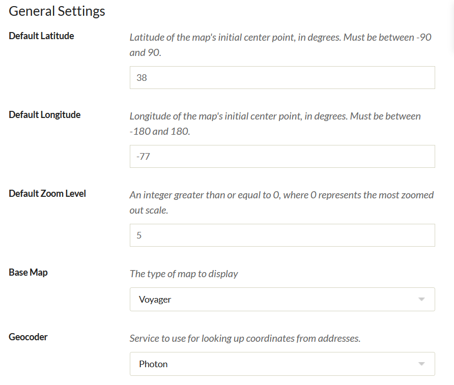

- **Default latitude**: set the center point of the map's latitude (North/South value), in degrees. Using numbers after the decimal point will pinpoint the location more precisely.
- **Default longitude**: set the center point of the map's longitude (East/West), in degrees. Using numbers after the decimal point will pinpoint the location more precisely.
- **Default Zoom Level**: Use a whole number of 0 of greater. 0 is the most zoomed out. A value of 15 will result in a map showing roughly one square mile.
- **Base Map**: select a map from the dropdown to serve as the base map in the display. All base maps except those served by Mapbox can be [previewed courtesy of Leaflet](http://leaflet-extras.github.io/leaflet-providers/preview/){target=_blank}.

If you select Mapbox from the dropdown for Base Map, two additional fields will appear under general settings. 

- **Mapbox Access Token**: in order to use Mapbox, you need to sign up for their service. Once you have done so, you can go to your [account page](https://www.mapbox.com/account/){target=_blank} and copy your access token to paste into this field. 
- **Mapbox Map ID**: The "map ID" that goes here is the part of a Mapbox "Style URL" that comes after "mapbox://styles/". You can use your own maps or one of the [globally available styles](https://docs.mapbox.com/api/maps/#mapbox-styles){target=_blank}. Leaving this input blank will use the default Mapbox street map.

As of June 1, 2020, Mapbox has deprecated older-style maps. Geolocation 3.2 and up support the newer Mapbox API, and the plugin will automatically update your selected Map ID if you were using one of the "standard" map types. If you had specified a custom map ID, you may need to update it after upgrading Geolocation.

You can use MapBox to create your own map tiles, for example a historic map layer. Please refer to the [MapBox documentation](https://www.mapbox.com/api-documentation/#introduction){target=_blank} for more information.

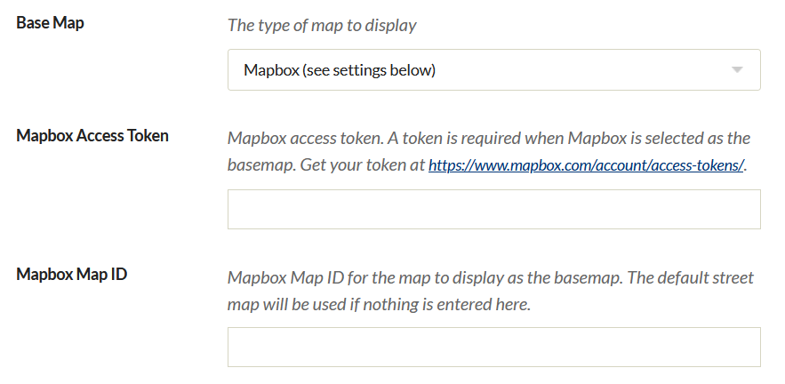

### Custom Map Overlay

Use this section if you wish to add a specific image, already mapped and uploaded elsewhere, as a display layer on all the maps of your site. For example, you can add a historical map that shows relevant areas as they looked in another time. You can use [this list to find example maps to test out this feature](https://www.ncwater.org/GWMS/openlayers/WMS_examples.html){target=_blank}. 

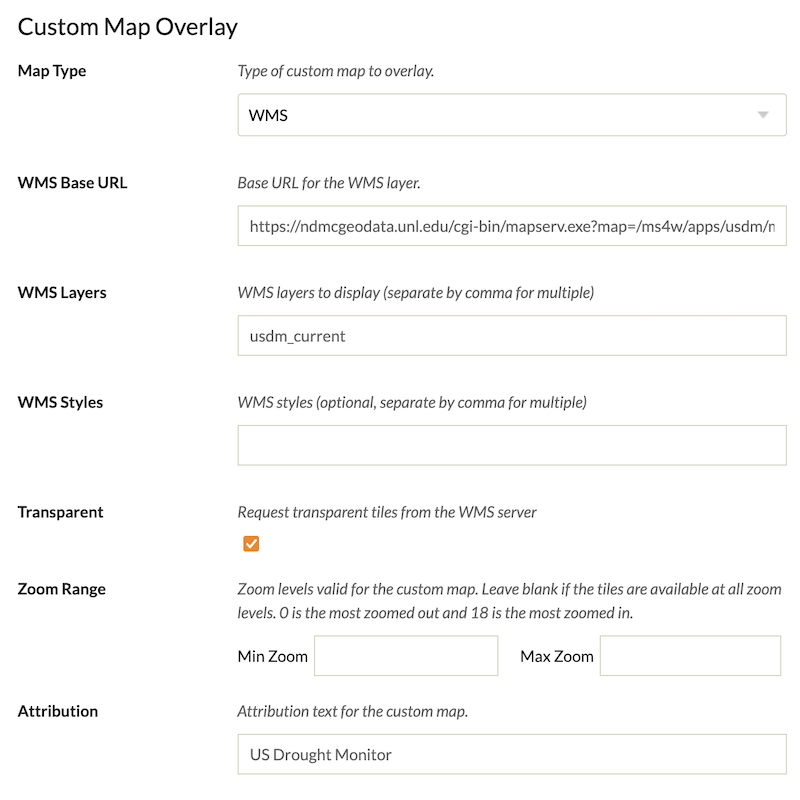

- **Map Type**: Type of custom map to overlay. Specify the standard of the map you wish to use: "Tiled web map" or "WMS". 

- **Tile URL Template**: Paste in the Tile URL for your desired map. This will contain coordinates in the form `(x)`, `(y)`, and `(z)`. For example, `https://mapwarper.net/maps/tile/105449/{z}/{x}/{y}.png` is a [world map from the 1850s](https://mapwarper.net/maps/105449#Show_tab){target=_blank}; the URL is found on the Preview page after the text "Tiles (Google/OSM scheme):". 

or 

- **WMS Base URL**: Paste in the WMS URL for your desired map. For example, `https://ndmcgeodata.unl.edu/cgi-bin/mapserv.exe?map=/ms4w/apps/usdm/map/usdm_current_wms.map` is a map of current USA drought conditions from the [National Drought Mitigation Center](https://droughtmonitor.unl.edu/DmData/GISData.aspx){target=_blank}.

Further WMS configuration fields: 

- **WMS Layers**: This field is required. From the source of your WMS map, find the names of available layers, and enter in as many as you wish to include, separated by commas. The layer names do not need quotes. You must use this field to fetch at least one layer from the WMS map. For example, `usdm_current` for the drought map URL given above. 
- **WMS Styles**: From the source of your WMS map, find the names of available styles if applicable and enter them in here. This field is optional and many WMS maps do not have styles.
- **Transparent**: If the WMS map provides them, check this box to request transparent map image tiles that will show the base map wherever the overlay does not cover. 

For both types of maps:

- **Zoom range**: **Min Zoom** and **Max Zoom** can help you narrow down the browsing area to the area of your custom overlay, or a relevant area within it. 
- **Attribution**: Provide attribution text for the custom map. This text will appear in the bottom right corner of the map, alongside the credits for the base map you have chosen. 

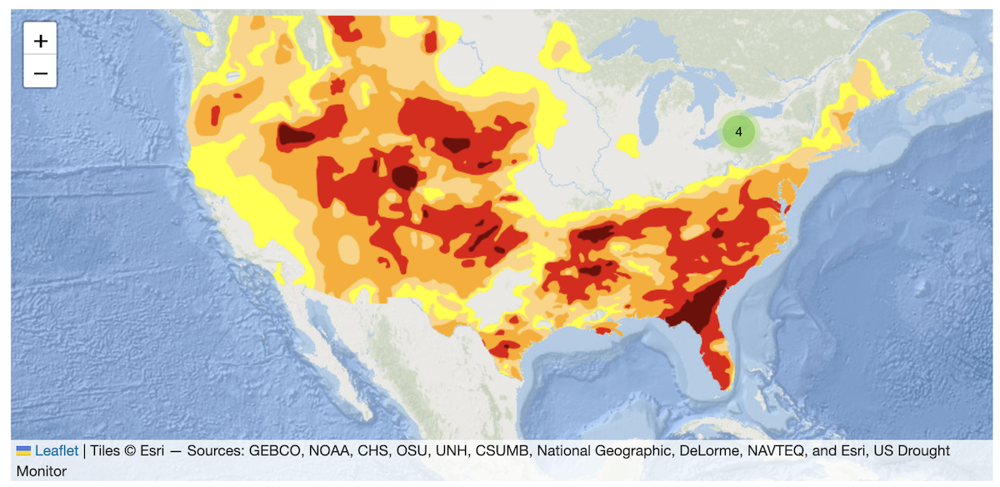
 
### Browse Map settings
These settings are for the map through which users can browse all geolocated items, and for the "Search by Address function" that Geolocation enables in advanced item search. 

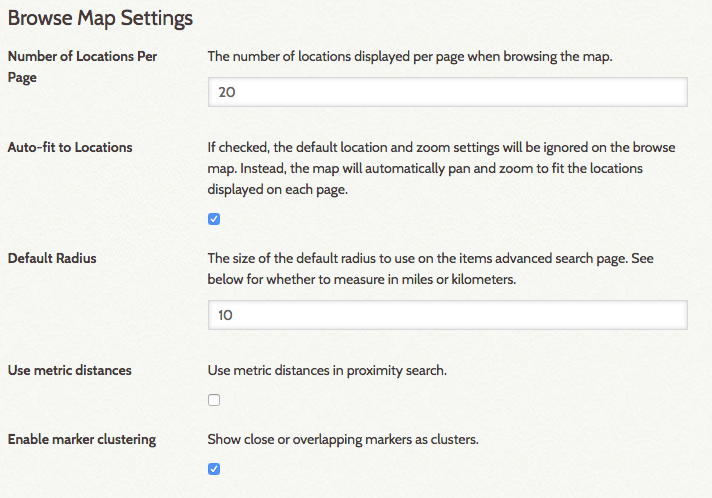

-   **Number of Locations Per Page**: The browsable map has pagination; set the number of items per map page with a whole number.
-   **Auto-fit to Locations**: If checked, the browse map will ignore default location and zoom settings designated in General Settings and instead auto fit to the locations of the items displayed (on that page).
-   **Default Radius**: for the Search By Address function in the advanced items search.
-   A checkbox to **Use metric distances** for radius search, rather than miles.
-   A checkbox to **Enable marker clusters**. When checked, markers that are very close to each other will cluster together and be represented by a number (indicating the number of markers).

A map with Enable marker clusters unchecked:  
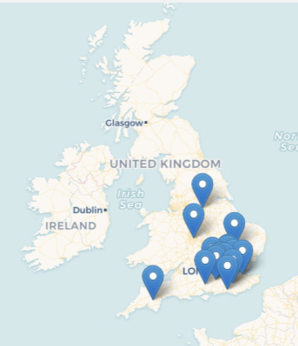

The same map with Enable marker clusters checked:   
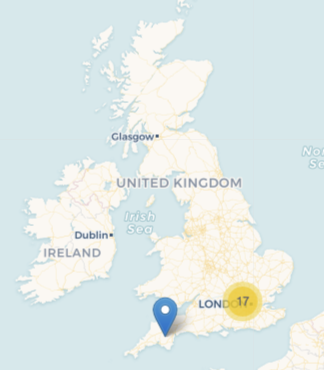

### Item map settings
These settings are for the map display on an `item/show` page. 

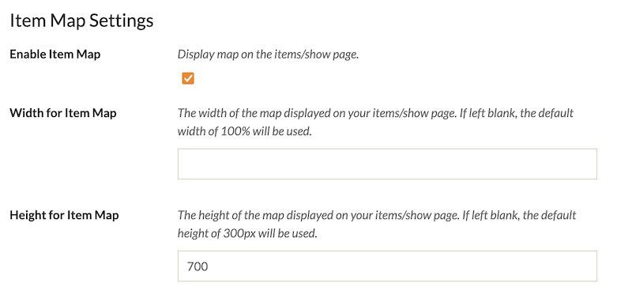

- **Enable Item Map**: - Display a map for each item that has one or more map location markers. For items with no geolocation data, the map is not displayed. The placement of the map is governed by each theme. 
- **Width for Item Map**: set in percent; defaults to 100% if left blank.
- **Height for Item Map**: set in pixels; defaults to 300px if left blank. 

### Map integration
These settings are for integration of the geolocation map into browse pages, and into the [Contribution](Contribution.md) plugin's form. 

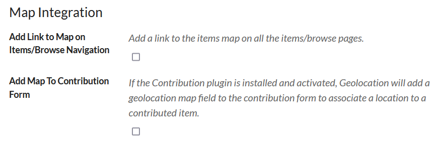

- **Add link to map on Items/Browse navigation**: This will make a "Browse Map" link appear alongside the "Browse Items", "Browse Tags", and "Advanced Search" links at the top of those pages. See the image below in the "View a public map" section. 
- **Add map to contribution form**: Note that this will only work if you have the Contribution plugin installed and active.

## Add location to an item

After you have activated and configured the Geolocation plugin, you can add a location marker to your items. 

!!! note
	An item can only have a single location marker; you cannot have an item associated with more than one location at a time.

Geolocation adds a Map tab to the options for adding or editing an item (`admin/item/edit` and `admin/item/add` pages).  When adding metadata for an item, click on the Map tab to add a location.

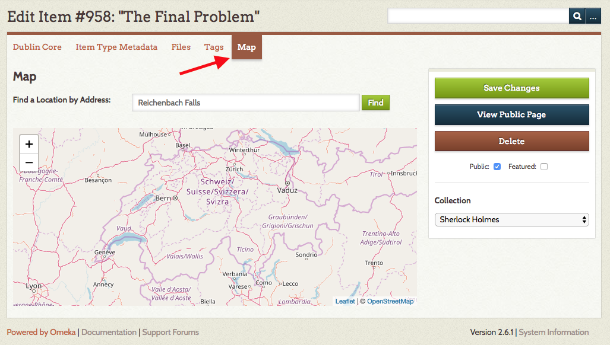

On the tab there is a field for you to **find a location by address** and a map which you can drag to move around, zoom in and out with the plus and minus options (or the scroll wheel on a mouse), and toggle between road and satellite maps. 

To find the location you want to assign to the item, you can:

- Enter the address where you want the marker for the item to be placed. The plugin will automatically add a marker at that location. You can use a street address (ex `100 First St SE, Washington, DC 20543`) or geocordinates in decimal form (ex `38.888611, -77.004722`).
- Zoom and scroll to navigate to where you want to place the marker, then click directly on the spot on the map where you want to place the marker. 

To change the location of an item, type in the new address or click on the new location. You'll be asked if you are sure you would like to change the item location. Select "OK" or "Cancel".

To remove geolocation from an item, click directly on the marker. A dialog box will ask you to confirm that you want to delete the location assignment. 

!!! note 
	Note that at this time you cannot use [CSV Import](CSV_Import.md) to add location data for use by the Geolocation plugin. Map pins can only be added manually.

Don't forget to save your changes.

## View a public map 

Visitors to your Omeka site can now use a map to browse through all of your geolocated items. The generic map showing all of your items with geolocation metadata can be found at `yourclassicsite/items/map`, which you can enable or disable in your site navigation. 

If you enable "Add Link to Map on Items/Browse Navigation" in the plugin configuration, the "Browse Map" link will also be added to the secondary navigation on the `items/browse` page. 

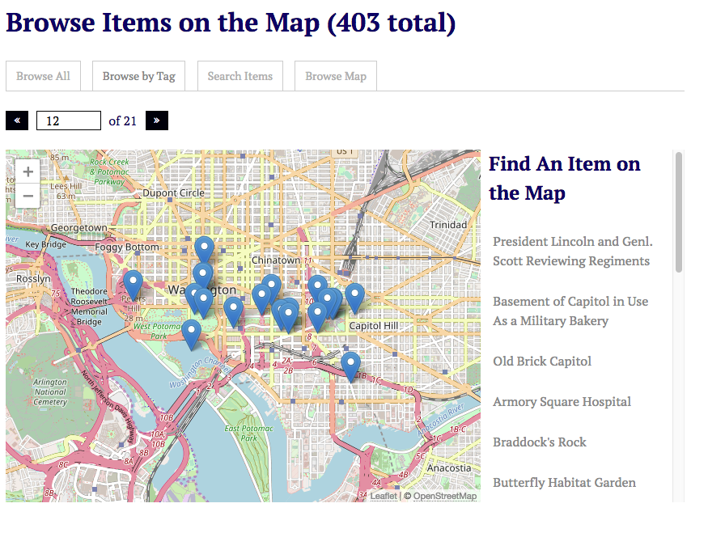

Users can click within the map on pins to see the relevant item, or click an item title in the right sidebar to move the map. 

## Use the admin map

A "Map" tab appears in the left-side navigation bar in the administrative dashboard. Clicking on the Map tab takes you to a map that displays all geolocated items in your Omeka site, public and not public, and an advanced search form to locate specific items.

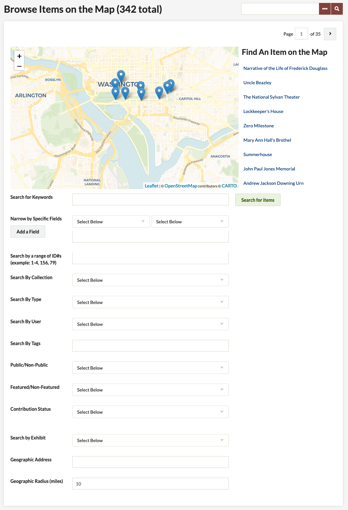

From this view, you may also search mapped items using the item advanced search. Search results appear directly on the map.

## Geolocation and Exhibit Builder

If you have [Exhibit Builder](ExhibitBuilder.md) (version 3.x or greater) installed, Geolocation will add a Map block to the options when building pages. 

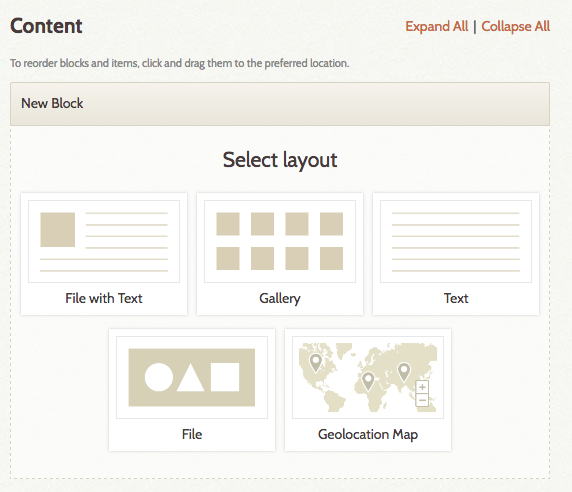

You can add items with geolocation markers to the map block by [adding items](ExhibitBuilder.md#add-items) as you would with any other Exhibit Builder block. The map will ignore items without a location.

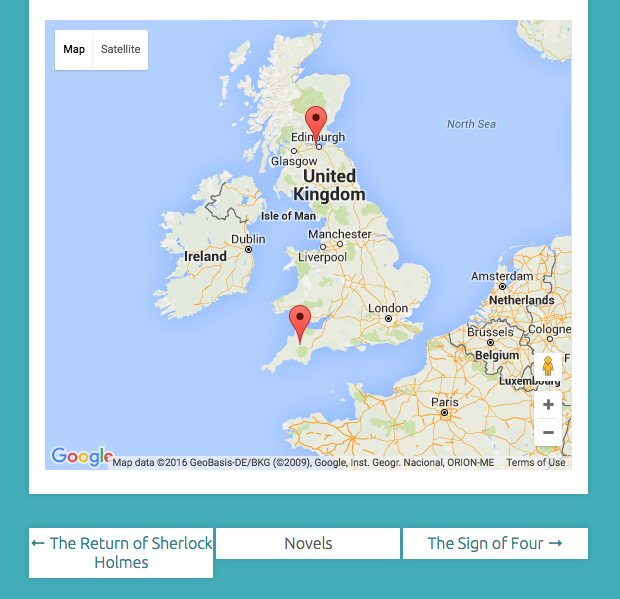

The exhibit will display a single map with the markers for those specific items, centered to display all the items within the map view.

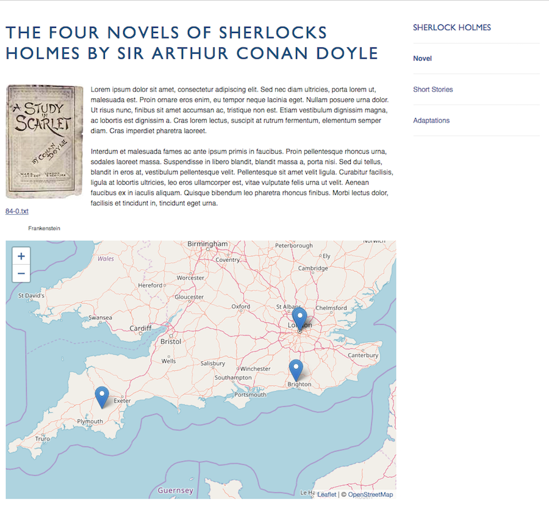

## Shortcodes

The geolocation [shortcode](../Content/Shortcodes.md#geolocation) will create a map of items based on parameters it is given.

The shortcode is `[geolocation]`. Without any additional parameters, it will return a map of all items that contain geolocation data, limited by the records per page as set in the Geolocation plugin configuration. See the relevant section on the Shortcodes page for more information. 