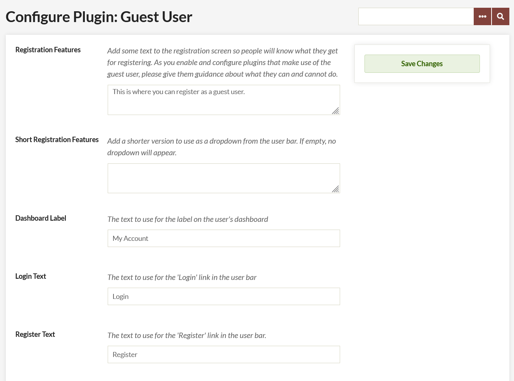

# Guest User

The [Guest User plugin](https://omeka.org/classic/plugins/GuestUser/){target=_blank} adds an additional user role to your Omeka Classic site. The Guest role works behind the scenes with other plugins (Commenting, and User Profiles, for example), without giving the guests admin access to your Omeka site.

## Install and Configure

After  [installing](../Admin/Adding_and_Managing_Plugins.md) the plugin, you should be automatically redirected to the configuration settings for the plugin. You can access these again at any time by clicking the Configure button for Guest User from the Plugins menu.

You can enter text for the following fields:

-   Registration Features: this text will appear at the top of the registration page. You can use it to explain what users are signing up to do, and what the limitations may be.
-   Short Registration Features: brief text appearing as a dropdown from the user bar.
-   Dashboard Label: By default, this is "My Account" and will appear when the user is logged in.
-   Login Text: What is displayed for the login button, defaults to Login.
-   Register Text: What is displayed for the Register link, defaults to Register.



There are also two checkboxes:

-   Allow open registration to allow individuals to register without administrators approving their accounts.
-   Allow instant access enables new users to access their accounts for 20 minutes after registering without administrator approval.


If you have [ReCaptcha enabled](../Admin/Settings/ReCaptcha.md), you can require a ReCaptcha key for registration.

## Using the Plugin

It is important to note that almost all the functionality of the will be with other plugins; Guest user does not do much on its own. You will have to do additional configuration within other plugins (User Profiles, for instance) to realize the full benefits of the Guest User plugin.

## Hiding the Header

When you activate Guest User, it adds a header bar with Login and Register links to the public side of your site. If you want to hide this header bar, you will need to edit the code of the plugin.

From your file manager, go to the folder for the Omeka Site, then to the plugins folder and open the GuestUser folder.

Open the file named “GuestUser.php” using a plain text editor suitable for writing and editing code.

Comment out lines 24 and 25 . Commenting out uses `/*` and the end result should look like this: 

```
protected $_filters = array(
       /* 'public_navigation_admin_bar',
       'public_show_admin_bar’, */
```

This will remove the general login/register links which are as follows:  
 
- Login: yoursiteurl/users/login 
- Register: yoursiteurl/guest-user/user/register

You might want to hard code those into a Simple Page or preserve the links somewhere else on your site.
