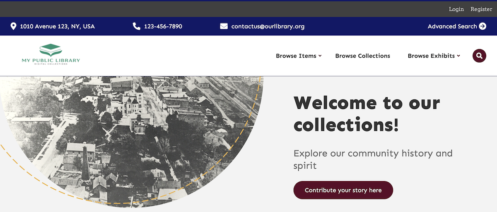
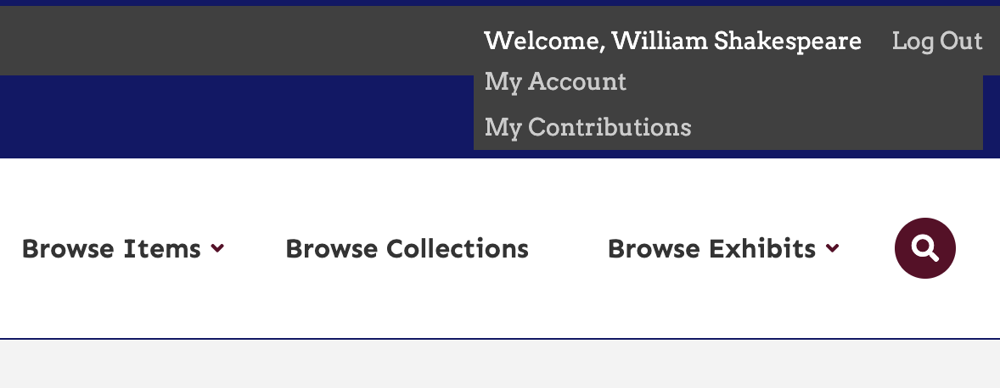

# Guest User

The [Guest User plugin](https://omeka.org/classic/plugins/GuestUser/){target=_blank} adds an additional, low-permission user role to your Omeka Classic site. The Guest role is used behind-the-scenes by other plugins ([Contribution](Contribution.md), [Commenting](Commenting.md), and [User Profiles](UserProfiles.md), for example), without giving the guests administrative access to your Omeka site.

## Install and configure

When active, Guest User adds an always-visible bar to the top of your Omeka site that includes "Login" and "Register" links. Without this plugin, the [basic suite of users](../Admin/Users.md) can only log in your Omeka site using the `admin/users/login` page. 



After [installing](../Admin/Adding_and_Managing_Plugins.md) the plugin, you should be automatically redirected to the configuration settings for the plugin. You can configure the registration page here. You can access this page again at any time by clicking the "Configure" button for Guest User from the Plugins menu. 

You can enter text for the following fields:

-   Registration Features: this text will appear at the top of the registration page. You can use it to explain what users are signing up to do, and what the limitations may be. We recommend you customize this based on the other plugins you have chosen to use - Commenting on items, Contribution to submit stories and materials, etc. 
-   Short Registration Features: brief text appearing as a dropdown from the user bar.
-   Dashboard Label: By default, this is "My Account" and will appear when the user is logged in.
-   Login Text: the text displayed for the login button; defaults to "Login".
-   Register Text: the text displayed for the Register link; defaults to "Register".


There are also two checkboxes:

-   "Allow open registration", so that users can register and begin contributing without waiting for administrators to approve their accounts.
-   "Allow instant access", so that new users can use their accounts for 20 minutes after registering, without administrator approval.


If you have [ReCaptcha enabled](../Admin/Settings/ReCaptcha.md), you can require a ReCaptcha key for registration.

## Using the plugin

Guest User adds a registration page and a user-access bar to your public site. Most other functionality is seen in additional plugins that you will install. You will have to do additional configuration within other plugins (User Profiles, for instance) to realize the full benefits of the Guest User plugin.

### The header bar

When you activate Guest User, it adds a header bar with "Login" and "Register" links to the public site. 

When a user is logged in, their display name appears in this bar, alongside a "Log out" link. When the display name is hovered over, a dropdown menu appears with "My account" and other entries added by plugins (such as "My contributions" from the Contribution plugin). 



If you want to hide this header bar, you will need to edit the code of the plugin.

From your file manager, go to the folder for the Omeka installation, then to the `plugins` folder, and open the `GuestUser` folder.

Open the file named “GuestUser.php” using a plain-text editor suitable for writing and editing code.

Comment out lines 24 and 25 . Commenting out uses `/*` and the end result should look like this: 

```
protected $_filters = array(
       /* 'public_navigation_admin_bar',
       'public_show_admin_bar’, */
```

This will remove the general login/register links which are as follows:  
 
- Login: `yoursiteurl/users/login` 
- Register: `yoursiteurl/guest-user/user/register`

If you remove the header bar, you will want to preserve and share the links somewhere else on your site. Consider your footer text, or on a dedicated Simple Page. 
