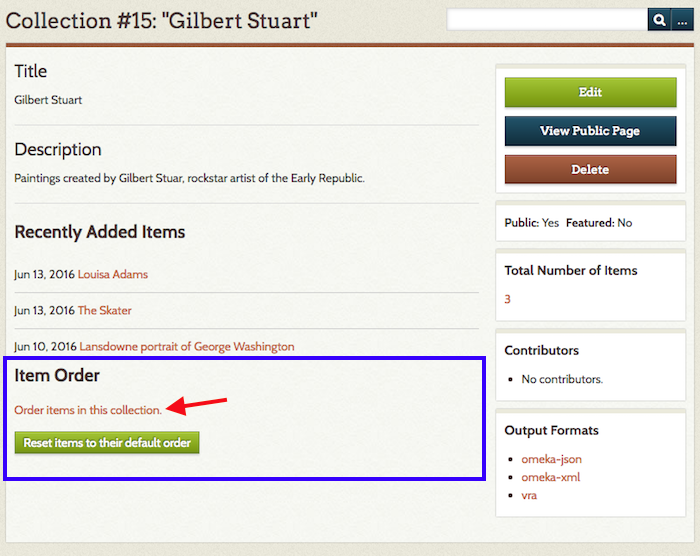
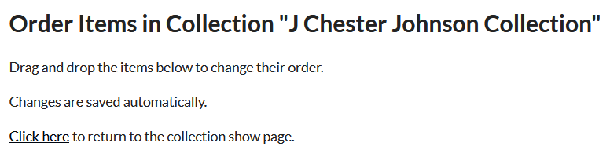

# Item Order

The [Item Order plugin](https://omeka.org/classic/plugins/ItemOrder/){target=_blank} allows users to use a drag-and-drop interface change the order in which items display on the public Collection browse pages of your Omeka Classic site.

## Order Items in a Collection

Item Order does not have any configuration settings, and will be available once [installed](../Admin/Adding_and_Managing_Plugins.md) and activated.
 
To use Item Order, go to the Collections tab in the sidebar of the admin Dashboard. Find the collection whose items you want to reorder and click on the name of the collection (note: do not click on edit).

On the collections page (`admin/collections/show/`), scroll to the bottom of the page where you will find the heading Item Order. Click the link to *Order Items in this Collection*.

A complete list of all items in that collection will appear on the page. Drag and drop the items into the preferred order. Changes are saved automatically.

-   Dragging automatically reorders the items for the public collection browse page. To see the public page, either click the link that states *click here to return to the collection show page* and then click on "View Public Page", or navigate to `yoursite.org/items/browse?collection=1` (where 1 equals the number of the collection you modified).

## Restore Original Order

Click the Collections tab in the sidebar of the admin Dashboard, find the collection you want to order and click on the name of the collection (note: do not edit the collection).

-   Scroll to the bottom of the page to the heading Item Order and click the green *Reset Items to their Default Order* button.

