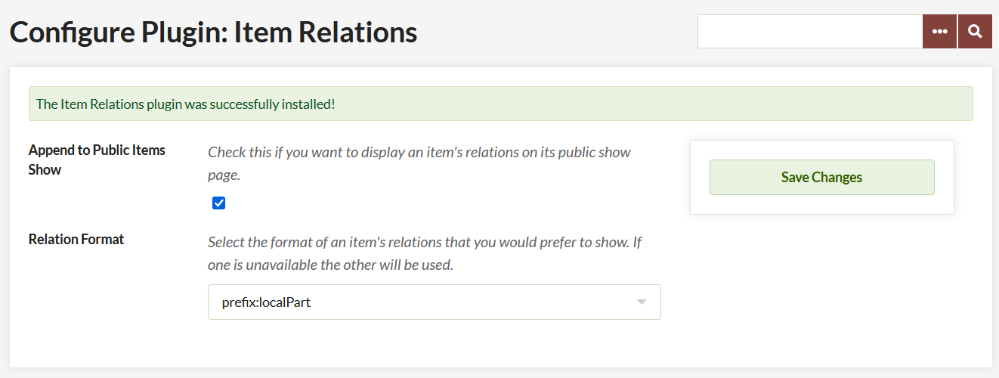
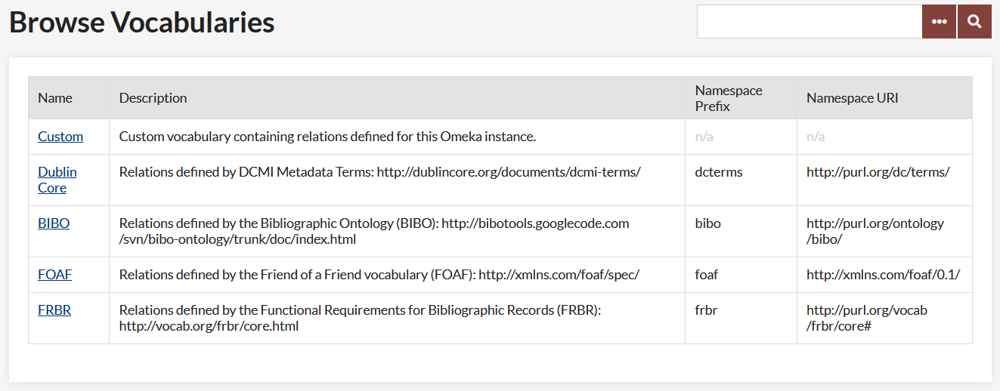
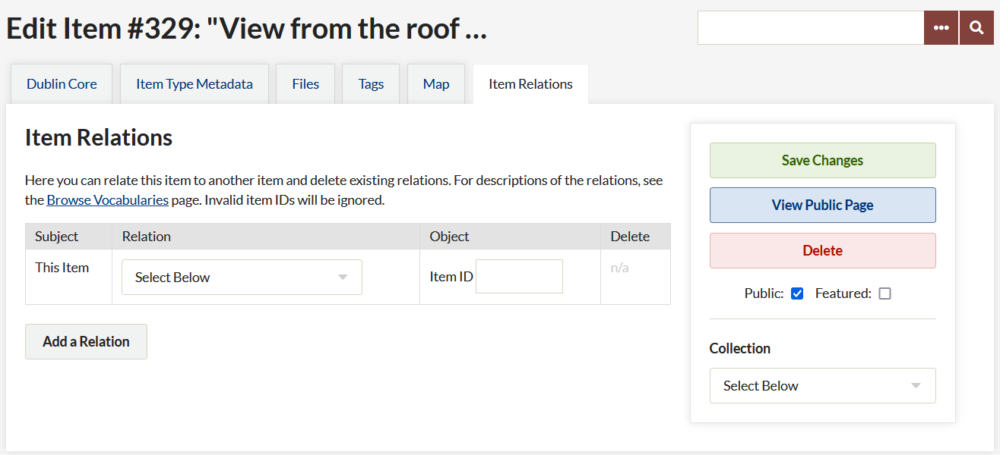

# Item Relations

The [Item Relations plugin](https://omeka.org/classic/plugins/ItemRelations/){target=_blank} lets you define relations between items in your Omeka Classic site. For example, you can make one item a part of another item, where "part of" is the relation. You can also make one item a "reproduction of" or a "translation of" another item.

We've bundled the plugin with common relations derived from several formal vocabularies, including:

- [Dublin Core](http://dublincore.org/documents/dcmi-terms/){target=_blank}
- [FRBR](http://vocab.org/frbr/core.html){target=_blank}
- [FOAF](http://xmlns.com/foaf/spec/){target=_blank}
- [BIBO](https://bibliontology.com/){target=_blank}.

You may use these or create a custom vocabulary with the relations needed in your site. You could, for example, define custom relations like "is parent of," "is better than," and "fits within."

## Configuration 

After you have [installed](../Admin/Adding_and_Managing_Plugins.md) the plugin, you will need to configure the plugin, from the link on the Plugins page accessed from the top navigation of your admin dashboard.

There are two configuration options:

- A checkbox to *Append to Public Items Show*. If you want to display an item's relations on its public show page, check this box. 
- A dropdown menu from which you can select the format of an item's relations as it appears on the item's show page. The options are: 
      - prefix:localPart
      - label given to the relationship.

## Customize Relationship Vocabulary

On the "Item Relations" tab in the left side of the admin navigation you will find the vocabularies available and their properties (a more general term for relations).

If you wish to create your own vocabulary, edit the "Custom" vocabulary by clicking on "Edit Custom Vocabulary" in its property show page. Here you can add, edit, and delete properties in your custom vocabulary.

## Relating Items

When adding or editing an item, click on the "Item Relations" tab, at the top of the admin/item page to relate the item to another item, or to delete existing relations.

This tab has a table with columns for

- the subject of the relation (always the item being edited), 
- the relation between items (a dropdown populated with all available vocabularies),
- the object of the relationship (the item with which you are creating the relationship), and 
- a delete option once a relationship has been created.

In order to relate two items, you will need to select the relationship from the dropdown and enter the item ID of the object-item. The ID is the item number - in the image below, the item number is displayed before the title of the item, and is 2558. 

You may batch relate items using the Batch Edit function from the Browse Items pages in the admin.

## Item Relations and RDF

The plugin follows the [RDF](http://en.wikipedia.org/wiki/Resource_Description_Framework){target=_blank} model for defining relations between items. There's a subject item, a predicate (a relation/property in this case), and an object item. If we decompose the sentence: "Item 1 is a part of Item 2," "Item 1" is the subject, "is a part of" is the predicate, and "Item 2" is the object. These "triples" are the foundation of RDF. Your end users won't have to know this, but it's helpful to know it as an administrator.

Following RDF, every formal vocabulary has a namespace prefix and namespace URI, which provide unambiguous context for its relations/properties. Every property has a local part and/or label, which are machine-readable and human-readable names of the property, respectively. As an administrator you'll only need to create labels, everything else is there for XML and RDFS compliance, to be used for future output formats.