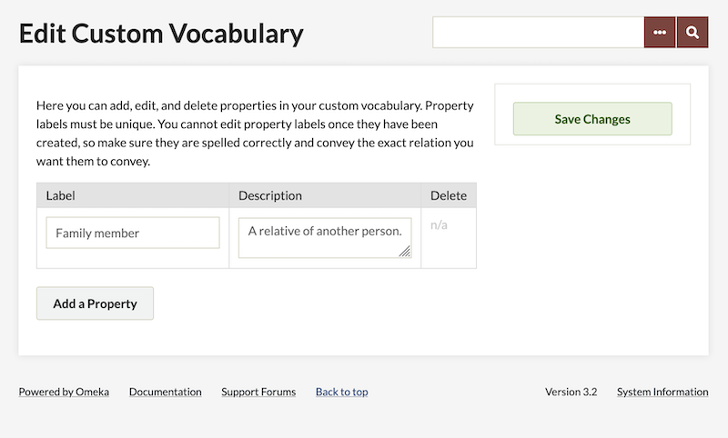

# Item Relations

The [Item Relations plugin](https://omeka.org/classic/plugins/ItemRelations/){target=_blank} lets you define relations between items in your Omeka Classic site. For example, you can make one item a part of another item, where "part of" is the relation. You can also make one item a "reproduction of" or a "translation of" another item.

The plugin comes bundled with common relations derived from several formal vocabularies, including:

- [Dublin Core](http://dublincore.org/documents/dcmi-terms/){target=_blank}
- [FRBR](http://vocab.org/frbr/core.html){target=_blank}
- [FOAF](http://xmlns.com/foaf/spec/){target=_blank}
- [BIBO](https://bibliontology.com/){target=_blank}.

You may use these or create a custom vocabulary with the relations needed in your site. You could, for example, define custom relations like "is parent of," "is better than," and "fits within."

## Configuration 

After you have [installed](../Admin/Adding_and_Managing_Plugins.md) the plugin, you will need to configure the plugin, from the link on the Plugins page accessed from the top navigation of your admin dashboard.

There are two configuration options:

- **Append to Public Items Show**: A checkbox to indicate if you want to display an item's relations on its public page. 
- **Relation Format**: A dropdown menu, if the above is checked, to control the display of an item's relations as it appears on the item's show page. The options are: 
      - **prefix:localPart**: The machine-readable name of the metadata field, as in "dcterms:HasPart"
      - **label**: the humean-readable name of the metadata field, as in "Has part".

## View vocabularies

On the "Item Relations" tab in the left side of the admin navigation you will find the vocabularies available and their properties.

For example, the Dublin Core properties provided for you to set relationships are:

|      Local Part     |           Label          | Description |
|-------------------|------------------------|-------------------------------------------------------------------------------------------------------------------------|
| relation            | Relation                 | A related resource.                                                                                                                                                |
| conformsTo          | Conforms To              | An established standard to which the described resource conforms.                                                                                                  |
| hasFormat           | Has Format               | A related resource that is substantially the same as the pre-existing described resource, but in another format.                                                   |
| hasPart             | Has Part                 | A related resource that is included either physically or logically in the described resource.                                                                      |
| hasVersion          | Has Version              | A related resource that is a version, edition, or adaptation of the described resource.                                                                            |
| isFormatOf          | Is Format Of             | A related resource that is substantially the same as the described resource, but in another format.                                                                |
| isPartOf            | Is Part Of               | A related resource in which the described resource is physically or logically included.                                                                            |
| isReferencedBy      | Is Referenced By         | A related resource that references, cites, or otherwise points to the described resource.                                                                          |
| isReplacedBy        | Is Replaced By           | A related resource that supplants, displaces, or supersedes the described resource.                                                                                |
| isRequiredBy        | Is Required By           | A related resource that requires the described resource to support its function, delivery, or coherence.                                                           |
| isVersionOf         | Is Version Of            | A related resource of which the described resource is a version, edition, or adaptation.                                                                           |
| references          | References               | A related resource that is referenced, cited, or otherwise pointed to by the described resource.                                                                   |
| replaces            | Replaces                 | A related resource that is supplanted, displaced, or superseded by the described resource.                                                                         |
| requires            | Requires                 | A related resource that is required by the described resource to support its function, delivery, or coherence.                                                     |
| source              | Source                   | A related resource from which the described resource is derived.                                                                                                   |
| abstract            | Abstract                 | A summary of the resource.                                                                                                                                         |
| accessRights        | Access Rights            | Information about who can access the resource or an indication of its security status.                                                                             |
| accrualMethod       | Accrual Method           | The method by which items are added to a collection.                                                                                                               |
| accrualPeriodicity  | Accrual Periodicity      | The frequency with which items are added to a collection.                                                                                                          |
| accrualPolicy       | Accrual Policy           | The policy governing the addition of items to a collection.                                                                                                        |
| audience            | Audience                 | A class of entity for whom the resource is intended or useful.                                                                                                     |
| contributor         | Contributor              | An entity responsible for making contributions to the resource.                                                                                                    |
| coverage            | Coverage                 | The spatial or temporal topic of the resource, the  spatial applicability of the resource, or the jurisdiction under which  the resource is relevant.              |
| creator             | Creator                  | An entity primarily responsible for making the resource.                                                                                                           |
| description         | Description              | An account of the resource.                                                                                                                                        |
| educationLevel      | Audience Education Level | A class of entity, defined in terms of progression  through an educational or training context, for which the described  resource is intended.                     |
| extent              | Extent                   | The size or duration of the resource.                                                                                                                              |
| format              | Format                   | The file format, physical medium, or dimensions of the resource.                                                                                                   |
| instructionalMethod | Instructional Method     | A process, used to engender knowledge, attitudes and skills, that the described resource is designed to support.                                                   |
| language            | Language                 | A language of the resource.                                                                                                                                        |
| license             | License                  | A legal document giving official permission to do something with the resource.                                                                                     |
| mediator            | Mediator                 | An entity that mediates access to the resource and for whom the resource is intended or useful.                                                                    |
| medium              | Medium                   | The material or physical carrier of the resource.                                                                                                                  |
| provenance          | Provenance               | A statement of any changes in ownership and custody of  the resource since its creation that are significant for its  authenticity, integrity, and interpretation. |
| publisher           | Publisher                | An entity responsible for making the resource available.                                                                                                           |
| rights              | Rights                   | Information about rights held in and over the resource.                                                                                                            |
| rightsHolder        | Rights Holder            | A person or organization owning or managing rights over the resource.                                                                                              |
| spatial             | Spatial Coverage         | Spatial characteristics of the resource.                                                                                                                           |
| subject             | Subject                  | The topic of the resource.                                                                                                                                         |
| tableOfContents     | Table Of Contents        | A list of subunits of the resource.                                                                                                                                |
| temporal            | Temporal Coverage        | Temporal characteristics of the resource.                                                                                                                          |
| type                | Type                     | The nature or genre of the resource.                                                                                                                               

### Add custom properties

If you wish to create your own vocabulary, edit the "Custom" vocabulary by clicking on its name, then the "Edit Vocabulary" button on its "Vocabulary Properties" page. 

Here you can add, edit, and delete properties in your custom vocabulary. You can provide a label and a description for each property. This custom vocabulary will not show on the "Element sets" or other vocabulary tabs in your installation; it is only used for relationships. 

## Link items

When adding or editing an item, click on the "Item Relations" tab, at the top of the item editing page, to relate the item to another item, or to delete existing relations.

This tab has a table with columns for:

- the subject of the relation (always the item being edited), 
- the relation between items (a dropdown populated with all available vocabulary properties),
- the object of the relationship (the item with which you are creating the relationship), and 
- a checkbox to delete a relationship, once it has been created and the page has been saved.

In order to relate two items, you will need to select the relationship from the dropdown and enter the item ID of the object-item. The ID is the item number, found in the item's URL on the admin or public pages. In the image below, the item number is displayed before the title of the item, and is 329. 

You may batch-relate items using the "Batch Edit" function from the "Browse Items" pages in the admin.

## Item Relations and RDF

The plugin follows the [RDF](http://en.wikipedia.org/wiki/Resource_Description_Framework){target=_blank} model for defining relations between items. The RDF model consists of a subject item, a predicate (a relation/property in this case), and an object item. If we decompose the sentence: "Item 1 is a part of Item 2," "Item 1" is the subject, "is a part of" is the predicate, and "Item 2" is the object. These "triples" are the foundation of RDF. 

Following RDF, every formal vocabulary has a namespace prefix and namespace URI, which provide unambiguous context for its relations/properties. Every property has a local part and/or label, which are machine-readable and human-readable names of the property, respectively. As an administrator, you'll only need to create labels; everything else is there for XML and RDF compliance, to be used for future output formats.