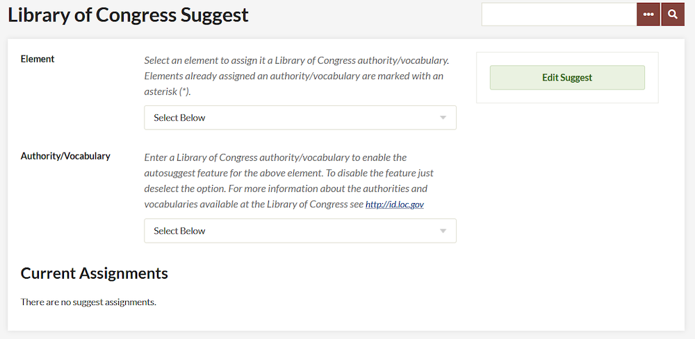

# Library of Congress Suggest

The [LC Suggest plugin](https://omeka.org/classic/plugins/LcSuggest/){target=_blank} adds an auto-complete feature to almost any metadata field in your Omeka Classic site by pulling results from Library of Congress's list of authorities and controlled vocabularies. This functionality helps those building an Omeka site to enforce consistent metadata input and data compatibility with other databases of records.

The plugin does not require configuration. After [installing](../Admin/Adding_and_Managing_Plugins.md) the plugin, there should be a LC Suggest tab on the left hand navigation of your admin dashboard.

## Choosing Vocabularies

The Library of Congress maintains an Authorities and Vocabularies service that controls metadata terms used in creating and maintaining records of their holdings. Choices include, LC Subject Headings, MARC Geographic Areas, and Thesaurus of Graphic Materials. See the [full list of standardized vocabularies and authorities](http://id.loc.gov/){target=_blank}.

-   In the LC Suggestion admin page, first choose a metadata field that you wish to contain controlled vocabulary (any of the core or item type fields) from the dropdown menu.
-   Assign that field a Library of Congress authority/vocabulary.
-   Elements already assigned an authority/vocabulary are marked with an asterisk (`*`).
-   Click Edit Suggest.

## Edit Vocabulary and Authority Associations

-   To change or remove a vocabulary/authority associated with a field go back to the LC Suggest tab.
-   Select the metadata element you wish to edit, and choose a new Authority/Vocabulary from that menu, or to remove a controlled set completely choose "Select Below."
-   Click Edit Suggest. If you removed an authority/vocabulary, no metadata will be deleted or changed in the items.

## Adding, Editing Items with LC Suggest 
When adding or editing item metadata, users must start typing in the open text box of that specific field adding the first couple of letters of the vocabulary or authority to prompt the auto-suggest feature. There might be a short delay, but a short menu will appear with choices drawn directly from the authority or vocab list you have associated with that field.
