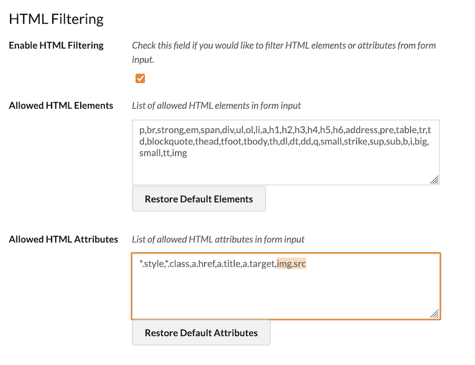
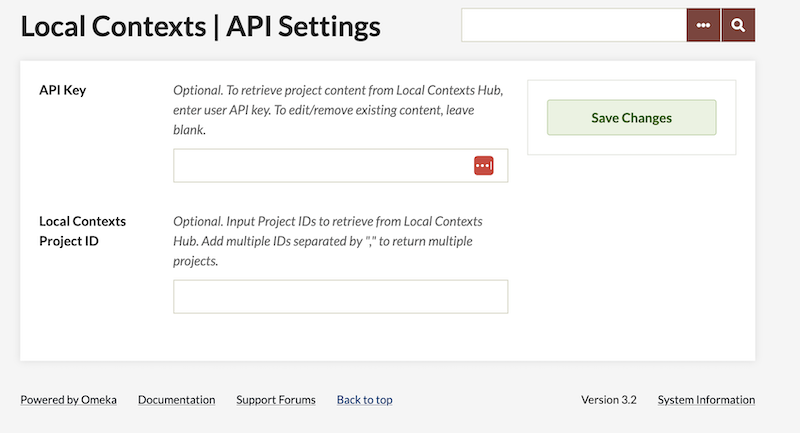
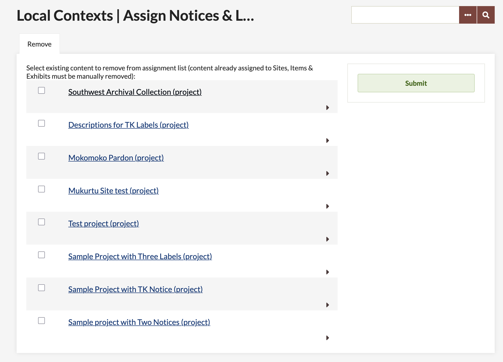
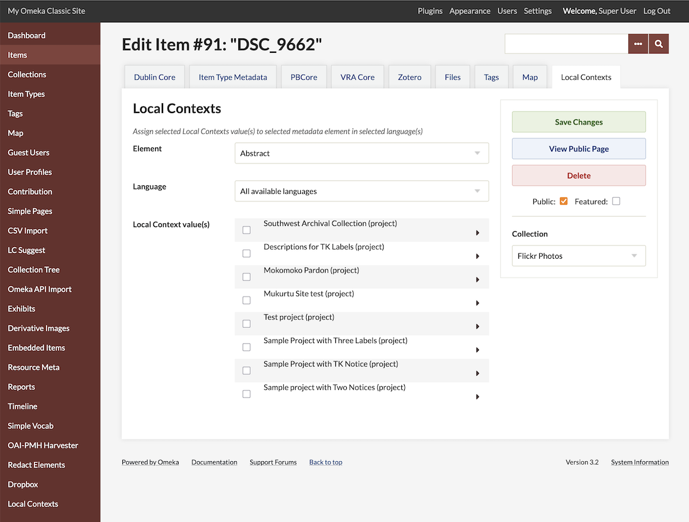
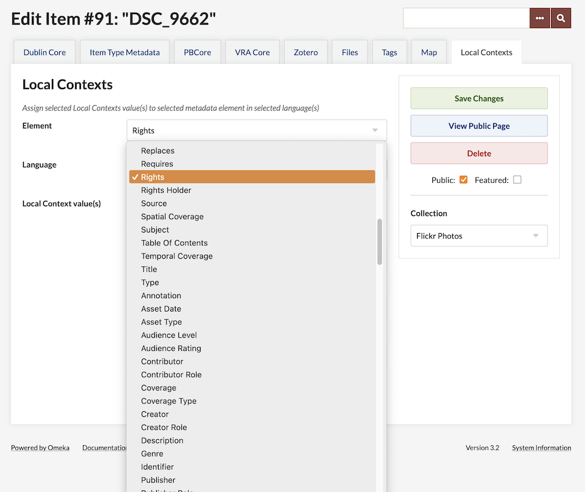
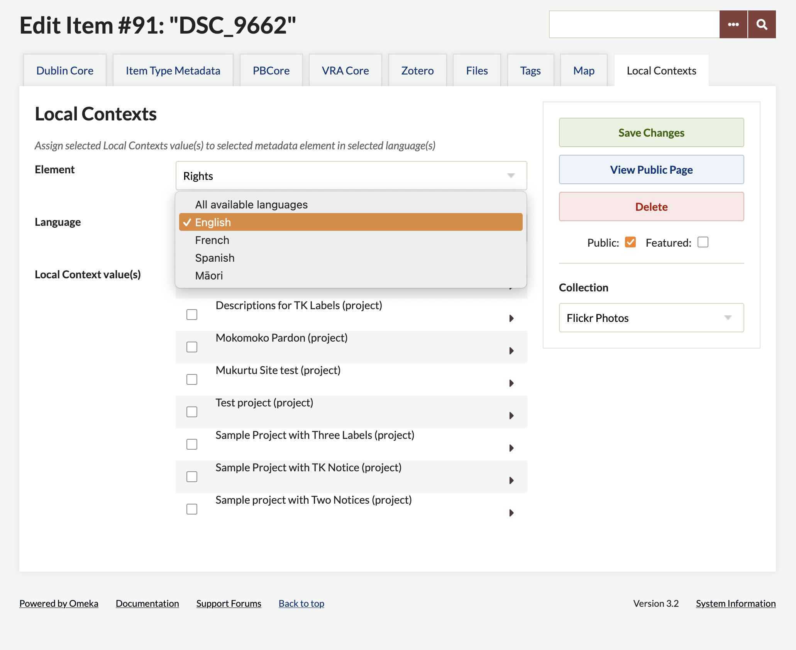
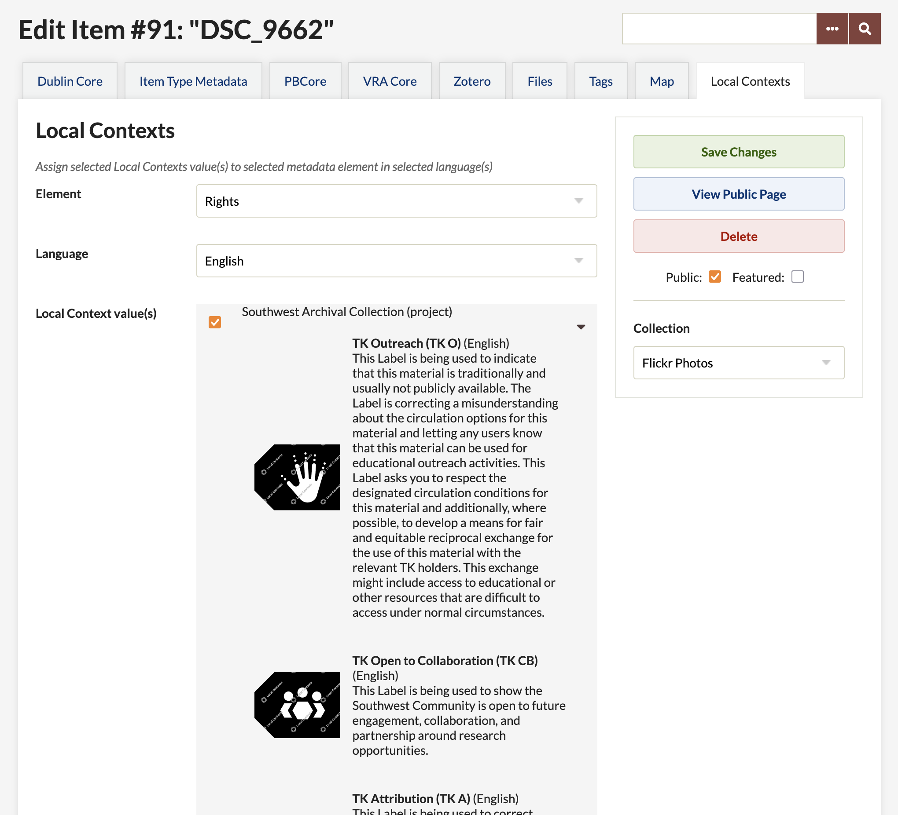
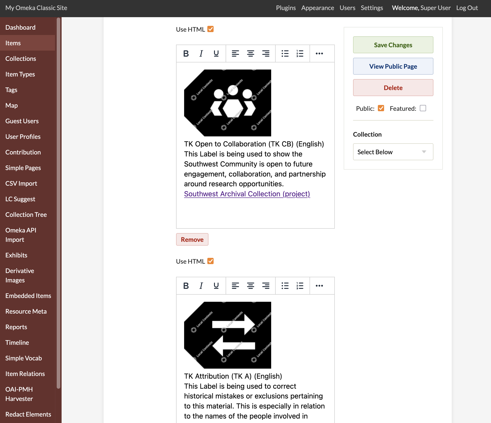
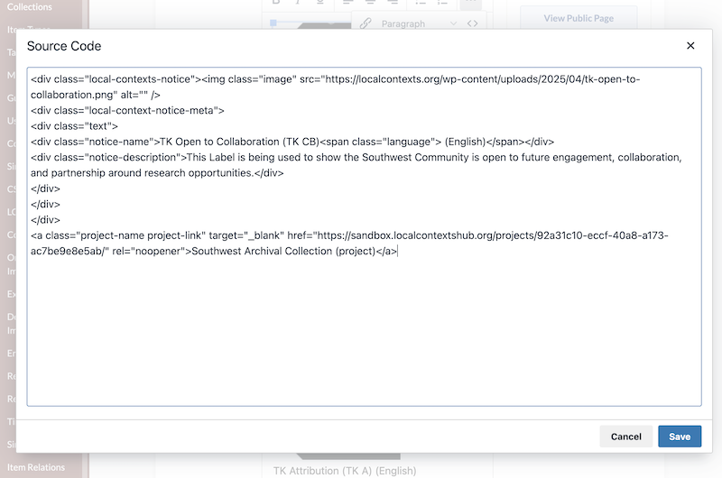

# Local Contexts

With the [Local Contexts plugin](https://omeka.org/classic/plugins/LocalContexts/){target=_blank} you can apply [Local Contexts](https://localcontexts.org/){target=_blank} labels and notices to your Omeka Classic site and resources. This requires setting up a Local Contexts account and creating projects in their registry. Then enter the API key into Omeka to bring your chosen [labels](https://localcontexts.org/labels/about-the-labels/){target=_blank} and [notices](https://localcontexts.org/notices/about-the-notices/){target=_blank} over and apply them to your items and exhibits. 

## What are Local Contexts?

### Notices

> *The Notices are tools for institutions and researchers to identify Indigenous collections and data and recognize Indigenous rights and interests. The Notices were developed to create pathways for partnership, collaboration, and support of Indigenous cultural authority.*

> *Notices can be applied to websites, publications, datasets, museum exhibitions, items in a collection, genetic samples, and more. Institutions and researchers can generate Notices using the Local Contexts Hub.*

> *There are three categories of Notices: Engagement, Disclosure, and Collections Care Notices. See below for more information on the different types of Notices.*

### Labels

> *The Traditional Knowledge (TK) and Biocultural (BC) Labels are tools for Indigenous communities and local organizations. Developed through sustained partnership and testing within Indigenous communities across multiple countries, the Labels allow communities to express local and specific conditions for sharing and engaging in future research and relationships in ways that are consistent with already existing community rules, governance, and protocols for using, sharing, and circulating knowledge and data.*

> *Labels can be applied to websites, publications, datasets, museum exhibitions, items in a collection, genetic samples, and more. Communities can customize and apply their TK and BC Labels using the Local Contexts Hub.*

### Projects

> *What is a Local Contexts Project?*

> *Local Contexts Projects describe the context where Labels or Notices are being applied. For example, a Project could include: a website, university syllabus, dissertation, research publication, dataset, museum exhibition, archival record, item in a collection, library database, photography collection, voucher specimen, and/or metadata about a record.*

> *When you create a Local Contexts Project, you will be asked for Project details and contacts, and have the option to add metadata.*

> *Creating Projects allows institutions and researchers to generate Notices and engage, acknowledge, and make visible Indigenous interests in collections, information, and data. Communities may then choose how and when to add their Labels.*

> *Community accounts can apply customized Labels to Projects they create in the Hub, as well as to  Projects they have been sent by institution and researcher accounts. You can see Projects that have been added to the Hub publicly on the Projects Board.*

## Requirements

To use this plugin, you must have a Local Contexts Hub account. Creating a profile there allows you to have Projects, which can then be connected to your Omeka installation with an API key.

[Go to the Local Contexts website to learn more and set up your Projects](https://localcontexts.org/support/getting-started-on-the-hub/#about-projects){target=_blank}. 

This plugin is available to Omeka Classic users at all levels. Any user can enter in a new API key and add new Projects to the Omeka site, and any user can apply those projects to items or exhibits to which they have access (e.g. Contributors can add them to items they create and/or own). Only site administrators (Super users) can add projects to the site footer. 

### Enable images in HTML elements

In order for Local Contexts thumbnail images to consistently appear in item metadata, users will need to add `img` to the "Allowed HTML Elements" list, and `img.src` to the "Allowed HTML Attributes" list in the Omeka Classic installation security settings. These settings only apply if HTML filtering is turned on for your site. 

## Using the LC plugin

### Import projects

With the plugin installed and active on your Omeka site, go to the "Local Contexts" plugin entry in the sidebar of the administrative dashboard. There you will be able to enter in your API key.

You can optionally select only a few of your Projects for import, by entering in their IDs. If you leave the "Projects" field blank, Omeka will load all the projects associated with your Local Contexts API key. 

When you save the page, the projects will load. You will see each project name and all of its associated notices and labels. 

Omeka Classic will not save the API key, and does not create a persistent connection. If you update content on the LC website, you will need to re-enter the API key to update Omeka's information from the source. 

Other users on the Omeka site can add more projects by entering in another LC API key (or by entering the same key and specifying other projects by ID). Projects from all sources will be listed together and can be accessed by any user. 

This table will allow you to remove projects from your site. If you wish to add these projects back later, you will have to re-import them by entering in the API key in again. This will not change any items or exhibits. 

### Apply projects in Omeka

#### Apply projects to Omeka items

You can apply LC projects to individual Omeka items, or through batch-editing a number of items.

Edit an item, then go to the LC tab at the top of the item editing screen. You can assign a LC project to a specific metadata field. 

When you save these edits, you will see that each LC Project notice or label appears in a separate metadata entry for your chosen field. 

You can manually delete these notices or labels if appropriate, with the "Remove" button on individual metadata entries. 

LC labels and notices are applied as HTML-formatted metadata entries that call upon images on the LC website and link to the project in the LC registry. 

The following image shows you the source code that is loaded into a metadata field when a project is applied to an item:

#### Apply projects to exhibits

#### Apply projects to your site

You can choose to have one or more projects appear in your site footer. This will display all labels and notices attached to that project, along with a link to the project in the LC Hubs registry. 

The LC content will load below the customized footer text that can be set in the theme configuration, and before the copyright information that is set in the installation settings. 

Note that Local Contexts labels and notices are designed to apply only to materials of Indigenous interest. If your Omeka site or collection as a whole does not fit this definition, we do not recommend you use the site footer. Only apply LC notices and labels to relevant items and exhibits. 

### Remove projects 

Once a project has been added to an item, exhibit block, or the site footer, it has to be removed manually. Edit the item or exhibit and delete the content by hand. Only a site administrator can remove projects from the site footer. 

Deleting a project from the list of projects in the plugin configuration must be done manually, and **will not** remove that project from resources to which it has been added. It will only remove the option to add it to resources in the future. 