# Ngram

The [Ngram plugin](https://omeka.org/classic/plugins/Ngram/){target=_blank} allows you to generate [ngrams](https://en.wikipedia.org/wiki/N-gram){target=_blank} using items in your Omeka Classic install. A corpus is generated by querying the content of a selected text element field. Corpora may then be investigated via Ngram graphs, counts, and frequencies.

For additional information on Ngrams, please see:

[Benjamin M. Schmidt, “Words Alone: Dismantling Topic Models in the Humanities,” Journal of Digital Humanities 2, no. 1 (winter 2012).](http://journalofdigitalhumanities.org/2-1/words-alone-by-benjamin-m-schmidt/){target=_blank}

[Dan Cohen, “A Conversation with Data: Prospecting Victorian Words and Ideas,” dancohen.org, May 30, 2012.](http://www.dancohen.org/2012/05/30/a-conversation-with-data-prospecting-victorian-words-and-ideas/){target=_blank}

Please note, your results will be more meaningful when you are working with clean data. Before you begin, ensure that the formatting of your data fields (in particular, those that include numeric sequences like dates) are consistent.

## System Requirements

The Ngram plugin requires the following libraries and dependencies:

- [IntlBreakIterator](https://www.php.net/manual/en/class.intlbreakiterator.php){target=_blank} class (in your php)
- Make sure [your PHP path is properly configured](../Technical/Setting_PHP_Path.md).

## Configuration

Once you’ve [installed it on your site](../Admin/Adding_and_Managing_Plugins/), there are two configuration features for the Ngram plugin:

**Text Element**: a dropdown menu from which you may select one text element to create an ngram corpus. 

In order to produce an ngram, the plugin must be directed to a particular text element. For best results, choose a Text Element by reviewing items within your collection and identify a text field that is meaningful across multiple items. 

Text Elements are listed in a dropdown menu. If you have created unique metadata categories for your collection, these will also be available for selection in the dropdown. You must select a single element. This means you cannot produce ngrams from multiple text fields. 

For example, a user might choose to examine a collection of items with useful text in the Description field. Configuring the Text Element to the Description field directs the plugin to create a corpus that includes all items with text in that element. Items that do not have content in this text element will be ignored.

You may select different text elements for different corpora. However do not modify the Text Element setting while you are in the process of validating items and generating ngrams for a corpus! Doing so will break that process. Only change this once you have generated all ngrams for a corpus.

**Reset processes**: a checkbox that will reset any ongoing processes that are hanging or showing errors. 

Be sure to click to save changes.

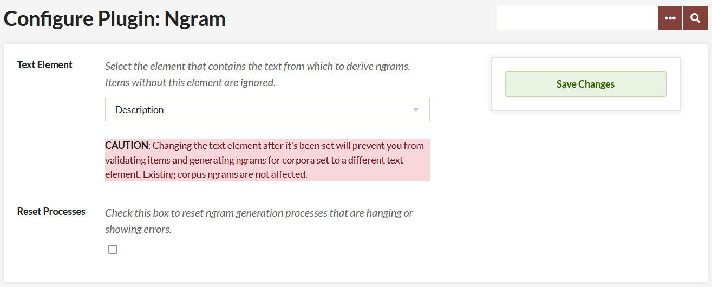

## Add a Corpus

### Create a Corpus

A corpus is drawn from the items in your collection with content in a particular text element (which is selected on the plugin configuration page), it is further defined by a Search Query and Sequence elements (on the Add a Corpus page), producing an Item Pool. The Item Pool will be further refined by Validating the Items.

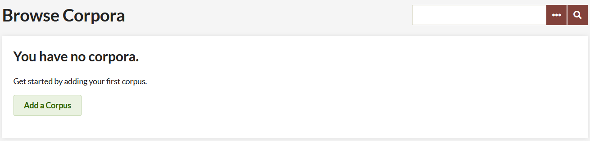

To create a corpus and start viewing ngrams, go to the Ngram tab on the left hand navigation of your Omeka admin dashboard. On the Browse Corpora page, click the green Add a Corpus button. 

On the Add a Corpus page, complete the following options:

**Name**: A field in which you must give the corpus a name. Ideally, choose something that meaningfully describes the corpora, as there are no descriptions for these corpora.

**Public**: A check box. Click the checkbox to make the corpus visible to public users (on the public side of the site).

**Search Query**: A field in which you refine the contents of your corpus by inputting a search query. The best way to get this search query is to perform an advanced search of the items in your collection on the Admin side of your Omeka site. Then, copy and paste the entire URL of the results, after the part that reads `admin/items/browse?`.

**Sequence**: 

- **Sequence Element**: select from elements but it should be something with numeric or date input. Items without the selected element field filled in (for instance, an item without a Date will not be included in the corpus). For best results, ensure consistency of metadata, and select a meaningful field.
- **Sequence type**: choose from Date by Year, Date by Month, Date by Day, or Numeric Sequence Range. The field will prompt you with the proper format for the sequence if you choose a Date type. If numeric, make sure the format matches the numeric sequence of the elements you’re drawing from.

**Note**: Date should be entered in the YearMonthDay format and should be entered as a range. (for instance, 20010101-20160101)

**Note**: You do not have to have a sequence, but without one you cannot generate graphs. 

**Note**: The Text Element box under the green Add Corpus button on the Add Corpus page. The Text Element was configured in the plugin panel. 

When you have completed adding your corpus, click the green Add Corpus button. 

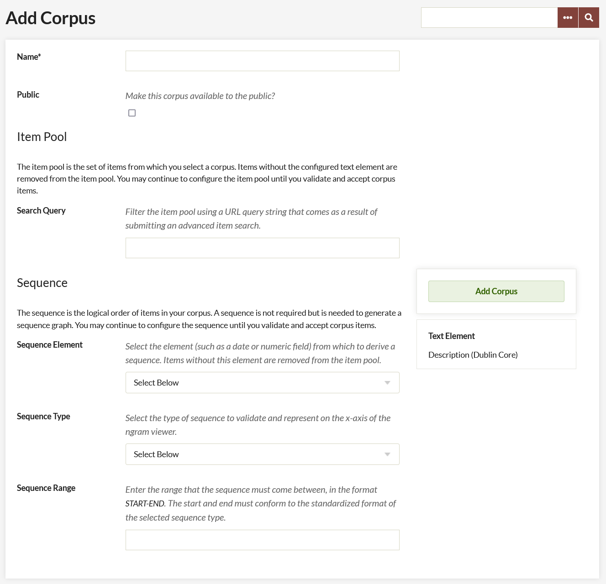

### Manage your Corpus
After you have added a corpus, the screen will update with information and options for that corpus.

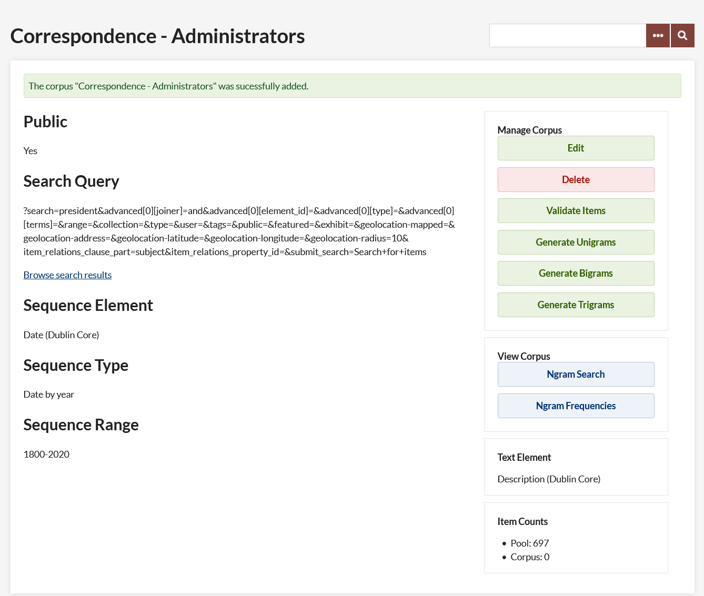

On the left the elements that were input on the Add Corpus screen are listed. 

- Public
- Search Query
- Browse search results
- Sequence Element
- Sequence Range

**Note**: Clicking browse Search Results will open a Browse Items page with all the items based on your search term.

On the right, buttons allow the user to Edit and Delete the corpus and Validate Items. After you have validated items, buttons here allow you to generate unigrams, bigrams, and trigrams, and to view the corpus. Below, a small pane indicates the Text Element for the corpus.  At the bottom an Item Counts pane will populate a pool of items from which this corpus may be derived. 

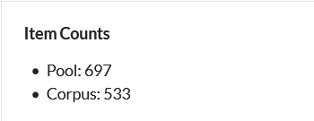

## Validate Items
After the Corpus has been created you must validate items before you can generate ngrams and view frequencies. To do so, click the green Validate Items button on the right hand side (just below the Delete button).

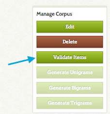

This will take you to a new screen with three tabs: valid items, invalid items, and out of range items. 

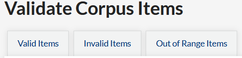

**Valid items** are those items with sequence text that is readable to the plugin (See Figure 1). The table on this tab gives: 

- the item number (a link to the item),
- the text in the sequence element, and
- Sequence member, or how it will be used in sequence by the plugin (Ex. when the sequence is “Date by Year” and the Sequence. 

**Invalid items** have text in the sequence element which the plugin cannot parse (See Figure 2). However, you can click on the Item ID number to go in and edit the item to correct the element text. 

**Out of range items** have text in their sequence element which is outside the range you set (See Figure 3). The table on this tab gives:

- the item number (a link to the item), 
- the text in the sequence element, and 
- Sequence member, or how it will be used in sequence by the plugin (Ex. when the sequence is “Date by Year” and the Sequence 

**Note**: to update the sequence text in these items, utilize the linked item number to modify each item. If you do not modify out of range items, they will not be included in the corpus.

For ease of navigation, you may click to open a new tab for the invalid or out of range items you would like to modify. Refresh the list of valid and invalid items by reloading this page. Once you are done correcting invalid items, or the list of valid items looks correct, click the green Accept Valid Items button.

**Note**: Once you click the Accept Valid Items button you will not be able to reconfigure the item pool or reset the body of valid items

Valid Items (Figure 1)

Invalid Items (Figure 2)

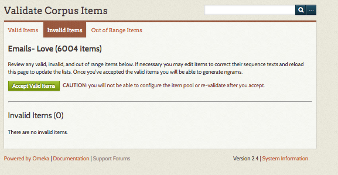

Out of Range Items (Figure 3)

**Note**: After you have validated your items, the Item Counts pane will update to provide a count of the number of items in your corpus.

### Generate Ngrams
After you have validated your items, click the buttons to generate unigrams (single words), bigrams (two word pairs), and trigrams (three word groups). You can only do one at a time. Refresh the page to see if the process is complete - larger corpora will take longer to process. While the ngrams are processing, these buttons will be grey and text will update to indicate which process is “In Progress.” When complete, the text will update to read “Generated.”

You do not have to generate unigrams, bigrams, and trigrams in order to use the View Corpus functions. However, running all three processes before you view corpus will give you more options when analyzing the corpus.

**Note**: It is only possible to generate one corpus at a time.

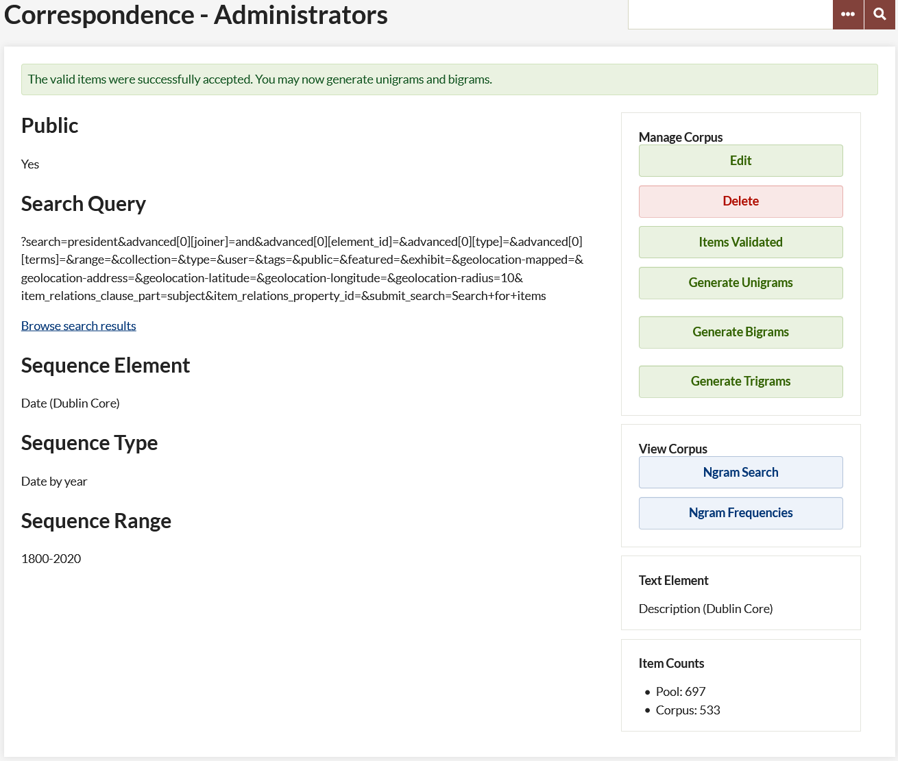

## View Corpus
Once you have created a corpus, validated the items, and generated ngrams, you can view the corpus in two ways: Ngram Search and Ngram Frequency.

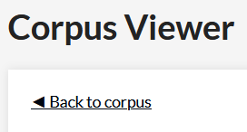

In order to get back to the Corpus summary page from the Corpus viewer, click the “back to Corpus” button just under the label Corpus viewer.

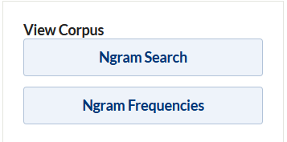

**Ngram Search** - Using the text field, enter comma-separated phrases or words to graph frequency across the corpus. 

**Note**: You can only search for two word phrases if you have generated bigrams, etc. 

You can, if you want, specify a range for the corpus search. Note that the format of the range you search must match exactly the format of your sequence data. So if you have sequenced the corpus by year, enter a four digit year, whereas if you have done it by month you must enter yyyymm formatted range data.

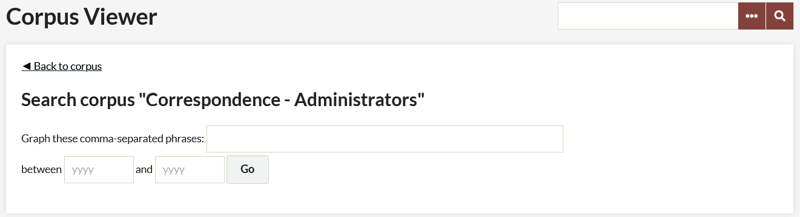

The results should return a sequence graph (if they do not, check the formatting of the range data), along with a table showing Ngram Counts and Total Ngram Counts.

Sequence Graph: Hovering over points on the sequence graph produces a small chart containing data that includes;

- time period
- ngram
- percentage of the ngram in the corpus for a particular time period.

Ngram Counts: This chart includes information about the ngrams in the corpus. 

- ngram: the phrases or words used to produce the sequence graph.
- n: number of words in the ngram phrase.
- Count: total number of that ngram in the corpus.
- Frequency %: percentage of the ngram in the entire corpus.

Total Ngram Counts: This chart includes information about the corpus.

- n: the number of words/phrases in an ngram.
- Total Count: the number of unigrams, bigrams, trigrams in the corpus.
- Total Unique Count: the number of unique ngrams within the unigrams, bigrams, trigrams.

**Note**: These results reflect the composition of the selected corpus (which has been filtered by text element and search query), not the entirety of your collection.  

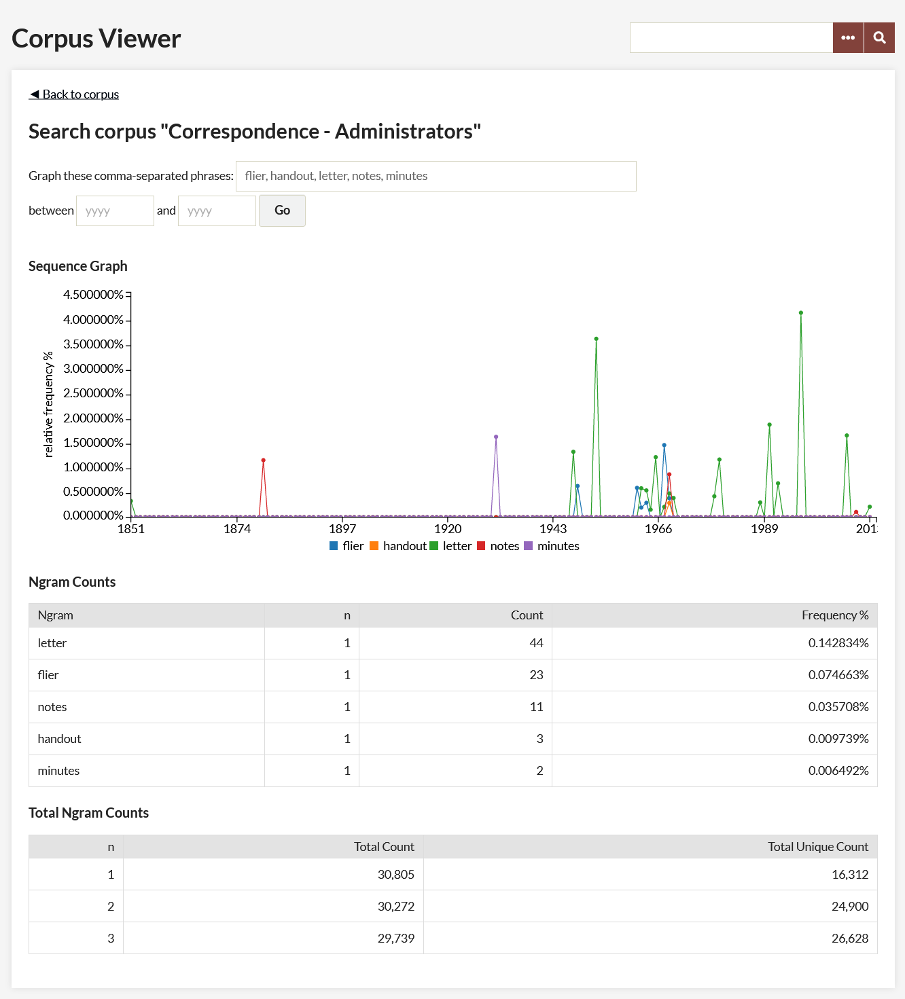

**Ngram Frequency** - The Ngram Frequency Corpus view returns ngrams in order of frequency.

Enter the number of results you want to return of unigram, bigrams, or trigrams (select one using the radio button). By default the number of results is set to 100.

Clicking the Go button produces frequency information, including; the total number and unique number of unigrams/bigrams/trigrams, and a chart that displays the ngram, total count, and a frequency percentage.

Note that the ngram plugin does not strip out stop words (a, the, of, for example) so depending on the content of the element that is forming your corpus you may want to enter a larger number in order to return useful results.

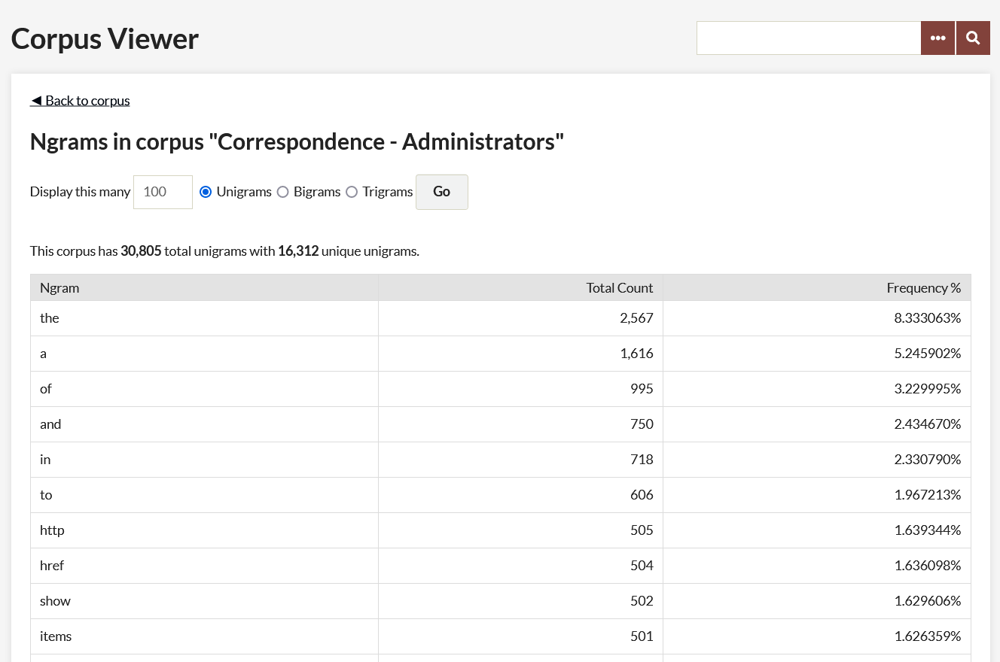

## Browse Corpora
Once you have at least one corpus, the page at admin/ngram/corpora (the ngram tab) will display a table of your corpora with the following information for each:

- **Name** (that you give it)
- **Text Element** being used as the source of the corpus data,  with element set in parentheses
- **Sequence Element**, with element set in parentheses
- **Sequence Type**
- **Sequence Range**

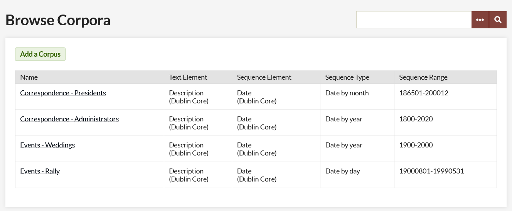

## Case Studies
The following case studies examine the [Text Analysis](TextAnalysis.md) and Ngram plugins using data from the [September 11 Digital Archive](http://911digitalarchive.org/){target=_blank}.

- [Jannelle Legg, "Experiencing the September 11 Digital Archive, Using Omeka’s Ngrams and Text Analysis Plugins," December 2017](../doc_files/911-CaseStudy-1.pdf){target=_blank}
- [Alyssa Fahringer, "Using Omeka’s Two Distant Reading Plugins to Explore the Language of Death and Mourning in the September 11 Digital Archive," December 2017](../doc_files/911-CaseStudy-2.pdf){target=_blank}
