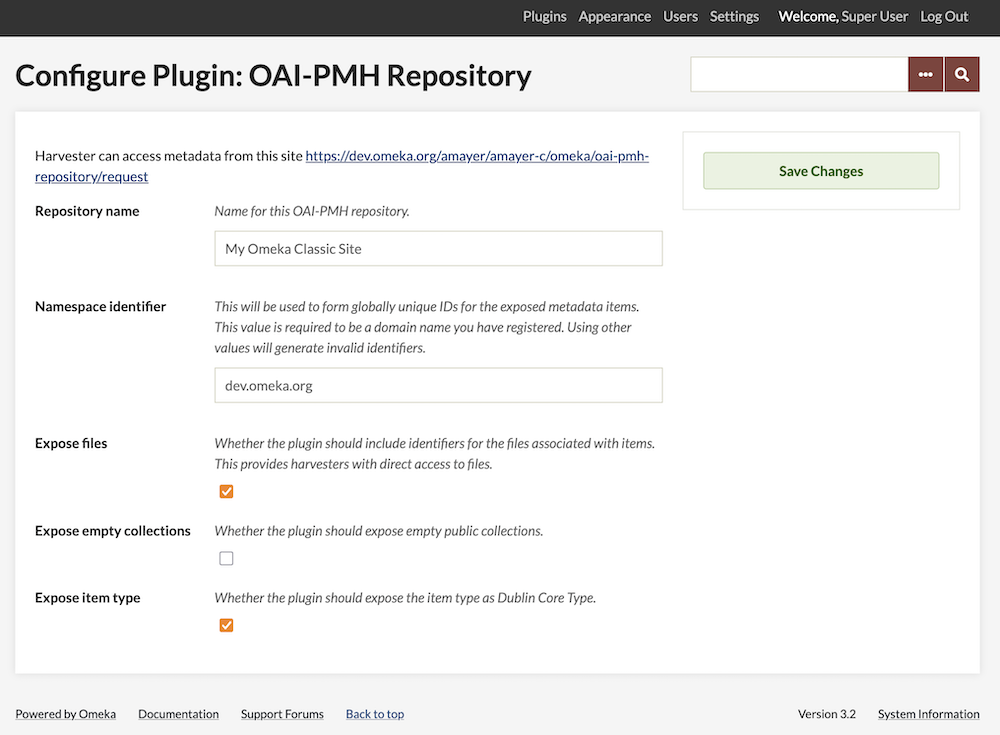

# OAI-PMH Repository

The [OAI-PMH Repository plugin](https://omeka.org/classic/plugins/OaipmhRepository/){target=_blank} implements an [Open Archives Initiative Protocol for Metadata Harvesting](http://www.openarchives.org/pmh) repository for Omeka Classic, allowing Omeka items to be harvested by OAI-PMH harvesters. The plugin implements version 2.0 of the protocol.

This plugin offers the reciprocal functionality provided by the [OAI-PMH Harvester plugin](OaipmhHarvester.md).

## Metadata Formats

The plugin ships with several default formats. Other plugins can alter these or add their own (see Extending below):

- [Dublin Core](http://dublincore.org){target=_blank} (`oai_dc`) 
    - This is required by the OAI-PMH specification for all repositories. Omeka metadata fields are mapped one-to-one with fields for this output format, and it is the preferred format to use with the plugin.
- [CDWA Lite](http://www.getty.edu/research/conducting_research/standards/cdwa/cdwalite.html){target=_blank} (`cdwalite`)
    - The mapping between Omeka's metadata and CDWA Lite metadata is more complicated, and certain fields may not be populated correctly.The chief advantage of using CDWA Lite output is that file URLs can be output in a controlled format, unlike Dublin Core. Harvesters may therefore be able to harvest or link to files in addition to metadata.
- [MODS](http://www.loc.gov/standards/mods/){target=_blank} (`mods`)
    - This output crosswalks the Dublin Core metadata to MODS using the [mapping](http://www.loc.gov/standards/mods/dcsimple-mods.html)[OAI-PMH Repository plugin](https://omeka.org/classic/plugins/OaipmhRepository/){target=_blank} recommended by the Library of Congress.
- [METS](http://www.loc.gov/standards/mets/){target=_blank} (`mets`)
    - The Metadata Encoding and Transmission Standard exposes files to harvesters.
- [RDF](https://www.w3.org/2001/sw/wiki/RDF){target=_blank} (`rdf`)
    - This format exposes metadata as RDF/XML. Unlike many of the other formats, RDF allows the repository to expose metadata from different standards all in the same output. The main practical distinction from other formats currently is that the RDF output will automatically include "qualified" data from the Dublin Core Extended plugin, if it's present. 
- Omeka XML (`omeka-xml`)
    - This output format uses an Omeka-specific XML output that includes all metadata elements without requiring crosswalking or subsetting, but is not well-supported by harvesters or other tools.

## Configuration

When you install the plugin, you will be automatically directed to the plugin configuration page. You can access these again at any time by going to the Plugins tab of the top navigation, scrolling down to the OAI-PMH Repository plugin in the list and clicking the blue "Configure" button.

At the top of the configuration page, the plugin displays the address for your OAH-PMH repository. 

**Repository name**: A text field where you can enter a name for this OAI-PMH repository. This value is sent as part of the response to an Identify request, and it is how the repository will be identified by harvesters. Defaults to the name of the Omeka installation.

**Namespace identifier**: A text field to set the namespace identifier; this is required to be the domain name of the Omeka site. If your site lives in a subdirectory (`yourdomain.com/omeka`), it is the main domain (`yourdomain.com`).  

If it can, the plugin will try to automatically detect the domain of the server hosting the site, and use that as the default namespace identifier.  

If a name can't be detected (for example, if the site is accessed through the `localhost` domain), the  default will be "default.must.change" and you will need to set the namespace manually. Best practice is to set this value to the domain name the Omeka server is published at, possibly with a prefix like "oai."

**Expose files**: A checkbox to set whether the repository should expose direct URLs to all the files associated with an item as part of its returned metadata. This gives harvesters the ability to directly access the files described by the metadata.  

**Expose empty collections**: A checkbox to set whether the plugin should expose empty public collections. If enabled, all public collections are included in ListSets output. If disabled, only collections that actually contain at least one public item will be included in the ListSets output. 

**Expose item type**: a checkbox to set whether the plugin should expose the item type as Dublin Core Type. When enabled, for items that belong to an item type, the repository will expose an additional Dublin Core Type element with a value of the item type's name. Note that this option will only expose the item type *name*, not any other item type metadata.

### Advanced Configuration 

The plugin also allows you to configure some more options about how the repository responds to harvesters. Since the default values are recommended for most users, these values must be edited by hand, in the `config.ini` file in the plugin's root directory, accessed using an FTP or SSH client.

**List response limit**: Number of individual items that can be returned in a response at once. Larger values will increase memory usage but reduce the number of database queries and HTTP requests. Smaller values will reduce memory usage but increase the number of DB queries and requests. Default is 50.

**List expiration time**: The amount of time, in minutes, a resumptionToken is valid for. The specification suggests a number in the tens of minutes. This boils down to the length of time a harvester has to request the next part of an incomplete list request. Default is 10 (minutes)

## Extending 

The plugin provides a filter that other plugins can use to add new metadata formats or replace the existing ones with new
implementations. As of version 2.1, it's no longer necessary to add or change files within the plugin itself to change the
available formats.

### Filter `oai_pmh_repository_metadata_formats` 

The filter passes no extra parameters. The value being filtered is an array of arrays, where each inner array describes a single metadata format. The key in the outer array is the metadata prefix for the format (i.e., `oai_dc` or `rdf`). Each inner array has three mandatory keys:

* `class` is the name of a class implementing `OaiPmhRepository_Metadata_FormatInterface`. This class holds the actual implementation
  of the format.
* `namespace` is the XML namespace for the format.
* `schema` is the location of the XML schema for the format.
