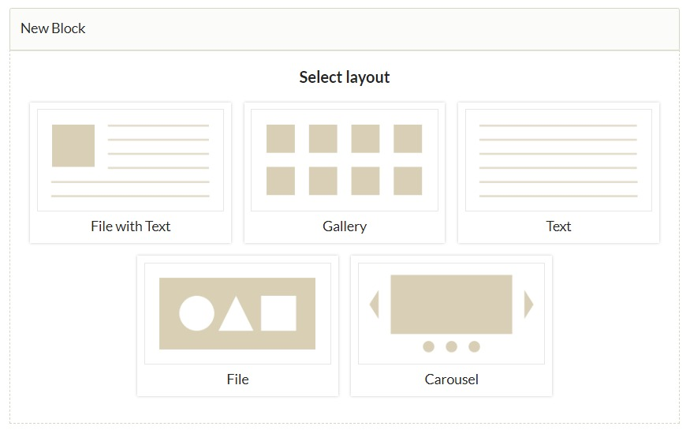

# OHMS Embed

The [OHMS Embed plugin](https://omeka.org/classic/plugins/OhmsEmbed/){target=_blank} allows site administrators to add [Oral History Metadata Synchonizer](https://www.oralhistoryonline.org/){target=_blank} objects as files to Omeka Classic items.

This plugin will add an OHMS viewer to places where files can be embedded, allowing users to view indexes, transcripts, and/or translations of videos and audio as they are played. 

OHMS XML files can be uploaded to Omeka items as media. Without this plugin, they will appear as attached files available for download. With this plugin installed and activated, they will render as video/audio displays with transcripts, indexes, etc. The plugin will also ensure that when an OHMS file is uploaded, its metadata is extracted into Omeka properties, such as Description, Subject, Identifier, Interviewer and Interviewee, etc. 

The OHMS media player can appear on item and files pages, and can be placed on Omeka sites with shortcodes, or exhibit pages by adding the item to a selected page block.

Preparing your Omeka installation to receive OHMS files can take some work. Read over the following steps thoroughly before taking any action, so that you can set up your installation correctly based on your specific needs. 

## Create OHMS files

To create OHMS packages with your interviews, you must use the OHMS application available on the [OHMS website](https://www.oralhistoryonline.org/){target=_blank}, which requires requesting a free account and working with the web-based application. 

The OHMS application will output XML files that contain all the information created within that tool. 

OHMS files include a link to the video or audio media that will be presented alongside the index and texts. They do **not** include the multimedia file itself. This must be hosted elsewhere. Your hosting options include Youtube, Vimeo, Soundcloud, and other audio/video hosting providers.

## Configuring the plugin

When you activate the OHMS Embed plugin, you will have two configuration options.

1. Embed Height: Set the height of the OHMS Viewer in pixels.
2. Extract Metadata: Selecting this option will set "Oral History" as the item type for items that have OHMS XML files added to them. Then, this feature will extract the metadata contained in the OHMS XML file and insert it into assigned Item Metadata and Item Type Metadata fields. Extracted metadata will be mapped as follows:
    - Dublin Core, Title
    - Dublin Core, Description
    - Dublin Core, Identifier (from "accession' in the XML)
    - Dublin Core, Date
    - Dublin Core, Subject
    - Oral History Item Type Metadata, Interviewer
    - Oral History Item Type Metadata, Interviewee
    - Oral History Item Type Metadata, Duration

## Add OHMS files to Omeka

The OHMS Editor produces an XML file that carries the metadata, index, and transcript that accompany the oral history. The file must be added to an Omeka Classic item as media to cause the OHMS viewer to appear. 

Usually, XML is not among the allowed media types and file extensions in an Omeka Classic installation. You will have to enable this first. 

### Enable XML uploads

Go to your installation's Settings page, and navigate to the Security section. 

- Add `xml` to the **Allowed file extensions** list. 
- Add `text/xml` to the **Allowed file types** list.

When you are finished, click the "Save" button in the upper right hand corner of the screen.

### Upload XML files

You can upload your OHMS XML files individually to items from your computer, or you can batch-import OHMS files onto new or existing items using [CSV Import](CSV_Import.md). 

!!! note
	Omeka Classic will not be able to generate an item thumbnail from OHMS files. You may wish to add an image the item to generate a thumbnail before you add your XML file.

#### Bulk-import OHMS files

If you are interested in adding many OHMS objects to your Omeka S installation at once, it is possible to use [CSV Import](CSV_Import.md). You can use the [Dropbox plugin](Dropbox.md) to host the XML files for ingest.

Upload the XML files to your hosting service or Dropbox directory. Then, create a spreadsheet that lists the URLs of the files. If you are planning to extract all metadata from the XML files, all you need to provide is a column of file URLs. If you have further metadata to add, create columns for those fields according to the CSV Import instructions in the user manual. 

## Display the OHMS viewer

Having added your OHMS XML files to your Omeka Classic items, the OHMS viewer will load on Item and File Pages. If you have included a thumbnail on your items, such as a video still, you must order the files so that the XML file comes first, if you wish the OHMS viewer to load. 

### OHMS on item pages

The Viewer will appear where you place it using shortcodes and exhibit blocks. 

On item pages, the OHMS Viewer will appear differently depending on your Omeka Classic theme. Each theme may need to have its settings adjusted to work smoothly. For example, the Lightbox gallery viewer that some themes offer may need to be disabled so that the OHMS Viewer can appear in its place. 

If your Omeka Classic site will include a variety of different item types and media alongside OHMS items, you may need to make decisions trading off the best display settings for each type. 

This display issue only applies when viewing a specific item's page with all its metadata and files. A File view page for each XML file will show the Viewer as intended - as long as your users can navigate to that page (that is, if the file shows in file lists as a link). 

We recommend the following themes and settings for best use of OHMS:

- The OHMS Viewer will render on item view pages in the themes Berlin, Rhythm, and Santa Fe, in the "file list" area of the page. 
- The OHMS Viewer will render in the theme Freedom but in a very narrow column. This can be modified using the CSS Editor if desired. 
- The OHMS Viewer will render in the theme Foundation __if__ your media display setting is on "Large derivative files stacked" - not "Media viewer" (i.e. the Lightbox gallery) or the square thumbnails. We recommend a single column layout.
- The OHMS Viewer will render in the themes Emiglio, Minimalist, Seasons, and Thanks, Roy __if__ the "Item File Gallery" setting is unchecked. Note that Emiglio has a very narrow column for displaying the Viewer on item pages, and users will only be able to see either the transcript or the index, not both at the same time. 

!!! note
	The OHMS Viewer will __not render at all__ on item view pages in themes The Daily, Big Picture, and Center Row (because the Lightbox gallery cannot be turned off). 

Below is an image of the OHMS Viewer rendering in the Thanks, Roy theme:

### Embed the OHMS viewer

To make a specific OHMS item display on your Omeka Classic website pages, use the [Files shortcode](../Content/Shortcodes.md#file). 

### OHMS viewer on Exhibit pages

You can use the ["File with Text" or the "File"](https://omeka.org/classic/docs/Plugins/ExhibitBuilder/#content) block to place the OHMS viewer directly into Exhibit pages. 

Choose an item by clicking the large plus sign button titled "Add Item" appearing in the Items area.

You must select the XML file as the attached media - do not choose any other files on the same item. 

Below is an image of the OHMS Viewer rendering in an exhibit using the Santa Fe theme:

#### Using the OHMS viewer

The Omeka Classic OHMS viewer has several public controls: a toggle between the index and the transcription and/or translation if those elements are available, an information icon that shows the media metadata, and an option to move to a fullscreen view.

